# The main window

The Consteel window consists of seven separate parts containing different functionalities.

<!-- /wp:paragraph -->

<!-- wp:image {"align":"center","id":6857,"sizeSlug":"large","linkDestination":"media","className":"is-resized is-style-default"} -->

[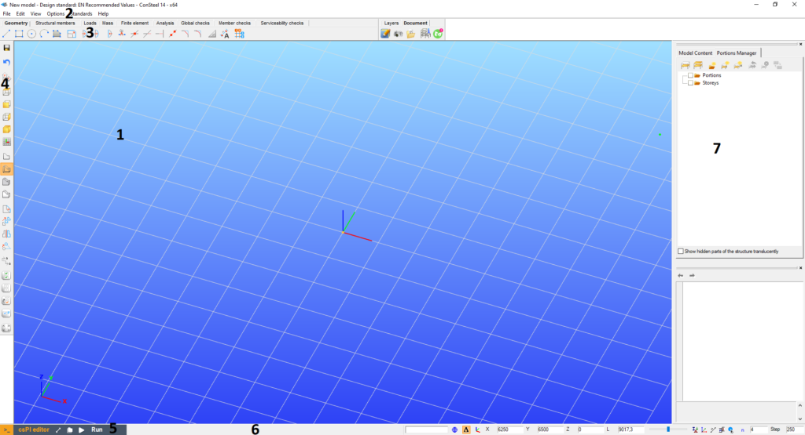](https://Consteelsoftware.com/wp-content/uploads/2021/04/Main-window-numbers-1.png)

- The **graphical window** is the area for the 3D structural modeling (#1)
- The **menu** on the top contains some important commands (#2)
- **Tabs** from left to right lead the user through the steps of structural design (#3)
- **Sidebar** on the left contains functions for grids, views, most commonly used transformations, and selections (#4)
- The **csPI editor** pop-up panel is for parametric modeling (#5)
- The **status bar** on the bottom makes the drawing phases easier (#6)
- The **Side Panel** contains the Object and parameter tables and gives always sophisticated information about the model, making fast modifications possible (#7).

<!-- wp:heading {"level":3} -->

### The graphical window

<!-- /wp:heading -->

<!-- wp:columns -->

<!-- wp:column {"width":"95%"} -->

<!-- wp:paragraph {"align":"justify"} -->

The structural model appears always in the graphical window. There are no other window opening options; however, there are lots of viewing possibilities in this single window. The graphical window supports the modeling by the global coordinate system (_GCS_) and a moveable, rotatable, and size adjustable grid. The [_**coordinate system**_](../4_0_drawing-geometry/4_1_coordinate-systems.md) at the left bottom corner denotes always the unchangeable _GCS_; the origin of the [_**user coordinate system (UCS)**_](../4_0_drawing-geometry/4_1_coordinate-systems.md#user-coordinate-system) takes place at the middle point of the grid which is always the plane “XY” of the _UCS_. The following moving possibilities and quick view settings can be used during the structural model manipulation:

- **Move**: push and hold down the middle mouse button or use the four arrow buttons on the keyboard to move the model on the screen
- **Rotate**: hold down the **_Alt_** key and the left mouse button. The center of rotation is always adapting the actual model view
- **Scaling**: spin the middle mouse button forth and back or use the **_+_** and **_-_** buttons on the keyboard or hold down the Alt key and the right mouse button
- **Zoom window**: window drawing by the left mouse button, while pressing **_Shift+Alt_** keys
- **Hotkeys for views**:

  - **Ctrl+1**: Switch to **top view**
  - **Ctrl+2**: Switch to **front view**
  - **Ctrl+3**: Switch to **side view**
  - **Ctrl+4**: Switch to **axonometric view**
  - **Ctrl+5**: Perpendicular to the actual UCS plane
  - **Ctrl+0**: Quick **zoom all**

### The menu

The _Consteel_ menu does not contain many commands since the main functionality is placed to the structured tabs and to the side bars, and the applicability and modeling efficiency does not really need to duplicate the functions. However, six important function groups appear here: [**_File_** ](#file-menu)handling, some [**_Edit_** ](#edit-menu)options (undo-redo), [**_View_** ](#view-menu)and diagnostics, [**_Options_**](#options-menu) for settings (for saving, updating, selecting language, and for model diagnostics), [**_Standards_** ](#standards-menu)for reviewing and defining standard parameters for design and **_[Help](#help-menu)_**.

<!-- /wp:paragraph -->

<!-- wp:heading {"level":4} -->

#### File menu

<!-- /wp:heading -->
Consteel 17

<!-- wp:paragraph -->

The File menu differs between Consteel 14 and Consteel 15.

<!-- /wp:paragraph -->

<!-- wp:columns -->

<!-- wp:column {"verticalAlignment":"center"} -->

<!-- wp:image {"align":"center","id":28230,"sizeSlug":"full","linkDestination":"none","className":"is-resized"} -->

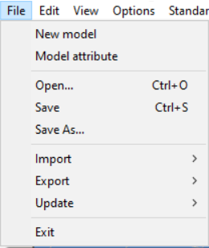

Consteel 14

<!-- /wp:image -->

<!-- /wp:column -->

<!-- wp:column -->

<!-- wp:image {"align":"center","id":27754,"sizeSlug":"full","linkDestination":"media","className":"is-resized"} -->

Consteel 15

<!-- /wp:image -->

<!-- /wp:column -->

<!-- /wp:columns -->

<!-- wp:paragraph -->

_Project Center_ (CS15)

<!-- /wp:paragraph -->

<!-- wp:paragraph {"editorskit":{"indent":60,"devices":false,"desktop":true,"tablet":true,"mobile":true,"loggedin":true,"loggedout":true,"acf_visibility":"","acf_field":"","acf_condition":"","acf_value":"","migrated":false,"unit_test":false}} -->

The Project Center will be opened. See more [here](./1_1_installing-and-running-the-software.md#project-center).

<!-- /wp:paragraph -->

<!-- wp:paragraph -->

_New model_

<!-- /wp:paragraph -->

<!-- wp:paragraph {"editorskit":{"indent":60,"devices":false,"desktop":true,"tablet":true,"mobile":true,"loggedin":true,"loggedout":true,"acf_visibility":"","acf_field":"","acf_condition":"","acf_value":"","migrated":false,"unit_test":false}} -->

A new Consteel applications launches and a new structural model can be created.

<!-- /wp:paragraph -->

<!-- wp:paragraph -->

_Model attribute_

<!-- /wp:paragraph -->

<!-- wp:paragraph {"editorskit":{"indent":60,"devices":false,"desktop":true,"tablet":true,"mobile":true,"loggedin":true,"loggedout":true,"acf_visibility":"","acf_field":"","acf_condition":"","acf_value":"","migrated":false,"unit_test":false}} -->

The model description and the EN National Annex, or design standard can be changed here. (These parameters can be set at first by creating a new model.)

<!-- /wp:paragraph -->

<!-- wp:image {"align":"center","id":6962,"sizeSlug":"full","linkDestination":"none","className":"is-resized"} -->

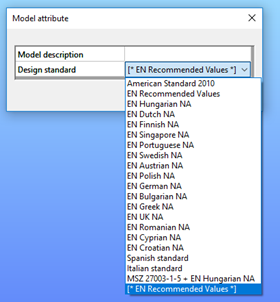

<!-- /wp:image -->

<!-- wp:paragraph -->

_Recent models_ (CS15)

<!-- /wp:paragraph -->

<!-- wp:paragraph {"editorskit":{"indent":60,"devices":false,"desktop":true,"tablet":true,"mobile":true,"loggedin":true,"loggedout":true,"acf_visibility":"","acf_field":"","acf_condition":"","acf_value":"","migrated":false,"unit_test":false}} -->

Opens the Project Center with the Recent models saved at your computer in focus.

<!-- /wp:paragraph -->

<!-- wp:paragraph -->

_Open (CS14) and Open from Computer (CS15)_

<!-- /wp:paragraph -->

<!-- wp:paragraph {"editorskit":{"indent":60,"devices":false,"desktop":true,"tablet":true,"mobile":true,"loggedin":true,"loggedout":true,"acf_visibility":"","acf_field":"","acf_condition":"","acf_value":"","migrated":false,"unit_test":false}} -->

Standard file open dialogue window will open.

<!-- /wp:paragraph -->

<!-- wp:paragraph -->

_Open from Cloud_ (Beta) (CS15)

<!-- /wp:paragraph -->

<!-- wp:paragraph {"editorskit":{"indent":60,"devices":false,"desktop":true,"tablet":true,"mobile":true,"loggedin":true,"loggedout":true,"acf_visibility":"","acf_field":"","acf_condition":"","acf_value":"","migrated":false,"unit_test":false}} -->

Open your cloud storage. Cloud functions are provided by the Steelspace platform. See more: _[Open from Cloud](./1_1_installing-and-running-the-software.md#cloud-open)_

<!-- /wp:paragraph -->

<!-- wp:paragraph -->

_Save_

<!-- /wp:paragraph -->

<!-- wp:paragraph {"editorskit":{"indent":60,"devices":false,"desktop":true,"tablet":true,"mobile":true,"loggedin":true,"loggedout":true,"acf_visibility":"","acf_field":"","acf_condition":"","acf_value":"","migrated":false,"unit_test":false}} -->

Saves the current model to the previously defined storage space. In Consteel 15, for the first save a pop-up window will open where you can select between Local and Cloud storage.

<!-- /wp:paragraph -->

<!-- wp:paragraph -->

_Save_ as

<!-- /wp:paragraph -->

<!-- wp:paragraph {"editorskit":{"indent":60,"devices":false,"desktop":true,"tablet":true,"mobile":true,"loggedin":true,"loggedout":true,"acf_visibility":"","acf_field":"","acf_condition":"","acf_value":"","migrated":false,"unit_test":false}} -->

Saves the model in another storage space. In Consteel 15, a pop-up window will open where you can select between Local and Cloud storage.

<!-- /wp:paragraph -->

<!-- wp:image {"align":"center","id":27765,"sizeSlug":"full","linkDestination":"media","className":"is-resized"} -->

<!-- /wp:image -->

<!-- wp:paragraph {"editorskit":{"indent":60,"devices":false,"desktop":true,"tablet":true,"mobile":true,"loggedin":true,"loggedout":true,"acf_visibility":"","acf_field":"","acf_condition":"","acf_value":"","migrated":false,"unit_test":false}} -->

Choosing the Local computer, the common dialogue of Windows will open.

<!-- /wp:paragraph -->

<!-- wp:paragraph {"editorskit":{"indent":60,"devices":false,"desktop":true,"tablet":true,"mobile":true,"loggedin":true,"loggedout":true,"acf_visibility":"","acf_field":"","acf_condition":"","acf_value":"","migrated":false,"unit_test":false}} -->

Choosing the Cloud (Beta), the cloud model directory powered by Steelspace will open where you can save your model. See more: [Cloud save](../2_0_file-handling/2_2_cloud-save-and-sharing-models.md#cloud-save-and-sharing-models)

<!-- /wp:paragraph -->

<!-- wp:paragraph -->

_Share (Beta)(CS15)_

<!-- /wp:paragraph -->

<!-- wp:paragraph -->

Models saved to the Cloud can be shared with other Consteel users who have an online account. For more details regarding sharing see here: _[Sharing models](../2_0_file-handling/2_2_cloud-save-and-sharing-models.md#sharing-models)_.

<!-- /wp:paragraph -->

<!-- wp:paragraph -->

_Import_

<!-- /wp:paragraph -->

<!-- wp:paragraph {"editorskit":{"indent":60,"devices":false,"desktop":true,"tablet":true,"mobile":true,"loggedin":true,"loggedout":true,"acf_visibility":"","acf_field":"","acf_condition":"","acf_value":"","migrated":false,"unit_test":false}} -->

Import menu contains a wide range of import possibilities from the very basic DXF wireframe import to the widespread IFC, furthermore the complex Dlubal and SAP2000 model import including the loadings as well. See more: **_[File handling](../../category/file-handling)_**.

<!-- /wp:paragraph -->

<!-- wp:image {"align":"center","id":27742,"sizeSlug":"full","linkDestination":"media","className":"is-resized"} -->

<!-- /wp:image -->

<!-- wp:paragraph -->

_Export_

<!-- /wp:paragraph -->

<!-- wp:paragraph {"editorskit":{"indent":60,"devices":false,"desktop":true,"tablet":true,"mobile":true,"loggedin":true,"loggedout":true,"acf_visibility":"","acf_field":"","acf_condition":"","acf_value":"","migrated":false,"unit_test":false}} -->

The selected part of the model can be exported to _TEKLA Structures_ or to IFC. In the case of a slab reinforcement result, the colored result view can be exported to DXF format as well. See more: **_[File handling](../../category/file-handling)_**.

<!-- /wp:paragraph -->

<!-- wp:image {"align":"center","id":27748,"sizeSlug":"full","linkDestination":"media","className":"is-resized"} -->

<!-- /wp:image -->

<!-- wp:paragraph -->

_Update_

<!-- /wp:paragraph -->

<!-- wp:paragraph {"editorskit":{"indent":60,"devices":false,"desktop":true,"tablet":true,"mobile":true,"loggedin":true,"loggedout":true,"acf_visibility":"","acf_field":"","acf_condition":"","acf_value":"","migrated":false,"unit_test":false}} -->

In the case of a connected Tekla model (previously Tekla import or export is needed), the connected Tekla model can be updated and modified acc. to the actual Consteel model. See more: **_[Tekla model update](../2_0_file-handling/2_3_tekla-structures-model-import-export-and-update.md)_**.

<!-- /wp:paragraph -->

<!-- wp:heading {"level":4} -->

#### Edit menu

<!-- /wp:heading -->

<!-- wp:image {"align":"center","id":6976,"sizeSlug":"large","linkDestination":"none"} -->

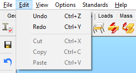

<!-- /wp:image -->

<!-- wp:paragraph -->

Standard Windows features that do not require special explanation.

<!-- /wp:paragraph -->

<!-- wp:heading {"level":4} -->

#### View menu

<!-- /wp:heading -->

<!-- wp:paragraph -->

**Consteel 17**

<!-- /wp:paragraph -->

<!-- wp:image {"align":"center","id":71136,"width":"204px","height":"auto","sizeSlug":"full","linkDestination":"none"} -->

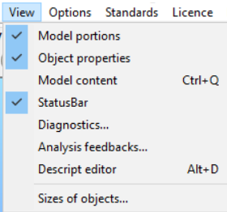

<!-- /wp:image -->

<!-- wp:paragraph -->

In addition to the several window options, the **Model content** can be switched _on_ and _off_ separately from the **Model portions**.

<!-- /wp:paragraph -->

<!-- wp:paragraph -->

**Consteel 16**

<!-- /wp:paragraph -->

<!-- wp:image {"align":"center","id":71126,"width":"220px","height":"auto","sizeSlug":"full","linkDestination":"none"} -->

<!-- /wp:image -->

<!-- wp:paragraph -->

The visibility status of several optional windows can be switched _on_ and _off_. See more: _**[Side panel](#side-panel)**_.  
With the **Sizes of objects…** function, the size of the model objects can be changed individually.

<!-- /wp:paragraph -->

<!-- wp:image {"align":"center","id":6992,"sizeSlug":"large","linkDestination":"none"} -->

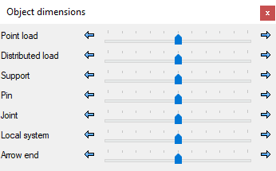

<!-- /wp:image -->

<!-- wp:heading {"level":4} -->

#### Options menu

<!-- /wp:heading -->

<!-- wp:paragraph -->

**Consteel 17**

<!-- /wp:paragraph -->

<!-- wp:image {"id":71106,"width":"512px","height":"auto","sizeSlug":"full","linkDestination":"none"} -->

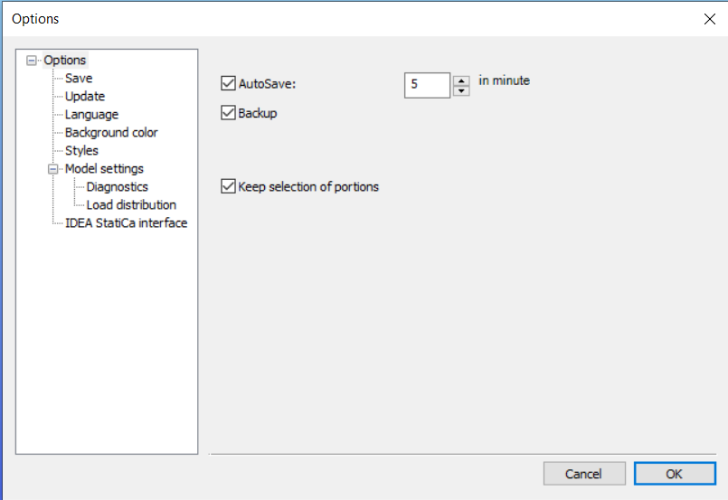

<!-- /wp:image -->

<!-- wp:paragraph -->

**Keep selections of portions** (only from version 17)

<!-- /wp:paragraph -->

<!-- wp:image {"id":71116,"width":"140px","height":"auto","sizeSlug":"full","linkDestination":"none"} -->

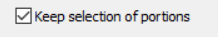

<!-- /wp:image -->

<!-- wp:paragraph -->

By utilizing the **Keep selection of portions** feature, one can maintain the same portion selection even when closing and reopening the model, assuming it was saved previously. In contrast, reopening the model will display the full view.

<!-- /wp:paragraph -->

<!-- wp:paragraph -->

**Consteel 16**

<!-- /wp:paragraph -->

<!-- wp:paragraph -->

In the pop up Options window the following settings can be found: Save, Update, Language, Background color, Styles, Diagnostics, and IDEA Statica Interface.

<!-- /wp:paragraph -->

<!-- wp:paragraph -->

In the pop up Options window the following settings can be found: Save, Update, Language, Styles, Diagnostics, and IDEA Statica Interface.

<!-- /wp:paragraph -->

<!-- wp:paragraph -->

_**Save**_

<!-- /wp:paragraph -->

<!-- wp:paragraph -->

**Consteel 15**

<!-- /wp:paragraph -->

<!-- wp:image {"align":"center","id":47521,"width":"510px","height":"auto","sizeSlug":"full","linkDestination":"media","className":"is-resized"} -->

<!-- /wp:image -->

<!-- wp:paragraph {"editorskit":{"indent":60,"devices":false,"desktop":true,"tablet":true,"mobile":true,"loggedin":true,"loggedout":true,"acf_visibility":"","acf_field":"","acf_condition":"","acf_value":"","migrated":false,"unit_test":false}} -->

If **Autosave** is clicked, the program automatically performs a save periodically in accordance with the adjusted number of minutes. If **Backup** is clicked, _Consteel_ creates a backup file _after a manual save is performed_. The backup model file can be used as a normal model by removing the **_.bak_** extension.

<!-- /wp:paragraph -->

<!-- wp:paragraph {"editorskit":{"indent":60,"devices":false,"desktop":true,"tablet":true,"mobile":true,"loggedin":true,"loggedout":true,"acf_visibility":"","acf_field":"","acf_condition":"","acf_value":"","migrated":false,"unit_test":false}} -->

**Convert previous models to the actual version of Consteel** (only form version 14)

<!-- /wp:paragraph -->

<!-- wp:paragraph {"editorskit":{"indent":60,"devices":false,"desktop":true,"tablet":true,"mobile":true,"loggedin":true,"loggedout":true,"acf_visibility":"","acf_field":"","acf_condition":"","acf_value":"","migrated":false,"unit_test":false}} -->

When the backup feature is active, the first time you save a model from a previous Consteel version, a backup is automatically created retaining the original version. The file name of this backup copy is created according to the following scheme: model_filename - Consteel XX.bak (where XX = the version number).

<!-- /wp:paragraph -->

<!-- wp:paragraph -->

_**Update**_

<!-- /wp:paragraph -->

<!-- wp:image {"align":"center","id":37343,"width":350,"height":239,"sizeSlug":"full","linkDestination":"none"} -->

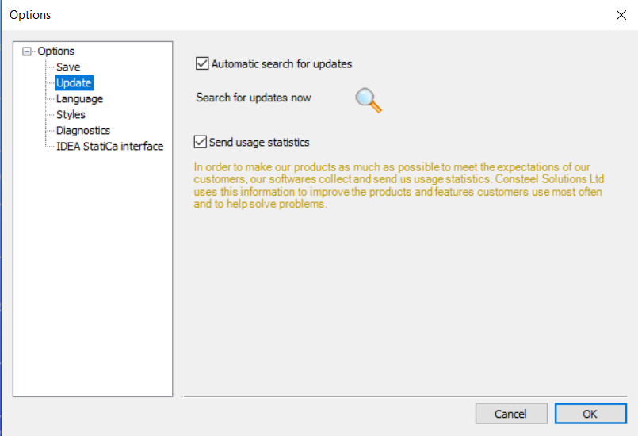

<!-- /wp:image -->

<!-- wp:paragraph {"editorskit":{"indent":60,"devices":false,"desktop":true,"tablet":true,"mobile":true,"loggedin":true,"loggedout":true,"acf_visibility":"","acf_field":"","acf_condition":"","acf_value":"","migrated":false,"unit_test":false}} -->

If the **Automatic search for updates** is checked _Consteel_ searches the web for an available new version at every startup. It can be turned off anytime. The check for a new version can also be performed manually by clicking on the **Search for updates now** ( ) button.

<!-- /wp:paragraph -->

<!-- wp:paragraph {"editorskit":{"indent":60,"devices":false,"desktop":true,"tablet":true,"mobile":true,"loggedin":true,"loggedout":true,"acf_visibility":"","acf_field":"","acf_condition":"","acf_value":"","migrated":false,"unit_test":false}} -->

**Customer experience improvement**

<!-- /wp:paragraph -->

<!-- wp:paragraph {"editorskit":{"indent":60,"devices":false,"desktop":true,"tablet":true,"mobile":true,"loggedin":true,"loggedout":true,"acf_visibility":"","acf_field":"","acf_condition":"","acf_value":"","migrated":false,"unit_test":false}} -->

In order to make our products meet the expectations of our customers as much as possible, our software collects and sends us usage statistics. Consteel Solutions Ltd. uses this information to improve the products and features customers use the most often and to help to solve problems. Our product collects and sends the following information: software version, used functionalities, running time, and location. Sent information does not contain any personal information (such as your name, address, or phone number) and is not used to identify you.

<!-- /wp:paragraph -->

<!-- wp:paragraph {"editorskit":{"indent":60,"devices":false,"desktop":true,"tablet":true,"mobile":true,"loggedin":true,"loggedout":true,"acf_visibility":"","acf_field":"","acf_condition":"","acf_value":"","migrated":false,"unit_test":false}} -->

In the case of commercial licenses, the collection of usage statistics can be turn off anytime by turning off the checkbox. In the case of a trial or an educational license, the collection of usage statistics is continuous.

<!-- /wp:paragraph -->

<!-- wp:paragraph -->

_**Language**_

<!-- /wp:paragraph -->

<!-- wp:image {"align":"center","id":7017,"width":320,"height":219,"sizeSlug":"full","linkDestination":"media"} -->

<!-- /wp:image -->

<!-- wp:paragraph {"editorskit":{"indent":60,"devices":false,"desktop":true,"tablet":true,"mobile":true,"loggedin":true,"loggedout":true,"acf_visibility":"","acf_field":"","acf_condition":"","acf_value":"","migrated":false,"unit_test":false}} -->

The language of the user interface can be chosen here from the following list: Hungarian, English, French, Rumanian, German, Russian, Slovenian, Polish, Spanish, Slovak, Portuguese, Serbian, Turkish, Chinese, Bulgarian, Greek, Italian, and Croatian.

<!-- /wp:paragraph -->

<!-- wp:paragraph {"editorskit":{"indent":60,"devices":false,"desktop":true,"tablet":true,"mobile":true,"loggedin":true,"loggedout":true,"acf_visibility":"","acf_field":"","acf_condition":"","acf_value":"","migrated":false,"unit_test":false}} -->

_Consteel_ has to be restarted after changing the interface language.

<!-- /wp:paragraph -->

<!-- wp:paragraph -->

**_Background color_** _(from **Consteel 16**)_

<!-- /wp:paragraph -->

<!-- wp:image {"align":"center","id":47529,"width":350,"sizeSlug":"full","linkDestination":"media"} -->

<!-- /wp:image -->

<!-- wp:paragraph {"editorskit":{"indent":60,"devices":false,"desktop":true,"tablet":true,"mobile":true,"loggedin":true,"loggedout":true,"acf_visibility":"","acf_field":"","acf_condition":"","acf_value":"","migrated":false,"unit_test":false}} -->

The background color of the model definition tabs can be set here.

<!-- /wp:paragraph -->

<!-- wp:paragraph -->

_**Styles**_

<!-- /wp:paragraph -->

<!-- wp:image {"align":"center","id":7025,"width":322,"height":221,"sizeSlug":"full","linkDestination":"media"} -->

<!-- /wp:image -->

<!-- wp:paragraph {"editorskit":{"indent":60,"devices":false,"desktop":true,"tablet":true,"mobile":true,"loggedin":true,"loggedout":true,"acf_visibility":"","acf_field":"","acf_condition":"","acf_value":"","migrated":false,"unit_test":false}} -->

The color of the objects can be changed. - (*This feature will be discontinued!*)

<!-- /wp:paragraph -->

<!-- wp:paragraph -->

_**Diagnostics**_

<!-- /wp:paragraph -->

<!-- wp:image {"align":"center","id":7037,"width":322,"height":222,"sizeSlug":"full","linkDestination":"media"} -->

<!-- /wp:image -->

<!-- wp:paragraph {"editorskit":{"indent":60,"devices":false,"desktop":true,"tablet":true,"mobile":true,"loggedin":true,"loggedout":true,"acf_visibility":"","acf_field":"","acf_condition":"","acf_value":"","migrated":false,"unit_test":false}} -->

Before the analysis, the program checks the model for possible modeling mistakes. Two different levels of modeling mistakes may occur: errors and warnings.

- **Error:** if the distance between the finite element nodes of 1D or 2D elements is more than 0 but less than the given value, the program sends an error message and shows with red sign the relevant members in the diagnostics window and does not perform the analysis.
- **Warning:** if the distance between the finite element nodes of 1D or 2D elements is more than the defined error level distance but less than the given value here, the program sends a warning message, and shows with a yellow sign the relevant members in the diagnostics window.

See more: **_[Model check](../8_0_structural-analysis/8_2_model-check-diagnostics.md#model-check-diagnostics)_** and _**[Diagnostic window](#diagnostic-window)**_

<!-- /wp:paragraph -->

<!-- wp:paragraph -->

**_Load distribution_**

<!-- /wp:paragraph -->

<!-- wp:image {"id":71096,"width":"452px","height":"auto","sizeSlug":"full","linkDestination":"none"} -->

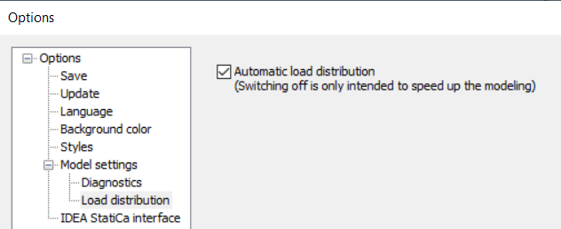

<!-- /wp:image -->

<!-- wp:paragraph -->

From _Consteel 17_ this function belongs to the **Model settings** category, together with the **Diagnostics.**

<!-- /wp:paragraph -->

<!-- wp:paragraph {"align":"justify"} -->

The **Automatic load distribution** can be switched off to increase the speed of modelling. In general, distribution of surface loads to bar members of the **Load Transfer Surfaces** is done automatically by the software and also the redistribution is immediate after any change on the model that indicates it. In case of large models with several LTS's, it can lead to slow model handling. By switching off automatic load distribution for the time of model adjustments, can speed up the process. Please note, that when the function is switched off, the **Distributed Line Loads** will not be valid any more in case of a change of the LTS or the surface load. As a consequence, analysis can not be run in this state of the model. A Diagnostic error will warn you on that. To update the loads according to the new model state, either check in the check-box or click on the Update button appearing with the Diagnostic error.

<!-- /wp:paragraph -->

<!-- wp:image {"align":"center","id":71253,"width":"510px","height":"auto","sizeSlug":"full","linkDestination":"none"} -->

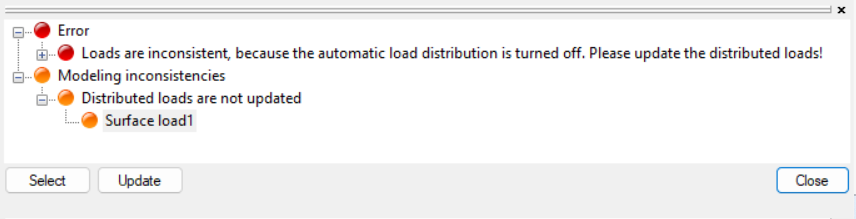

<!-- /wp:image -->

<!-- wp:paragraph -->

#### _**IDEA StatiCa Interface**_

<!-- /wp:paragraph -->

<!-- wp:image {"align":"center","id":27734,"width":403,"height":276,"sizeSlug":"full","linkDestination":"media"} -->

<!-- /wp:image -->

<!-- wp:paragraph {"editorskit":{"indent":60,"devices":false,"desktop":true,"tablet":true,"mobile":true,"loggedin":true,"loggedout":true,"acf_visibility":"","acf_field":"","acf_condition":"","acf_value":"","migrated":false,"unit_test":false}} -->

To establish the link between Consteel and IDEA Statica steel connection design software the installation path of IDEA has to be set in this section. See more:

<!-- /wp:paragraph -->

<!-- wp:heading {"level":4} -->

#### Standards menu

<!-- /wp:heading -->

<!-- wp:image {"align":"center","id":7050,"width":511,"height":339,"sizeSlug":"full","linkDestination":"media"} -->

<!-- /wp:image -->

<!-- wp:paragraph -->

The menu provides an opportunity to view the parameters of the existing standards and to create new ones in an easy way. The used standard can be chosen in the **_[File menu](#file-menu)_** - **_Model attribute_**.

<!-- /wp:paragraph -->

<!-- wp:paragraph -->

The first row of the Standard tree shows the applied standard which is stored in the model.

<!-- /wp:paragraph -->

<!-- wp:paragraph -->

For creating a new, user defined standard:

- Press the **New** button at the bottom left corner.

- Select one of the existing standards from the list.
   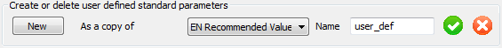
- Give a new name to your defined standard and click on the green checkmark.
- The parameters for the newly defined standard can now be changed.

The user defined standards are saved to the following file: C:\\Users\\%USERNAME%_\\Documents\\Consteel\\ver\\UserStandard.xml_ (Where "C" can be different according to the install drive and "ver" has to be changed to the actual Consteel version number (e.g.:14))

<!-- /wp:paragraph -->

<!-- wp:paragraph -->

<!-- /wp:paragraph -->

<!-- wp:heading {"level":4} -->

#### Help menu

<!-- /wp:heading -->

<!-- wp:paragraph -->

**Consteel 17**

<!-- /wp:paragraph -->

<!-- wp:image {"id":71616,"width":"415px","height":"auto","sizeSlug":"full","linkDestination":"none"} -->

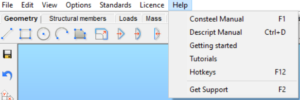

<!-- /wp:image -->

<!-- wp:paragraph -->

The menu is divided into two categories, distinguished by the longitudinal bar as shown in the picture. Information regarding the first part can be found below at **Consteel16.**

<!-- /wp:paragraph -->

<!-- wp:paragraph -->

In addition to the already existing functions, with the help of the **Getting Started** button, easy access to the software's YouTube page is possible. By pressing **Hotkeys**, a list of all the most important commands and their corresponding hotkeys will appear.

<!-- /wp:paragraph -->

<!-- wp:image {"id":71606,"width":"506px","height":"auto","sizeSlug":"full","linkDestination":"none"} -->

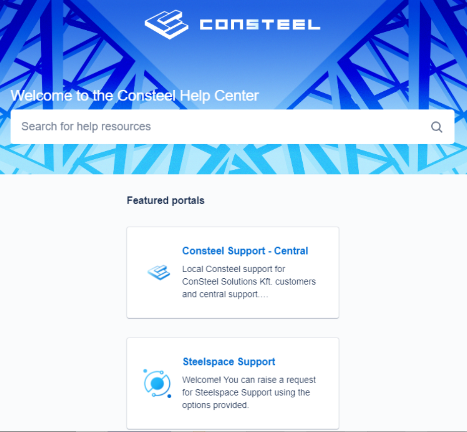

<!-- /wp:image -->

<!-- wp:paragraph -->

The second category can be accessed by clicking on **Get Support**. The online window opens, and two options will appear. Depending on the issue, users can choose either **Consteel Support-Central** or **Steelspace Support**.

<!-- /wp:paragraph -->

<!-- wp:paragraph -->

In the **Consteel support-center**, additional options will become available:

<!-- /wp:paragraph -->

- _Support Request_: The most general option when technical support engineers are needed.
- _Licensing, Protection, and Update Issues._
- _Feature Request_: For suggesting new features or improvements to existing ones.

**Steelspace support** is designed for the following purposes:

- To _get help_ with specific problems.
- To _report a bug_ when issues are experienced in Steelspace.
- _Feature request_ for suggesting new features or the development of existing ones.
- _Requesting more bandwidth_

<!-- wp:image {"id":71576,"width":"549px","height":"auto","sizeSlug":"full","linkDestination":"none"} -->

<!-- /wp:image -->

<!-- wp:image {"id":71626,"width":"544px","height":"auto","sizeSlug":"full","linkDestination":"none"} -->

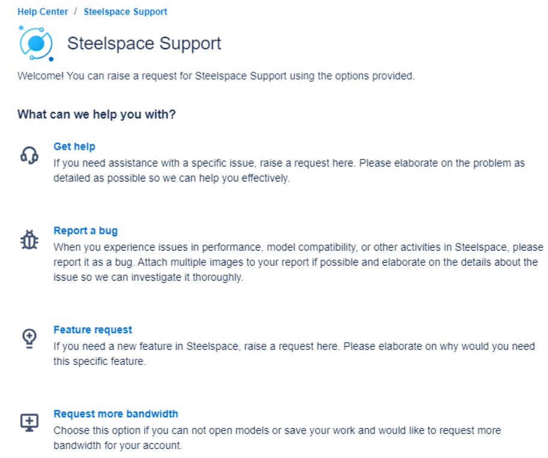

<!-- /wp:image -->

<!-- wp:paragraph -->

**Consteel 16**

<!-- wp:image {"align":"center","id":35575,"sizeSlug":"full","linkDestination":"none"} -->

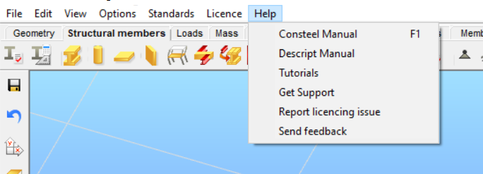

Help menu

<!-- /wp:image -->

<!-- wp:paragraph -->

(Only from version 15) The menu has been divided into two sections, the first includes links to the [Online Manual](../../manual/intro.md), to the [Descript Manual](../../descript/15_1_introduction/15_1_1_what-is-descript.md), and to a filtered selection of our [Knowledge Base](https://Consteelsoftware.com/knowledgebase/?search=&filters=366,367,399,392,375,372) with tutorials and guides. No need to login to our website as it will be done automatically through Consteel if you use it with online protection.

<!-- /wp:paragraph -->

<!-- wp:paragraph -->

The second section is for support-related requests. The “[Get Support](https://Consteel.atlassian.net/servicedesk/customer/portal/1/group/1/create/1)” command opens our Support system notification window to ask for help issues regarding Consteel. If you have trouble with licensing then you will need to click on the “[Report licensing issue](https://Consteel.atlassian.net/servicedesk/customer/portal/1/group/22)” command. We would like to hear your ideas regarding Consteel as well, so if you have any feedback, click on the “[Send feedback](https://Consteel.atlassian.net/servicedesk/customer/portal/1/group/23/create/60)” command and share your thoughts with us! Your email address will fill in automatically.

<!-- /wp:paragraph -->

<!-- wp:spacer -->

<!-- /wp:spacer -->

<!-- wp:heading {"level":3} -->

### The Tabs

<!-- /wp:heading -->

<!-- wp:paragraph -->

The tabs contain the systematically collected functions of modeling, analysis and design, leading the engineers through the logical steps of the structural design. The number of available functions depends on the version number of the currently used software. The pictures and descriptions below always correspond to the latest version of Consteel.

<!-- /wp:paragraph -->

<!-- wp:paragraph -->

By approaching any of the icons with the cursor, the short name of the function will be appeared.

<!-- /wp:paragraph -->

<!-- wp:heading {"level":4} -->

#### Geometry tab

<!-- /wp:heading -->

<!-- wp:image {"id":7064,"width":612,"height":54,"sizeSlug":"full","linkDestination":"none"} -->

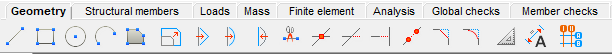

<!-- /wp:image -->

<!-- wp:paragraph -->

It contains all the important CAD drawing and modification functions as well as dimensioning and measuring tools.  
See the **_[Drawing Geometry](../../category/drawing-geometry)_** chapter for a detailed description of these functions.

<!-- /wp:paragraph -->

<!-- wp:heading {"level":4} -->

#### Structural members tab

<!-- /wp:heading -->

<!-- wp:image {"id":11438,"sizeSlug":"large","linkDestination":"media"} -->

[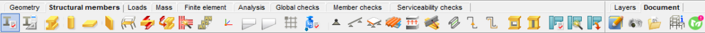](https://Consteelsoftware.com/wp-content/uploads/2021/04/Tab-struc-memb-v15.png)

<!-- /wp:image -->

<!-- wp:paragraph -->

All functions related to structural modeling are included here, such as cross-sections, members, plates and walls, frame corner wizard, diaphragm, and rigid body, supports, and connections, etc. The automatic members to plate conversion function can be also found here.  
See the **_[Structural modeling](../../category/structural-modeling)_** chapter for a detailed description of these functions.

<!-- /wp:paragraph -->

<!-- wp:heading {"level":4} -->

#### Loads tab

<!-- /wp:heading -->

<!-- wp:image {"id":7076,"sizeSlug":"large","linkDestination":"none"} -->

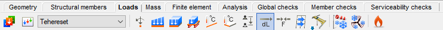

<!-- /wp:image -->

<!-- wp:paragraph -->

All functions related to creating loads can be found on this tab including load cases, load groups, combinations. The functions of meteorological load generation, crane and train load, and fire effect and protection can also be found here.  
See the **_[Structural loads](../6_0_structural-loads/6_1_load-cases-and-load-groups.md)_** chapter for a detailed description of these functions.

<!-- /wp:paragraph -->

<!-- wp:heading {"level":4} -->

#### Mass tab

<!-- /wp:heading -->

<!-- wp:image {"id":7082,"sizeSlug":"large","linkDestination":"none"} -->

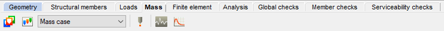

<!-- /wp:image -->

<!-- wp:paragraph -->

Mass cases, mass groups, point masses, response spectrums, and seismic effects can be created on the Mass tab. See the **_[Masses](../../category/masses)_** chapter for a detailed description of these functions.

<!-- /wp:paragraph -->

<!-- wp:heading {"level":4} -->

#### Finite element tab

<!-- /wp:heading -->

<!-- wp:image {"id":7094,"sizeSlug":"large","linkDestination":"none"} -->

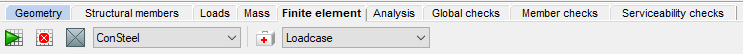

<!-- /wp:image -->

<!-- wp:paragraph -->

It contains functions connected with the finite element mesh generation and modification and a model check option indicating possible modeling mistakes.

<!-- /wp:paragraph -->

<!-- wp:heading {"level":4} -->

#### Analysis tab

<!-- /wp:heading -->

<!-- wp:image {"id":7106,"sizeSlug":"large","linkDestination":"none"} -->

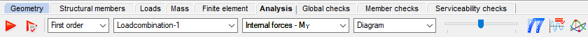

<!-- /wp:image -->

<!-- wp:paragraph -->

The types of structural analysis can be set and executed, the results can be viewed and labeled in various forms.  
See the **_[Structural analysis](../../category/structural-analysis)_** chapter for a detailed description of these functions.

<!-- /wp:paragraph -->

<!-- wp:heading {"level":4} -->

#### Global checks tab

<!-- /wp:heading -->

<!-- wp:paragraph -->

**Global checks tab**

<!-- /wp:paragraph -->

<!-- wp:paragraph -->

**Consteel 17**

<!-- /wp:paragraph -->

<!-- wp:image {"id":71596,"width":"682px","height":"auto","sizeSlug":"large","linkDestination":"none"} -->

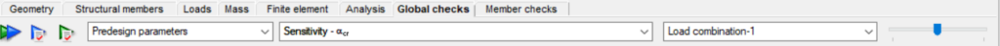

<!-- /wp:image -->

<!-- wp:image {"id":71656,"width":"279px","height":"auto","sizeSlug":"full","linkDestination":"none"} -->

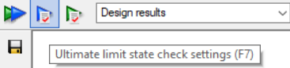

<!-- /wp:image -->

<!-- wp:image {"id":71668,"sizeSlug":"full","linkDestination":"none"} -->

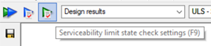

<!-- /wp:image -->

<!-- wp:paragraph -->

Starting from _Consteel 17_ The **Serviceability limit state check**, along with the **Ultimate limit state check** is included in the **Global checks** tab.

<!-- /wp:paragraph -->

<!-- wp:paragraph -->

Both verifications can be done separately by pressing their respective rows (the blue and the green), and together by clicking on the icon .

<!-- /wp:paragraph -->

<!-- wp:paragraph -->

For more detailed information, please visit the **_[Standard design](../../category/standard-design)_** chapter.

<!-- /wp:paragraph -->

<!-- wp:paragraph -->

**Consteel 16**

<!-- /wp:paragraph -->

<!-- wp:image {"id":7112,"sizeSlug":"large","linkDestination":"none"} -->

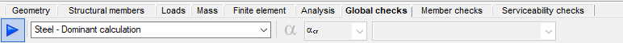

<!-- /wp:image -->

<!-- wp:paragraph -->

The Global checks tab contains the options and results of possible cross-sections checks as well as the global buckling standard checks.  
See the **_[Standard design](../../category/standard-design)_** chapter for a detailed description of these functions.

<!-- /wp:paragraph -->

<!-- wp:heading {"level":4} -->

#### Member checks tab

<!-- /wp:heading -->

<!-- wp:image {"id":7100,"sizeSlug":"large","linkDestination":"none"} -->

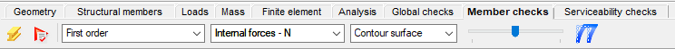

<!-- /wp:image -->

<!-- wp:paragraph -->

Steel member design related checks functions (buckling, lateral-torsional buckling, and interaction stability) and the composite beam design related functions can be found on the Member design tab.  
See the **_[Member checks](../9_0_standard-design/9_1_steel-design.md#member-checks)_** chapter for a detailed description of these functions.

<!-- /wp:paragraph -->

<!-- wp:heading {"level":4} -->

#### Serviceability checks tab

<!-- /wp:heading -->

<!-- wp:image {"id":7118,"sizeSlug":"large","linkDestination":"none"} -->

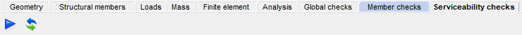

<!-- /wp:image -->

<!-- wp:paragraph -->

All serviceability related functions (horizontal and vertical deflection checks) can be found on the Serviceability checks tab.  
See the **_[Serviceability checks](../9_0_standard-design/9_4_serviceability-checks.md)_** chapter for a detailed description of these functions.

<!-- /wp:paragraph -->

<!-- wp:heading {"level":4} -->

#### Layers tab

<!-- /wp:heading -->

<!-- wp:image {"id":7124,"sizeSlug":"large","linkDestination":"none"} -->

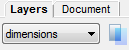

<!-- /wp:image -->

<!-- wp:paragraph -->

It provides functions for adjusting the layer properties. More info: **_[Layers](../4_0_drawing-geometry/4_4_layers.md)_**

<!-- /wp:paragraph -->

<!-- wp:heading {"level":4} -->

#### Document tab

<!-- /wp:heading -->

<!-- wp:paragraph -->

**Consteel 17**

<!-- /wp:paragraph -->

<!-- wp:image {"id":71636,"width":"166px","height":"auto","sizeSlug":"full","linkDestination":"none"} -->

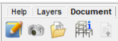

<!-- /wp:image -->

<!-- wp:paragraph -->

**Consteel 16**

<!-- /wp:paragraph -->

<!-- wp:image {"id":7130,"sizeSlug":"large","linkDestination":"none"} -->

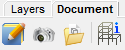

<!-- /wp:image -->

<!-- wp:paragraph -->

The functions of the Document tab allow the flexible creation of a detailed statical documentation and contain a model information tool.  
For detailed description see chapter: [_**Documentation**_](../13_0_documentation-2/13_1_the-document-tab.md)

<!-- /wp:paragraph -->

<!-- wp:heading {"level":4} -->

#### Help tab

<!-- /wp:heading -->

<!-- wp:paragraph -->

**Consteel 17**

<!-- /wp:paragraph -->

<!-- wp:image {"id":71646,"width":"181px","height":"auto","sizeSlug":"full","linkDestination":"none"} -->

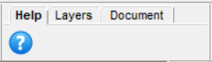

<!-- /wp:image -->

<!-- wp:paragraph -->

Clicking on the question mark icon provides access to the same Help page as described in the[ **Help menu.**](#help-menu)

<!-- /wp:paragraph -->

<!-- wp:paragraph -->

**Consteel 16**

<!-- /wp:paragraph -->

<!-- wp:image {"id":37353,"sizeSlug":"full","linkDestination":"none","className":"is-resized"} -->

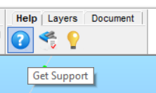

<!-- /wp:image -->

<!-- wp:paragraph -->

The Help tab is for the essential support-related requests like “Get Support”, “[Report licensing issue” ](https://Consteel.atlassian.net/servicedesk/customer/portal/1/group/22)and “[Send feedback](https://Consteel.atlassian.net/servicedesk/customer/portal/1/group/23/create/60)” to make posting support issues more convenient.

#### Load combination sets tab

Clicking on the icon provides access to the same Load combination sets window as described in the[ **Load combinations.**](../6_0_structural-loads/6_2_load-combinations.md#load-combination-sets)

### Side bar

<!-- /wp:heading -->

<!-- wp:paragraph -->

The side bar at the left of the main screen contains the mostly used functions for modeling.

<!-- /wp:paragraph -->

<!-- wp:paragraph -->

**Consteel 17**

<!-- /wp:paragraph -->

<!-- wp:paragraph -->

From Consteel 17, the **Copy** 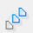 and **Move**  functions are now separated by two distinct buttons.

<!-- /wp:paragraph -->

<!-- wp:columns -->

<!-- wp:column {"verticalAlignment":"top","width":"10%"} -->

<!-- wp:image {"align":"right","id":7137,"width":"44px","height":"auto","sizeSlug":"full","linkDestination":"none","className":"is-resized"} -->

<!-- /wp:image -->

<!-- /wp:column -->

<!-- wp:column {"verticalAlignment":"center"} -->

<!-- wp:paragraph -->

_Save model/History_

<!-- /wp:paragraph -->

<!-- wp:paragraph -->

_Undo/Redo_

<!-- /wp:paragraph -->

<!-- wp:paragraph -->

_Settings for the coordinate system, and snapping grids_

<!-- /wp:paragraph -->

<!-- wp:paragraph -->

_Model views: **Top, Front, Side, Isometric, Perpendicular to raster**_

<!-- /wp:paragraph -->

<!-- wp:paragraph -->

_Line view visualization of the model_

<!-- /wp:paragraph -->

<!-- wp:paragraph -->

_Wireframe visualization of the model_

<!-- /wp:paragraph -->

<!-- wp:paragraph -->

_Hidden line view visualization of the model_

<!-- /wp:paragraph -->

<!-- wp:paragraph -->

_Solid view visualization of the model_

<!-- /wp:paragraph -->

<!-- wp:paragraph -->

_Move point and edge_

<!-- /wp:paragraph -->

<!-- wp:paragraph -->

_Move/Copy the selected objects_

<!-- /wp:paragraph -->

<!-- wp:paragraph -->

_Mirror the selected objects_

<!-- /wp:paragraph -->

<!-- wp:paragraph -->

_Rotate the selected objects_

<!-- /wp:paragraph -->

<!-- wp:paragraph -->

_Make a section (works on shell models only)_

<!-- /wp:paragraph -->

<!-- wp:paragraph -->

_Select all objects_

<!-- /wp:paragraph -->

<!-- wp:paragraph -->

_Deselect all objects_

<!-- /wp:paragraph -->

<!-- wp:paragraph -->

_Invert selection_

<!-- /wp:paragraph -->

<!-- wp:paragraph -->

_Select by properties_

<!-- /wp:paragraph -->

<!-- wp:paragraph -->

_Fit view (Ctrl+0)_

<!-- /wp:paragraph -->

<!-- /wp:column -->

<!-- /wp:columns -->

<!-- wp:paragraph -->

**Consteel 16**

<!-- /wp:paragraph -->

<!-- wp:spacer -->

<!-- /wp:spacer -->

<!-- wp:heading {"level":3} -->

### Descript panel (previously called 'csPI panel', before version 15)

<!-- /wp:heading -->

<!-- wp:image {"id":27682,"height":28,"sizeSlug":"full","linkDestination":"media"} -->

<!-- /wp:image -->

<!-- wp:paragraph {"align":"justify"} -->

At the bottom left of the screen, the **Descript** control panel can be found. **Descript** is a programming interface of Consteel, with which parametric models can be built. Almost all of the structural objects which can be found in Consteel can be created through Descript, and all of the parameters of these objects are available to set from Descript. Please see **[Chapter 16 Descript-Consteel Programming Interface](../../descript/15_1_introduction/15_1_1_what-is-descript.md)** to know more!

<!-- /wp:paragraph -->

<!-- wp:spacer -->

<!-- /wp:spacer -->

<!-- wp:heading {"level":3} -->

### Status bar

<!-- /wp:heading -->

<!-- wp:image {"align":"center","id":11096,"width":982,"height":25,"sizeSlug":"full","linkDestination":"media"} -->

<!-- /wp:image -->

<!-- wp:paragraph -->

The first field is a progress bar showing the progress of the actions.

<!-- /wp:paragraph -->

<!-- wp:paragraph -->

The next 3 icons on the status bar ( ) determine the interpretation of the manually entered coordinates during drawing/modeling operations. To enter a coordinate value click on the input box or press the corresponding key on the keyboard (“X, Y, Z, L” for the coordinate axis or a length into a direction, or “a, b, L” for polar coordinates). The user can change the interpretation of the manually entered values by clicking on these three icons. Each click changes the state of this switches:

<!-- /wp:paragraph -->

<!-- wp:paragraph {"editorskit":{"indent":40,"devices":false,"desktop":true,"tablet":true,"mobile":true,"loggedin":true,"loggedout":true,"acf_visibility":"","acf_field":"","acf_condition":"","acf_value":"","migrated":false,"unit_test":false}} -->

Coordinates can be entered in the  **Global** (GCS), or in the  **User** (UCS) coordinate system.

<!-- /wp:paragraph -->

<!-- wp:paragraph {"editorskit":{"indent":40,"devices":false,"desktop":true,"tablet":true,"mobile":true,"loggedin":true,"loggedout":true,"acf_visibility":"","acf_field":"","acf_condition":"","acf_value":"","migrated":false,"unit_test":false}} -->

The entered value can be an 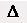 **Absolute** value measured from the origin of the coordinate system or a  **Relative** one measured from the  insertion point ( the yellow dot in the model space).

<!-- /wp:paragraph -->

<!-- wp:paragraph {"editorskit":{"indent":40,"devices":false,"desktop":true,"tablet":true,"mobile":true,"loggedin":true,"loggedout":true,"acf_visibility":"","acf_field":"","acf_condition":"","acf_value":"","migrated":false,"unit_test":false}} -->

Finally, coordinates can be entered in a 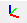 **Descartes**, or in a  **Polar** coordinate system.

<!-- /wp:paragraph -->

<!-- wp:paragraph -->

Even when using the Descartes coordinate system, it is possible to define a point by specifying a direction and a distance as follows. If you have already picked the first point e.g of a new structural beam, while approaching another point with your cursor in the model space, after typing “L” (lowercase), you can enter the length of your beam manually into the L field. By pressing the Enter key the beam will be created with the given length ("L" value) and the direction defined by the two points.

<!-- /wp:paragraph -->

<!-- wp:paragraph -->

By moving the slider (), the size representation of the objects can be changed. Clicking on it with the right mouse button the sizes can be changed individually by object types. The next four icons ( ) allow the sophisticated visibility adjustment. By approaching any of these icons with the cursor a group of graphic symbols will appear ordered into a matrix shape.

<!-- /wp:paragraph -->

<!-- wp:paragraph -->

Clicking the first icon on each of these four visibility setting matrix the scope of the settings will be changed between global () (valid for all tabs), or valid only for the current tab (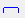). Changing this option on any of the 4 visibility matrixes, the selected scope will also change on all the other three accordingly. Changing this scope will also change the visibility between the previously adjusted global and the current tab visibility settings.

<!-- /wp:paragraph -->

<!-- wp:heading {"level":4} -->

#### **Sizing of objects**

<!-- /wp:heading -->

<!-- wp:image {"id":71276,"width":"113px","height":"auto","sizeSlug":"full","linkDestination":"none"} -->

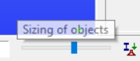

<!-- /wp:image -->

<!-- wp:paragraph -->

By right-clicking on the slider, the object dimensions window will open. In this window, the size of individual model objects can be changed.

<!-- /wp:paragraph -->

<!-- wp:image {"id":71266,"width":"313px","height":"auto","sizeSlug":"full","linkDestination":"none"} -->

<!-- /wp:image -->

<!-- wp:paragraph -->

You can also open the window from the View menu. For more information, visit the [View menu.](#viewmenu)

<!-- /wp:paragraph -->

<!-- wp:heading {"level":4} -->

#### Visibility options of graphic symbols

<!-- /wp:heading -->

<!-- wp:image {"id":27714,"sizeSlug":"full","linkDestination":"media"} -->

<!-- /wp:image -->

<!-- wp:paragraph -->

(Description of the switches in order from the upper left corner to the lower right.)

- Visibility of lines, created with line, circle and arc function of Geometry tab
- Visibility of structural members created with the beam or column function in the Structural members tab; switching these members to non-visible their centerlines might still be visible accordingly to the status of line visibility settings
- Visibility of hinges (end releases)
- Visibility of the 2D shapes; switching these 2D shapes to non-visible their surrounding lines might still be visible accordingly to the status of line visibility settings
- Visibility of the 3D objects (plates, slabs and walls); switching these 3D objects to non-visible the surrounding lines and 2D shape components might still be visible accordingly to the status of the visibility settings of lines and 2d shapes
- Visibility of supports
- Visibility of link elements
- Visibility of smart link elements
- Visibility of placed joints symbols
- Visibility of initial bow imperfection
- Visibility of shear fields
- Visibility of frame corners
- Visibility of loads
- Visibility of load transfer surfaces (LTS); switching these load transfer surfaces to non-visible their surrounding lines might still be visible accordingly to the setting of visibility of the lines
- Visibility of distributed representation of surface loads (by LTS loads)
- Visibility of masses
- Visibility of constraints
- Visibility of rigid bodies
- Visibility of diaphragms
- Visibility of purlin lines
- Visibility of stiffeners
- Visibility of cutouts

<!-- wp:heading {"level":4} -->

#### Visibility options of the grid and the local coordinate system (LCS)

<!-- /wp:heading -->

<!-- wp:image {"id":27720,"sizeSlug":"full","linkDestination":"media"} -->

<!-- /wp:image -->

<!-- wp:paragraph -->

(Description of the switches in order from the upper left corner to the lower right.)

- Visibility of the raster grid
- Visibility of the model grid
- Visibility of the LCS of 1D members (beams and columns)
- Visibility of the LCS of 2D members (plates, slabs and walls)
- Visibility of the LCS of supports
- Visibility of the LCS of spread footing
- Visibility of the LCS of link elements
- Visibility of the LCS of smart link elements
- Visibility of the LCS of the load transfer surfaces

<!-- wp:quote {"editorskit":{"indent":20,"devices":false,"desktop":true,"tablet":true,"mobile":true,"loggedin":true,"loggedout":true,"acf_visibility":"","acf_field":"","acf_condition":"","acf_value":"","migrated":false,"unit_test":false}} -->

> <!-- wp:paragraph -->
>
> **NOTE:**
>
> <!-- /wp:paragraph -->
>
> <!-- wp:paragraph -->
>
> _When the visibility of an object is off, also the local coordinate system of the object will be invisible!_
>
> <!-- /wp:paragraph -->

<!-- /wp:quote -->

<!-- wp:heading {"level":4} -->

#### Visibility options of object names

<!-- /wp:heading -->

<!-- wp:image {"id":27727,"sizeSlug":"full","linkDestination":"media"} -->

<!-- /wp:image -->

<!-- wp:paragraph -->

(Description of the switches in order from the upper left corner to the lower right.)

- Show finite element point numbering (visible only on the **Finite element** and **Analysis** tabs)
- Show bar member names
- Show shell member (plates, slabs and walls)
- Show support names
- Show hinges names (end releases)
- Show link element names
- Show smart link element names
- Show placed joint model names
- Show load transfer surface names
- Show shear field names
- Show reinforcement object names
- Show constraint names
- Show rigid body names
- Show diaphragm names
- Show purline line names
- Show stiffener names
- Show cutout names
- Show model grid names

<!-- wp:quote {"editorskit":{"indent":20,"devices":false,"desktop":true,"tablet":true,"mobile":true,"loggedin":true,"loggedout":true,"acf_visibility":"","acf_field":"","acf_condition":"","acf_value":"","migrated":false,"unit_test":false}} -->

> <!-- wp:paragraph -->
>
> **NOTE:**
>
> <!-- /wp:paragraph -->
>
> <!-- wp:paragraph -->
>
> _When the visibility of an object is off, also the name of it will be invisible!_
>
> <!-- /wp:paragraph -->

<!-- /wp:quote -->

<!-- wp:heading {"level":4} -->

#### Visibility options of labels

<!-- /wp:heading -->

<!-- wp:image {"id":7292,"width":115,"height":153,"sizeSlug":"full","linkDestination":"none"} -->

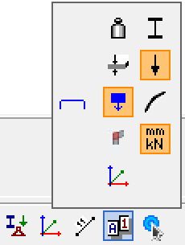

<!-- /wp:image -->

<!-- wp:paragraph -->

(Description of the switches in order from the upper left corner to the lower right.)

<!-- /wp:paragraph -->

<!-- wp:list {"className":"is-style-arrow"} -->

- Show material grades
- Show profile names
- Show the thickness of plates in mm
- Show the load intensity
- Show the masses
- Show initial bow imperfections
- Show the type of frame corners
- Show the units of quantities
- Show labels of the local coordinate systems

<!-- wp:heading {"level":4} -->

#### Object color setting

<!-- /wp:heading -->

<!-- wp:image {"id":11108,"sizeSlug":"large","linkDestination":"media"} -->

<!-- /wp:image -->

<!-- wp:list {"className":"is-style-arrow"} -->

- Colors of members according to the default settings (layer styles)
- Colors of members according to the section colors (see _**[Section administration](../10_0_section-module/10_1_section-modelling.md)**_ for information on how to change colors.)

<!-- wp:heading {"level":4} -->

#### Action point sets

<!-- /wp:heading -->

<!-- wp:image {"id":7298,"sizeSlug":"large","linkDestination":"none"} -->

<!-- /wp:image -->

<!-- wp:paragraph -->

The **Action point sets** offer a wide range of setting the point snapping functions.

<!-- /wp:paragraph -->

<!-- wp:paragraph -->

(Description of the switches in order from the upper left corner to the lower right.)

<!-- /wp:paragraph -->

<!-- wp:list {"className":"is-style-arrow"} -->

- Snapping the end points of graphical (lines, arcs) and structural (beams, columns) objects
- Switch divide function ON / OFF
  - ON
    - When the Divide snap mode is turned ON, a new field will appear on the status bar. There are 3 options for the divide snap point specification. The user can switch cyclically between them by clicking on the icon before the numeric field.>
      - The percentage of the length of the approached element will be calculated, and from its approached end this length will be measured by the snapping points. Usually, there is a rest distance at the end of the element
      - 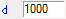A distance can be specified. This length will be measured by the snapping points from the approached end of the object. Usually, there is a rest distance at the end of the element
      - The number of divisions can be specified. The created snapping points are the intersection points of subdivided lengths. There is no rest distance at the end of the element

  - OFF: The field of division will disappear from the bottom status bar

- Snapping the intersection points of graphical (lines, circles, arcs) and structural (beams, columns) objects
- Snapping the parallel point to a linear object (Its use is recommended only for smaller models.)
- Snapping edges and line object
- Snapping the lengthened point of a linear object. The system is showing the actual distance of the snapping point in \[mm] from the endpoint of a linear element. The lengthening distance can be set in steps given in the last field of the status bar (see below).
- Snap to points.
- Snap to raster points.
- Snapping point to create a tangent of an Arc / Circle from one point
- Snapping point to create a perpendicular from one point to an object (Line or Arc/Circle )
- Snapping the Center point of Arc / Circle.

For snapping the center of linear elements, you have to use the appropriate settings of snap divided points, see above!

<!-- /wp:paragraph -->

<!-- wp:heading {"level":4} -->

#### Step field

<!-- /wp:heading -->

<!-- wp:paragraph -->

The last field of the Status bar is the STEP field. Here the given number in mm is the snapping distance towards the length direction of line and bar elements when the lengthening snapping point is ON.

<!-- /wp:paragraph -->

<!-- wp:image {"align":"center","id":7330,"width":274,"height":246,"sizeSlug":"full","linkDestination":"media"} -->

<!-- /wp:image -->

<!-- wp:spacer -->

<!-- /wp:spacer -->

<!-- wp:heading {"level":3} -->

### Side panel

<!-- /wp:heading -->

<!-- wp:paragraph -->

The visibility of the additional windows can be switched ON / OFF in the [_**View menu**_](#view-menu). Some of this windows is turned ON by default, and all of them has a default position that can be changed with drag&drop operations. The windows can be floating or docked to any side of the Consteel main window.

<!-- /wp:paragraph -->

<!-- wp:paragraph -->

**Consteel 17**

<!-- /wp:paragraph -->

<!-- wp:image {"id":71086,"width":"189px","height":"auto","sizeSlug":"full","linkDestination":"none"} -->

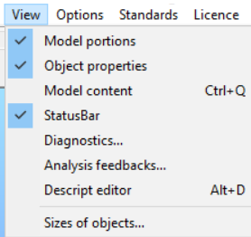

<!-- /wp:image -->

<!-- wp:paragraph -->

**Model Portions** tab

<!-- /wp:paragraph -->

<!-- wp:paragraph -->

The default position of the **Model portions** window is in the upper right corner. It is divided into **Custom portions** and **Auto portions.**

<!-- /wp:paragraph -->

<!-- wp:image {"id":71076,"width":"245px","height":"auto","sizeSlug":"full","linkDestination":"none"} -->

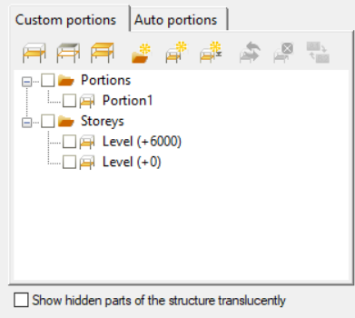

<!-- /wp:image -->

<!-- wp:paragraph -->

For detailed description see [**Model Views**](../3_0_model-view/3_1_model-views.md), and [**Portions Manager**](../3_0_model-view/3_3_portions-manager.md) chapters!

**Model Content** tab (Ctrl+Q)

<!-- /wp:paragraph -->

<!-- wp:image {"id":71066,"width":"266px","height":"auto","sizeSlug":"full","linkDestination":"none"} -->

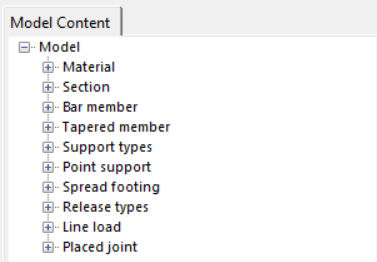

<!-- /wp:image -->

<!-- wp:paragraph -->

The **Model Content** tab contains all the predefined basic object types which can be used to build up a structural model.

<!-- /wp:paragraph -->

<!-- wp:paragraph -->

See more in the [**_Selection_**](../3_0_model-view/3_2_selection.md) chapter and at _Consteel 16._

<!-- /wp:paragraph -->

<!-- wp:paragraph -->

**Consteel 16**

<!-- /wp:paragraph -->

<!-- wp:image {"align":"center","id":71126,"width":"194px","height":"auto","sizeSlug":"full","linkDestination":"media"} -->

<!-- /wp:image -->

<!-- wp:heading {"level":4} -->

#### Object tree window

<!-- /wp:heading -->

<!-- wp:paragraph -->

The default position of the Object tree window is in the upper right corner. It contains two tabs:

<!-- /wp:paragraph -->

<!-- wp:paragraph {"editorskit":{"indent":60,"devices":false,"desktop":true,"tablet":true,"mobile":true,"loggedin":true,"loggedout":true,"acf_visibility":"","acf_field":"","acf_condition":"","acf_value":"","migrated":false,"unit_test":false}} -->

**Model Content** tab

<!-- /wp:paragraph -->

<!-- wp:image {"align":"center","id":7342,"sizeSlug":"full","linkDestination":"media","className":"is-resized"} -->

<!-- /wp:image -->

<!-- wp:paragraph {"editorskit":{"indent":60,"devices":false,"desktop":true,"tablet":true,"mobile":true,"loggedin":true,"loggedout":true,"acf_visibility":"","acf_field":"","acf_condition":"","acf_value":"","migrated":false,"unit_test":false}} -->

By default, the Model Content tab contains all the predefined basic object types which can be used to build up a structural model. While modeling, each new object (materials, sections, loads, members, supports etc.) will appear in the tree object structure in the appropriate group. Selecting any of the objects, it will be highlighted (selected) in the model graphic. Multiple selections of objects are possible in this tree. See more in the [**_Selection_**](../3_0_model-view/3_2_selection.md) chapter.

<!-- /wp:paragraph -->

<!-- wp:paragraph {"editorskit":{"indent":60,"devices":false,"desktop":true,"tablet":true,"mobile":true,"loggedin":true,"loggedout":true,"acf_visibility":"","acf_field":"","acf_condition":"","acf_value":"","migrated":false,"unit_test":false}} -->

**Portions Manager** tab

<!-- /wp:paragraph -->

<!-- wp:image {"align":"center","id":7354,"sizeSlug":"large","linkDestination":"media"} -->

<!-- /wp:image -->

<!-- wp:paragraph {"editorskit":{"indent":60,"devices":false,"desktop":true,"tablet":true,"mobile":true,"loggedin":true,"loggedout":true,"acf_visibility":"","acf_field":"","acf_condition":"","acf_value":"","migrated":false,"unit_test":false}} -->

For detailed description see [**Model Views**](../3_0_model-view/3_1_model-views.md), and [**Portions Manager**](../3_0_model-view/3_3_portions-manager.md) chapters!

<!-- /wp:paragraph -->

<!-- wp:spacer -->

<!-- /wp:spacer -->

<!-- wp:heading {"level":4} -->

#### Diagnostic window

<!-- /wp:heading -->

<!-- wp:paragraph -->

**Consteel 17**

<!-- /wp:paragraph -->

<!-- wp:image {"id":71427,"width":"536px","height":"auto","sizeSlug":"full","linkDestination":"none"} -->

<!-- /wp:image -->

<!-- wp:paragraph -->

In addition to the already existing error messages starting from Consteel 17, the orange-coloured error message will appear.

<!-- /wp:paragraph -->

<!-- wp:paragraph -->

This type of error occurs when the **automatic load distribution** is turned off. To update the loads according to the new model state, either check in the check-box or click on the **Update** button that appearing with the Diagnostic error.

<!-- /wp:paragraph -->

<!-- wp:paragraph -->

For more information, please go to Options>[Load Distribution.](#loads-tab)

<!-- /wp:paragraph -->

<!-- wp:paragraph -->

**Consteel 16**

<!-- /wp:paragraph -->

<!-- wp:paragraph -->

In the case of geometrical or modeling mistakes (like overlapping two or more objects, missing supports, etc..), the _Diagnostic_ window switches ON automatically listing problematic objects in a tree structure.

<!-- /wp:paragraph -->

<!-- wp:image {"align":"center","id":7336,"sizeSlug":"full","linkDestination":"media","className":"is-resized"} -->

<!-- /wp:image -->

<!-- wp:paragraph -->

The first type of diagnostic result is the **error** messages appearing in **red** color.

<!-- /wp:paragraph -->

<!-- wp:paragraph -->

The second type of diagnostic result is **possible errors** in **yellow** color.

<!-- /wp:paragraph -->

<!-- wp:paragraph -->

By clicking on any of the object names in the tree structure, and pressing the Select button, the object will be selected and highlighted in the model and the properties of it will be displayed as well in the Object properties window (see below). You can select more objects at the same time by clicking their name while pressing the Shift or Ctrl key or you can select a whole group of objects by clicking on the problem description.

<!-- /wp:paragraph -->

<!-- wp:paragraph -->

The selected object can be erased by pressing the Delete button at the bottom of the Diagnostic window or using the Delete key on the keyboard.

<!-- /wp:paragraph -->

<!-- wp:spacer -->

<!-- /wp:spacer -->

<!-- wp:heading {"level":4} -->

#### Object properties window

<!-- /wp:heading -->

<!-- wp:paragraph -->

**Consteel 17**

<!-- /wp:paragraph -->

<!-- wp:image {"id":71386,"width":"260px","height":"auto","sizeSlug":"full","linkDestination":"none"} -->

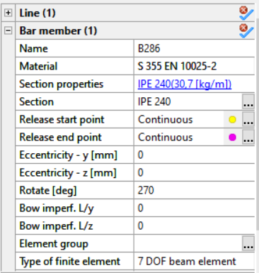

<!-- /wp:image -->

<!-- wp:paragraph -->

In the **Object properties** Tab (located by default on the bottom right side of the window) the start and end points of the elements can be identified, they are marked with yellow and magenta.

<!-- /wp:paragraph -->

<!-- wp:image {"id":71376,"width":"264px","height":"auto","sizeSlug":"full","linkDestination":"none"} -->

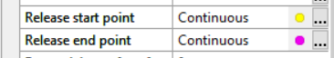

<!-- /wp:image -->

<!-- wp:paragraph -->

To increase the size of the coloured point in the model, go to the **view panel**, **object dimensions,** and change it from the **local system**, as shown in the picture below:

<!-- /wp:paragraph -->

<!-- wp:image {"id":71396,"width":"427px","height":"auto","sizeSlug":"full","linkDestination":"none"} -->

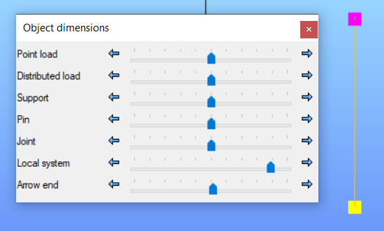

<!-- /wp:image -->

<!-- wp:paragraph -->

**Consteel 16**

<!-- /wp:paragraph -->

<!-- wp:paragraph -->

By selecting one object in the model space all the relevant properties will appear in this window (#1). The values of the parameters can be overviewed and in most cases, these parameters can be changed.

<!-- /wp:paragraph -->

<!-- wp:image {"align":"center","id":11123,"sizeSlug":"full","linkDestination":"media","className":"is-resized"} -->

<!-- /wp:image -->

<!-- wp:paragraph -->

All selected objects (and sub-object) appear in the table. Selecting different types of objects (e.g. members and supports) the objects will be shown in groups. By expanding any of the groups all of the object's parameters can be seen and modified if possible. In the case of multiple selections, a replacement value ("different") will be displayed for different values. However, the different ones can also be changed. In this case, the new value will be applied to all of the selected objects.

<!-- /wp:paragraph -->

<!-- wp:paragraph -->

With the unselect button () the previously selected object type can be removed from the selection.

<!-- /wp:paragraph -->
