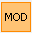

# Drawing

The functions for the drawing described below are collected on the Geometry tab.

<!-- /wp:paragraph -->

<!-- wp:image {"id":8440,"sizeSlug":"full","linkDestination":"media"} -->

<!-- /wp:image -->

<!-- wp:paragraph -->

**Draw line**

<!-- /wp:paragraph -->

<!-- wp:paragraph -->

 Simple line drawing. First, select the start point, then select the endpoint.

<!-- /wp:paragraph -->

<!-- wp:paragraph -->

 Polyline drawing. First, select the start point, then select the next points. Press Esc to interrupt line drawing.

<!-- /wp:paragraph -->

<!-- wp:paragraph -->

**Draw rectangle with lines**

<!-- /wp:paragraph -->

<!-- wp:paragraph -->

 Draw rectangle. Select the first corner point, then select the opposite corner.

<!-- /wp:paragraph -->

<!-- wp:paragraph -->

 Draw a leaning rectangle in the space. Select the first corner point, then select the endpoint of the first edge of the rectangle. At last, select the third point of the rectangle.

<!-- /wp:paragraph -->

<!-- wp:paragraph -->

**Draw Circle**

<!-- /wp:paragraph -->

<!-- wp:paragraph -->

 Draw circle by radius. Select the center point of the circle, then select the end point of the radius. The circle will be created in the plane containing the center point and parallel to the actual _UCS_.

<!-- /wp:paragraph -->

<!-- wp:paragraph -->

 Draw circle by diameter. Select the start point, then select the endpoint. The circle can be created out of the actual _UCS_ system.

<!-- /wp:paragraph -->

<!-- wp:paragraph -->

 Draw circle by 3 points. Select the first point, then select the second and the third point. The circle will be created in the plane defined by the three definition points.

<!-- /wp:paragraph -->

<!-- wp:paragraph -->

**Draw Arc**

<!-- /wp:paragraph -->

<!-- wp:paragraph -->

Arcs could be created out of the actual _UCS_.

<!-- /wp:paragraph -->

<!-- wp:paragraph -->

 Draw arc by center-point, start point, and angle. First, select the center of the arc, then select the start point. At last, select the angle of the arc or enter it manually in the dialog window.

<!-- /wp:paragraph -->

<!-- wp:paragraph -->

 Draw arc by 3 points. Select the first point, then select the endpoint of the arc. At last, select the third point on the arc.

<!-- /wp:paragraph -->

<!-- wp:paragraph -->

 Draw arc by a start point, endpoint and tangent. First, select the start point, then the endpoint. Select another point of the tangent, at last.

<!-- /wp:paragraph -->

<!-- wp:paragraph -->

**Draw two-dimensional plane elements**

<!-- /wp:paragraph -->

<!-- wp:paragraph -->

 Draw a two-dimensional plane element. Define the geometry of the plane element.

<!-- /wp:paragraph -->

<!-- wp:paragraph -->

 Draw hole. Select the plane element. Define the geometry of the hole (Rectangle, closed polyline, or circle).

<!-- /wp:paragraph -->

<!-- wp:paragraph -->

 Edit a plate element.

<!-- /wp:paragraph -->

<!-- wp:paragraph {"editorskit":{"indent":40,"devices":false,"desktop":true,"tablet":true,"mobile":true,"loggedin":true,"loggedout":true,"acf_visibility":"","acf_field":"","acf_condition":"","acf_value":"","migrated":false,"unit_test":false}} -->

_The editing modes of a plate element:_

<!-- /wp:paragraph -->

<!-- wp:paragraph {"editorskit":{"indent":40,"devices":false,"desktop":true,"tablet":true,"mobile":true,"loggedin":true,"loggedout":true,"acf_visibility":"","acf_field":"","acf_condition":"","acf_value":"","migrated":false,"unit_test":false}} -->

 Add a new point to the plane element by breaking the edge. To do this, you need to select the desired edge and then enter the location of the new point.

<!-- /wp:paragraph -->

<!-- wp:paragraph {"editorskit":{"indent":40,"devices":false,"desktop":true,"tablet":true,"mobile":true,"loggedin":true,"loggedout":true,"acf_visibility":"","acf_field":"","acf_condition":"","acf_value":"","migrated":false,"unit_test":false}} -->

 Delete a point or an arc section of a plane element. In both cases, after deletion, a straight edge is created between adjacent corner points.

<!-- /wp:paragraph -->

<!-- wp:paragraph -->

 Change the direction of the local “x” axes of a plane element by defining two points.  
Select the surface. Select the start point. Set the direction with the second point.

<!-- /wp:paragraph -->

<!-- wp:paragraph -->

**The construction modes of the plane elements:**

<!-- /wp:paragraph -->

<!-- wp:paragraph -->

The construction mode of a rectangle-type plane element can be selected: rectangle or leaning rectangle.

<!-- /wp:paragraph -->

<!-- wp:paragraph -->

 The construction mode of a circular type of the plane element can be selected: draw a circle by radius, by diameter, or circle by 3 points.

<!-- /wp:paragraph -->

<!-- wp:paragraph -->

 Draw polygon (a closed polyline). Set the first point. Set the next points. Close the polygon by a right-click on the mouse.

<!-- /wp:paragraph -->

<!-- wp:paragraph -->

 Select the lines that make up the surface. The ends of the lines should not extend beyond the corners

<!-- /wp:paragraph -->
