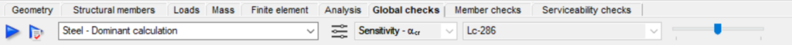

# Steel design

Steel design related functions can be found on the Global checks and the Member checks tabs.

<!-- /wp:paragraph -->

<!-- wp:spacer -->

<!-- /wp:spacer -->

<!-- wp:heading {"level":3} -->

### Global checks

<!-- /wp:heading -->

<!-- wp:heading {"level":4} -->

#### Basics

<!-- /wp:heading -->

<!-- wp:paragraph -->

<!-- /wp:paragraph -->

<!-- wp:image {"align":"left","id":46154,"width":"861px","height":"auto","sizeSlug":"large","linkDestination":"none"} -->

<!-- /wp:image -->

<!-- wp:paragraph -->

<!-- /wp:paragraph -->

<!-- wp:paragraph -->

<!-- /wp:paragraph -->

<!-- wp:paragraph -->

Cross-section and global buckling checks (according to the Section 6.3.4 (General method) of EN 1993-1-1) which are independent of any specific member parameter can be fully automatically evaluated on the global checks tab.

<!-- /wp:paragraph -->

<!-- wp:paragraph -->

Design settings are available by clicking on the  icon (or F7).

<!-- /wp:paragraph -->

<!-- wp:paragraph -->

When selecting the  icon (or F8), the global checks will run with the previously saved settings.

<!-- /wp:paragraph -->

<!-- wp:paragraph -->

As basic settings the analysis result type (first or second order) should be selected and the load combinations which should be evaluated.

<!-- /wp:paragraph -->

<!-- wp:paragraph -->

<!-- /wp:paragraph -->

<!-- wp:paragraph {"fontSize":"medium"} -->

#### Cross section check

<!-- /wp:heading -->

<!-- wp:image {"align":"center","id":10529,"sizeSlug":"full","linkDestination":"media"} -->

<!-- /wp:image -->

<!-- wp:paragraph -->

Cross-section check can be done according to the EN 1993-1-1 6.2 or EN 1993-1-2 4.2 (if the combination contains fire effect).

<!-- /wp:paragraph -->

<!-- wp:paragraph -->

Check can be performed for the whole model or partial model.

<!-- /wp:paragraph -->

<!-- wp:paragraph -->

Used safety factor can be selected. If it is necessary γM1 can be used instead of γM0 by clicking on the checkbox.

<!-- /wp:paragraph -->

<!-- wp:paragraph -->

If the model also includes cold-formed sections, their cross-sectional dimensioning according to EN 1993-1-3 can be performed only, if the check box on the Set Design parameters window is checked.

<!-- /wp:paragraph -->

<!-- wp:image {"align":"center","id":10535,"width":685,"height":54,"sizeSlug":"full","linkDestination":"media"} -->

<!-- /wp:image -->

<!-- wp:heading {"level":4} -->

#### Stable length check

<!-- /wp:heading -->

<!-- wp:paragraph -->

According to the Eurocode (1993-1-1 BB3), stable length check can be defined using the results of a plastic hinge analysis. During the calculation, the distance between the plastic hinge and the nearest lateral (Lub) or torsional restraint (Lm, Ls) is being compared with the calculated stable length of the corresponding plastic segment. If the stable length of a plastic segment is bigger than the distance between the plastic hinge and the lateral/torsional restraint, lateral torsional buckling of the member can be neglected.

<!-- /wp:paragraph -->

<!-- wp:paragraph -->

During the stable length check, the following checks are performed by Consteel:

1. Automatic recognition of the plastic hinges on the structure

2. Searching for the nearest supports of each plastic hinges

   - Lateral restraint
 
   - Torsional restraint

3. Defining the distance between the plastic hinge and the nearest supports

4. Calculating the stable length (depending on the type of the support) for the plastic segments, between the plastic hinge and the nearest supports

On the elastic segments global stability resistance will be evaluated according to the General method of Eurocode.

#### Buckling check

Buckling check can be evaluated for steel structures according to the EN 1993-1-1 6.3.4.

$$
\frac{\chi_{op}*\alpha_{ult,k}}{\gamma_{M1}}\geq 1,0
$$

<!-- /wp:image -->

<!-- wp:paragraph -->

To run the buckling check, it is required to have buckling analysis results.

For the buckling check the following parameters can be set:

- Elastic critical load factor acr,op: eigenvalue of the buckling analysis. It can be the first or the selected eigenvalue according to the design situation or can be automatically selected for each members based on the results of the sensitivity analysis.

Eigenvalue can be selected on the Analysis tab to click in the model area with right click.

- Ultimate resistance factor ault,k: reciprocal of utilization calculated with characteristic resistances of axial force and strong axial bending dominant in terms of loss of stability. Value of the utilization can be considered by members or by the model portion.

$$
\overline{\lambda _{op}}=\sqrt{\frac{\alpha _{ult,k}}{\alpha _{cr,op}}}
$$

- Reduction factor cop: reduction factor for the lop slenderness. It can be determined from the minimum of (c,cLT) or from the interpolated value of (c,cLT).

Check can be performed for the whole model or partial model.

#### Results

The results of the performed checks are demonstrated with graphical visualization and result tables (for the general functionality of tables used in _Consteel_ see section 1.4 General functions for tables).

The shown results can be changed in the drop down menu.

When moving the mouse along the structural elements the result markers continuously appear showing the actual utilization.

<!-- /wp:paragraph -->

<!-- wp:paragraph -->

The detail of the results can be seen in the Section module (see section 10 Section module). Section module can be opened directly from the Global checks tab to click on the proper cross section on the model area or in the result table with right click.

<!-- /wp:paragraph -->

<!-- wp:spacer -->

<!-- /wp:spacer -->

<!-- wp:heading {"level":3} -->

### Member checks

<!-- /wp:heading -->

<!-- wp:heading {"level":4} -->

#### Basics

<!-- /wp:heading -->

<!-- wp:image {"align":"center","id":10565,"sizeSlug":"full","linkDestination":"media"} -->

<!-- /wp:image -->

<!-- wp:paragraph -->

All steel member design related functions can be found on the Member design tab.

<!-- /wp:paragraph -->

<!-- wp:paragraph -->

The following parts of the Eurocode 3 (EN 1993-1-1) can be evaluated:

<!-- /wp:paragraph -->

<!-- wp:paragraph -->

6.3.1 Uniform members in compression

<!-- /wp:paragraph -->

<!-- wp:paragraph -->

6.3.2 Uniform members in bending

<!-- /wp:paragraph -->

<!-- wp:paragraph -->

6.3.3 Uniform members in bending and axial compression

<!-- /wp:paragraph -->

<!-- wp:heading {"level":4} -->

#### Individual Member Design

<!-- /wp:heading -->

<!-- wp:paragraph -->

To run steel member design go to Member checks tab and select Steel tab in the table at the bottom of the screen. First the members have to be selected and then added to the list. It can be performed by clicking on the Add button. After that one member has to be chosen and Select button is clicked.

<!-- /wp:paragraph -->

<!-- wp:image {"align":"center","id":10571,"width":700,"height":94,"sizeSlug":"full","linkDestination":"media"} -->

<!-- /wp:image -->

<!-- wp:paragraph -->

If a member is selected, the corresponding row highlighted with green and analysis results are automatically loaded. Member design can be run if there is analysis result (first and second order) and cross check for the member. Same like in the analysis the type of the result view can be set by three drop down menus.

<!-- /wp:paragraph -->

<!-- wp:image {"align":"center","id":10577,"sizeSlug":"full","linkDestination":"media"} -->

<!-- /wp:image -->

<!-- wp:paragraph -->

Special analysis can be run by clicking on the second icon (#1). Only one load combination can be selected at the same time. Buckling and lateral torsional buckling analysis is performed just for the selected member. If the normal force is negligible then no buckling analysis can be run. On the basis of these special analysis, _Consteel_ can determine the factors (effective length factors, warping factor etc.) for the buckling and the lateral-torsion buckling design.

<!-- /wp:paragraph -->

<!-- wp:image {"align":"center","id":10583,"width":487,"height":299,"sizeSlug":"full","linkDestination":"media"} -->

<!-- /wp:image -->

<!-- wp:paragraph -->

The next step is to choose the load combination and design type from the options: pure cases (strong axis buckling, weak axis buckling, lateral-torsional buckling) and interaction stability (interaction of buckling and lateral torsional buckling, interaction of buckling and bending, interaction of lateral-torsional buckling and bending). The dominant load combination is automatically selected and marked with a \* symbol.

<!-- /wp:paragraph -->

<!-- wp:image {"align":"center","id":10589,"width":350,"height":419,"sizeSlug":"full","linkDestination":"media"} -->

<!-- /wp:image -->

<!-- wp:paragraph -->

Depending on the member not all checks can be performed. If the normal force is negligible then strong or weak axis buckling design cannot be run.

<!-- /wp:paragraph -->

<!-- wp:paragraph -->

If **strong or weak axis buckling option** is selected then first the design parameters has to be set. The program automatically identifies the supports which could have effect on the buckling check.

<!-- /wp:paragraph -->

<!-- wp:image {"align":"center","id":10595,"width":605,"height":414,"sizeSlug":"full","linkDestination":"media"} -->

<!-- /wp:image -->

<!-- wp:paragraph -->

Among the supports the member is divided to segments. Segments can also be turned off in order not to calculate them during the analysis. The design parameters can be individually set for each segment by clicking on the three dots icon.

<!-- /wp:paragraph -->

<!-- wp:image {"align":"center","id":10601,"width":377,"height":275,"sizeSlug":"full","linkDestination":"media"} -->

<!-- /wp:image -->

<!-- wp:paragraph -->

The actual segment is highlighted with green. There are two options to set the design parameters: set the effective length factor manually by typing in the appropriate value or by choosing the right critical load multiplier. The second option is possible if the special analysis has already been run. In both cases the elastic critical axial force is automatically calculated.

<!-- /wp:paragraph -->

<!-- wp:paragraph -->

If all the design parameters has been properly set then design check can be performed by clicking on the Check button. Results will be displayed.

<!-- /wp:paragraph -->

<!-- wp:image {"align":"center","id":10607,"width":347,"height":511,"sizeSlug":"full","linkDestination":"media"} -->

<!-- /wp:image -->

<!-- wp:paragraph -->

There are three drop down menus in order to view different results. The first one can be used to change member, the second one is to change load combinations and the third one is to change the buckling case. The corresponding case is highlighted with green in the image. A short explanation can be read in the bottom when any of the rows is selected.

<!-- /wp:paragraph -->

<!-- wp:paragraph -->

**Lateral torsional buckling design** is more or less the same as the buckling design in _Consteel_ usage, there are only small differences. New cases can be defined and unnecessary cases can be deleted. For each segment start and end node can be set.

<!-- /wp:paragraph -->

<!-- wp:image {"align":"center","id":10613,"width":532,"height":440,"sizeSlug":"full","linkDestination":"media"} -->

<!-- /wp:image -->

<!-- wp:paragraph -->

By clicking on the three dots button the design parameters can be altered. The elastic critical bending moment can be calculated from the analytic formula or from the critical load multiplier. When the first method is used the factors can be typed in or a special automatic C factor calculator can be used by clicking on the AutoC button. The second option is to choose the corresponding critical load multiplier from the list.

<!-- /wp:paragraph -->

<!-- wp:image {"align":"center","id":10619,"width":345,"height":352,"sizeSlug":"full","linkDestination":"media"} -->

<!-- /wp:image -->

<!-- wp:paragraph -->

**Interaction stability** **design** goes through the steps of the pure cases.

<!-- /wp:paragraph -->

<!-- wp:paragraph -->

After the check is made the state of the member in the list at the bottom changes to ‘Examined’ from ‘Unexamined’.

<!-- /wp:paragraph -->

<!-- wp:heading {"level":4} -->

#### Member Group Design

<!-- /wp:heading -->

<!-- wp:paragraph -->

By using the Select (+) button it is possible to select more members for the member design. Select (-) can be used for remove members from the selection. Member group design works nearly the same as individual member design there are just minor differences. No special analysis can be run in member group design therefore the critical load factor cannot be selected.

<!-- /wp:paragraph -->

<!-- wp:paragraph -->

If the members are selected then the next step is to select the design type and set the design parameters, then click Check button similar to the individual member design.

<!-- /wp:paragraph -->

<!-- wp:image {"align":"center","id":10625,"width":346,"height":503,"sizeSlug":"full","linkDestination":"media"} -->

<!-- /wp:image -->

<!-- wp:paragraph -->

For each load combination member design can be turned off. It is important to know that not all the design options can be run for all members in load combinations. It depends on the analysis result.

<!-- /wp:paragraph -->

<!-- wp:paragraph -->

In the results tab the dominant member is automatically shown. The number next to the member number shows the capacity.

<!-- /wp:paragraph -->

<!-- wp:image {"align":"center","id":10517,"width":354,"height":734,"sizeSlug":"full","linkDestination":"media"} -->

<!-- /wp:image -->
