# Converter for AXISVM'

## 1. AxisVM Plugin Installation: A Step-by-Step Guide

To utilize the import feature initially, users are required to install the AXISVM plugin. This plugin can be accessed via the Consteel website under the 'Downloads' section. Within the plugins category, select 'Consteel 17' and proceed to download the 'Consteel Converter for AXISVM' plugin.

Starting from Consteel 17 and AXISVM X7, the Plugin is compatible. For older Consteel versions, it's possible to open the converted .smadsteel files from AXISVM, but the Import log will not appear. For older AXISVM versions, we cannot guarantee proper functioning. The variation of AXISVM API can influence the quality of the import.

After downloading the plugin .exe file, ensure that you install it in the same directory where the AXISVM program file is located. Press ‘Next’.

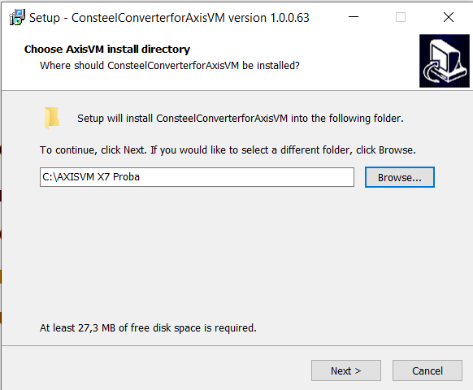

In the subsequent window, users can verify whether the installation location settings point to the correct folder. If everything appears correct, users can proceed with the installation by clicking 'Install' and then 'Finish' on the following window.

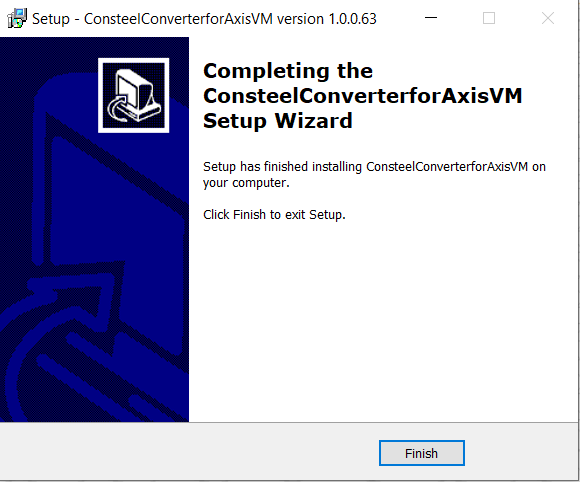

If the installation was successful, upon opening the AXISVM program, users can locate the 'Consteel Converter 1.0.0' option under the 'Plugins' tab.

## 2. Converting AXISVM Models to Consteel

By utilizing the 'Consteel Converter 1.0.0' option, users can export the created model into a .smadsteel file format, which is compatible with Consteel. Users have the flexibility to convert either the entire model or only selected members. If opting for selected member conversion, users must make their selections prior to initiating the Consteel conversion process.

Next, users can specify the file name in the adjacent field, followed by appending the file type '.smadsteel'. This format ensures compatibility with Consteel. Additionally, users can designate the export path by browsing and selecting the desired folder.

In the final checkbox, users can choose whether to automatically open the folder containing the exported file after completion. Finally, clicking 'Export' initiates the process.

It's important to note that a model can only be exported once after it has been saved or opened. If users wish to export it again, the model should be closed and reopened.

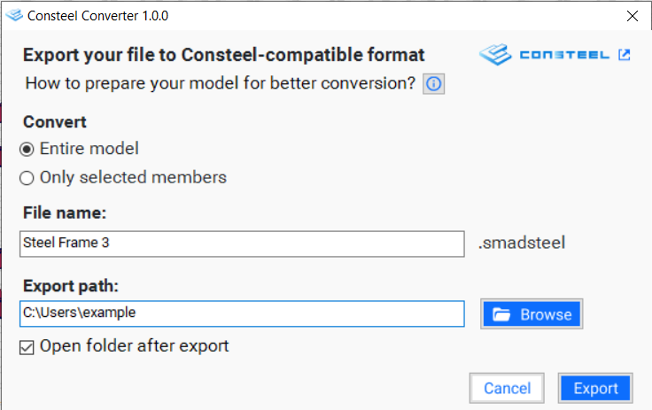

## 3.Opening and Diagnosing a New Model

After the conversion process is completed, the file can be opened in Consteel. Users have the option to open it immediately after launching Consteel by selecting 'Open from Computer'. Alternatively, if Consteel is already open with a different model, users can access the 'Open from Computer' option from the File tab or use the shortcut Ctrl+O to open the converted file.

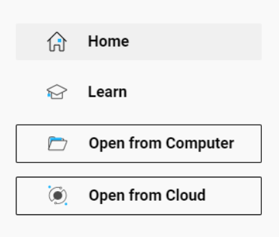

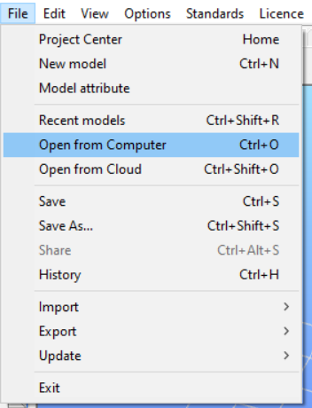

Consteel files are typically saved with the extension .csm, which stands for ConSteel Model. However, since we are working with files transformed from AXISVM, we need to select the .smadsteel format. Locate the file that was just converted from AXISVM and select it.

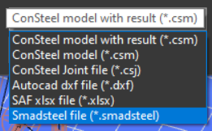

After selecting the .smadsteel file, the 'Create a new model' window will appear. Despite already being saved as an .smadsteel file, ConSteel will utilize the information within to generate a new model in the .csm file format. Within this window, users have the option to modify the model's name, description, and, most importantly, specify the design standard and language for names. In the end, press ‘OK’.

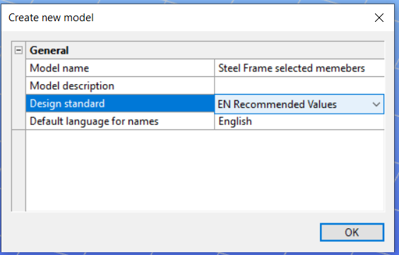

Within the Document tab, the Import Log button is active only when an .smadsteel file has been imported but not yet saved. Once the file is saved, its format changes to .csm, and the Import Log button becomes inactive.

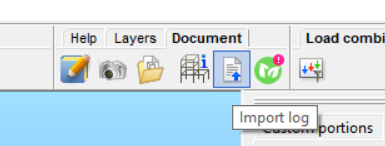

In the Import Objects list, three types of signs are used to indicate the import status:

- **green** signifies a successful import with no issues in that category.
- **orange** warns users of potential missing attributes.
- **red**indicates that the program couldn’t recognize certain elements, necessitating manual specification.

The import log provides detailed information regarding structural, sections, material, load, and geometry-related problems encountered during the import process. It helps users to identify elements; by selecting them in the import log, they will be selected in the model.

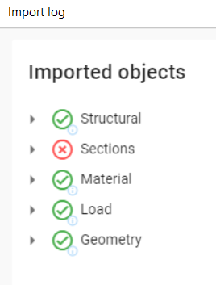

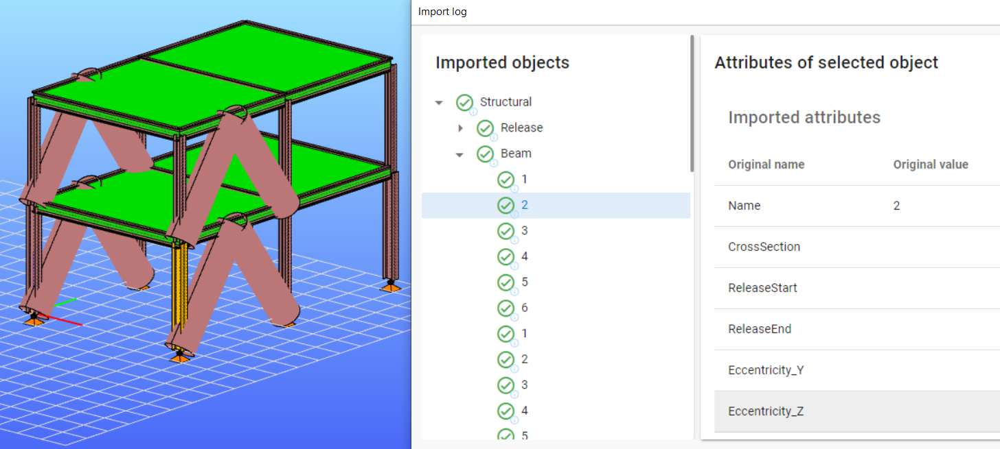

## 4. Limitations of the import

- **Materials**

- Steel and concrete materials are converted according to their name if the algorithm finds a matching one in the database.

  - If the first solution is not possible, the program attempts to create a material with all the new information. In this case, the material's name will include the '(AXISVM)' mark.

  - If none of the above solutions are applicable, it substitutes the default placeholder material S235 EN 100025-2. If the 'Placeholder (AXISVM)' symbol appears, users should replace the material with the correct one.

  - To verify imported materials, go to the section administration (Shift+A) or access the Auto Portions Material section. Here, you'll find a comprehensive list of all materials included in the model.

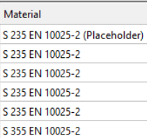

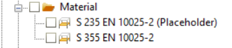

- **Sections**

  - Bar member sections are primarily converted based on their names. If this is not possible, the converter will attempt to create the section as a Consteel macro using the available attributes. In such cases, a '(AXISVM)’ marker will be added to the section name.

  - If a section cannot be found by name or created as a macro, the program will substitute it with a placeholder. These placeholder (dummy) sections are easily identifiable in the model as unrealistically large circular sections with 'Placeholder (AXISVM)' in their name. Users will need to manually replace these placeholder sections with the correct ones.

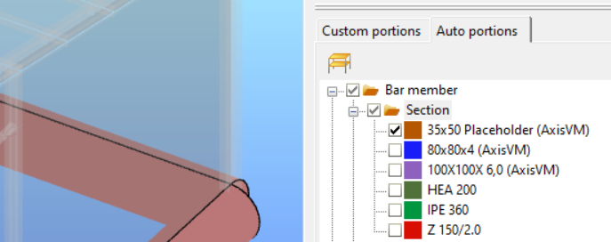

- **Bar members**

  - One of the most significant differences between Consteel and AXISVM is that in Consteel, is working with 7 degrees of freedom, whereas AXISVM, mostly works with only 6. Therefore, when converting to Consteel, the program selects the 7th degree of freedom, making it essential to verify before proceeding with further calculations.

  - For bar members, the most important properties that can be transferred to Consteel include the release type, the finite element type, rotation, and also the eccentricity for most sections. However, it is best to verify eccentricity in the case of nonsymmetrical or unusual shaped sections.

* **Plate element**

  - Plate elements are transferred to Consteel with respect to their materials, dimensions, and placements.

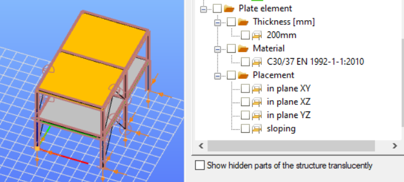

- **Supports**

  - All types of supports from AXISVM, including Point supports/Nodal support, Line supports, and Surface supports, can be converted to Consteel.
  - Do not forget that Consteel operates with 7 degrees of freedom (7DOF), whereas AXISVM only utilizes 6. The program will define the 7th value, so users need to verify it.

- **Loads transfer surface**

  - Load panels can be seamlessly transferred from AXISVM to Consteel.

- **Loads**

  - Conversion of various types of point loads, line loads, and surface loads is possible within load cases, provided they are organized into load groups: Permanent, Variable, and Accidental.

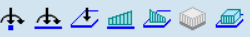

- Ungrouped loads will not be converted.

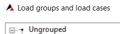

- Automatically generated load cases like Wind, and Snow can only be exported if they were previously converted into regular load cases:

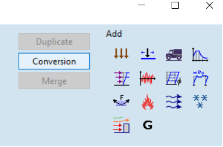

- Some specific loads currently cannot be converted, such as: tension/compression, thermal load, fluid loads, seismic loads, support displacement etc.

- **Load combinations**

  - manually created load combinations can be converted.