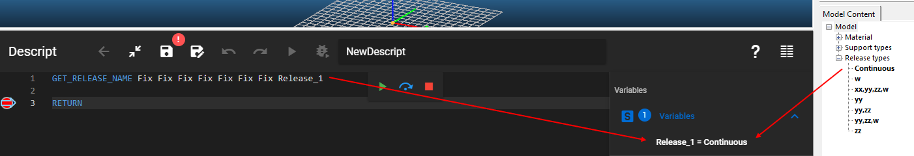
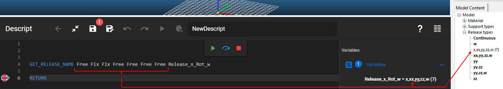

Gets the name of a release type.

### Description

This command tries to find a release type in Consteel with the specified release parameters. If there is one with the given parameters then its name will be saved in a variable.

If there is no such release type, then it will be created, named based on its parameters, and then its name will be saved in a variable.

### Syntax

**GET_RELEASE_NAME** \[x] \[y] \[z] \[xx] \[yy] \[zz] \[w] [Variable name]

### Command parameters

| **Command parameter**                             | **Assignment** | **Value format**                                    | **Input options** |
| ------------------------------------------------- | -------------- | --------------------------------------------------- | ----------------- |
| [x, y, z, xx, yy, zz, w](#x-y-z-xx-yy-zz-w)       | Required       | [Predefined strings](#Degree-of-freedom-value-name) | Local, variable   |
| [Variable name](#variable-name)                   | Required       | String                                              | Local, variable   |

#### x, y, z, xx, yy, zz, w:
Degrees of freedom of the end release. Every parameter can only have 2 values: "Fix" or "Free".

<span id="Degree-of-freedom-value-name" style={{paddingTop: '80px'}}> Available degree of freedom values: </span>
<div style={{paddingBottom: '20px'}}> </div>

| **Degree of freedom value name** | **Value** |
| -------------------------------- | --------- |
| Fixed (Continuous)               | Fix       |
| Free                             | Free      |

#### Variable name:
Name of the variable that will store the release type name.

### Sample code

**Example 1:** (release type already exists)

```
GET_RELEASE_NAME Fix Fix Fix Fix Fix Fix Fix Release_1
```

This example will find the already existing "Continuous" release type, retrieve its name, and save that in the variable.

[](./img/Get_Release_Name_Fig_01_v01.png)

**Example 2:** (release type does not exist yet)

```
GET_RELEASE_NAME Free Fix Fix Free Free Free Free Release_x_Rot_w
```

In this example the specified release type does not exist yet, therefore a new release type will be created in Consteel, and its name saved in the variable.

[](./img/Get_Release_Name_Fig_02_v01.png)
