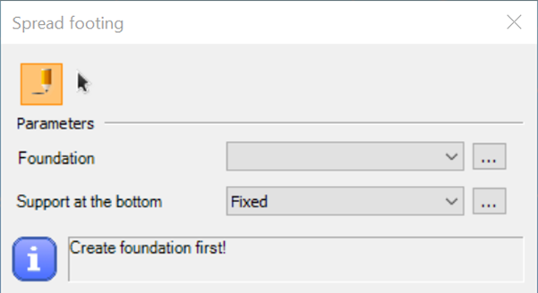
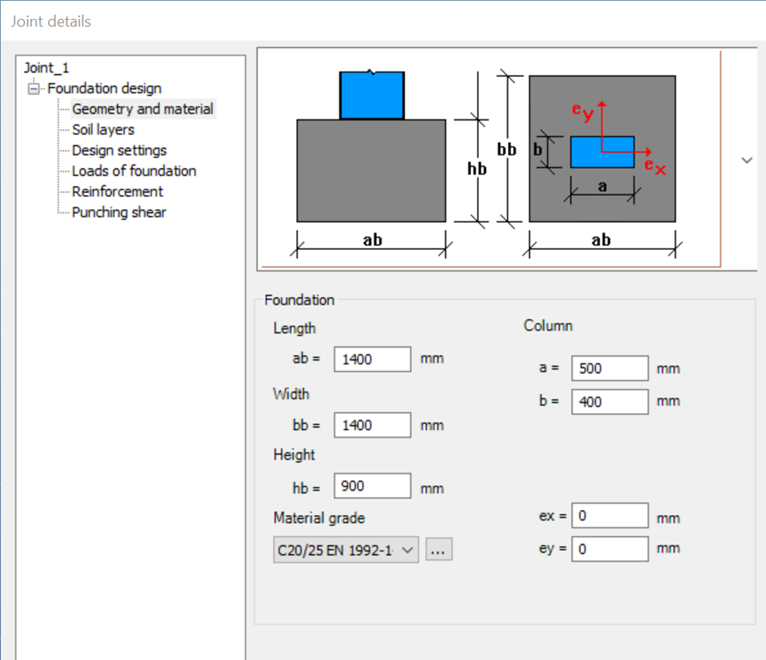
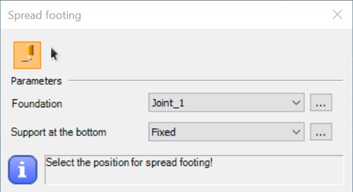

# Spread footing

 **_Spread footing_** function is available on **_Structural members_** tab. It is a targeted function only for shallow spread foundations of separate columns.

<!-- /wp:paragraph -->

<!-- wp:image {"align":"center","id":44437,"sizeSlug":"full","linkDestination":"none"} -->

<!-- /wp:image -->

<!-- wp:paragraph -->

The spread footing is a compound object which consists of a bar member, a support and a Joint model. The support is always located at the geometrical center of the foundation bottom, no matter the eccentricities. The reference line of the spread footing is always parallel to global Z axis.

<!-- /wp:paragraph -->

<!-- wp:image {"align":"center","id":44444,"sizeSlug":"full","linkDestination":"none"} -->

<!-- /wp:image -->

<!-- wp:heading {"level":3} -->

### Definition

<!-- /wp:heading -->

<!-- wp:paragraph -->

When clicking on the function icon, the **_Spread footing_** dialog appears. If there is no foundation-type Joint object created yet, the upper drop-down menu is empty.

<!-- /wp:paragraph -->

<!-- wp:image {"align":"center","id":44451,"width":476,"height":260,"sizeSlug":"full","linkDestination":"none"} -->

<!-- /wp:image -->

<!-- wp:paragraph -->

It is possible to create one by clicking on the … and then on  button on the appearing **_Joints_** dialog. Only spread footing Joint can be created here.

<!-- /wp:paragraph -->

<!-- wp:image {"align":"center","id":44465,"width":857,"height":149,"sizeSlug":"full","linkDestination":"none"} -->

<!-- /wp:image -->

<!-- wp:paragraph -->

It is sufficient to define the dimensions, material and eccentricities in the **_Geometry and material_** dialog in Consteel Joint.

<!-- /wp:paragraph -->

<!-- wp:image {"align":"center","id":44472,"width":615,"height":530,"sizeSlug":"full","linkDestination":"none"} -->

<!-- /wp:image -->

<!-- wp:paragraph -->

After the foundation joint is created, and the support is selected, the spread footing can be placed one-by-one  or multiple placement is available with .

<!-- /wp:paragraph -->

<!-- wp:image {"align":"center","id":44493,"width":473,"height":258,"sizeSlug":"full","linkDestination":"none"} -->

<!-- /wp:image -->

<!-- wp:paragraph -->

Spread footing can be placed at any point of the model. The reference point of the placement is the is the upper end of the object’s reference line.

<!-- /wp:paragraph -->

<!-- wp:paragraph -->

When the spread footing is placed at the end of a bar member (practically a column), it inherits the eccentricities (directions y and z and rotation) of the bar member. Transformation between local coordinate-systems is handled automatically. If there are more than one member connected to that point, it is necessary to select from which to inherit the properties. Once the footing is placed, the modification of the member eccentricities has no longer any effect on the spread footing.

<!-- /wp:paragraph -->

<!-- wp:heading {"level":3} -->

### Eccentricities

<!-- /wp:heading -->

<!-- wp:paragraph -->

Eccentricities can be set for the spread footing at two places but the finite element model differs in case of the two definitions.

<!-- /wp:paragraph -->

<!-- wp:paragraph -->

\#1 – Property tree: to adjust the spread footing under the column

<!-- /wp:paragraph -->

<!-- wp:paragraph -->

It is based on the assumption that in general cases the footing should be physically under the column (not under the reference line of the column). Unlike other objects in Consteel, the reference line of the spread footing moves when eccentricity is defined.

<!-- /wp:paragraph -->

<!-- wp:paragraph -->

In case the object inherits the eccentricities, it will be visible here too.

<!-- /wp:paragraph -->

<!-- wp:paragraph -->

Spread footing placed under eccentric column:

<!-- /wp:paragraph -->

<!-- wp:image {"align":"center","id":44500,"width":1028,"height":330,"sizeSlug":"full","linkDestination":"none"} -->

<!-- /wp:image -->

<!-- wp:paragraph -->

\#2 – Consteel Joint: to define if the column is placed eccentrically on the spread footing.

<!-- /wp:paragraph -->

<!-- wp:image {"align":"center","id":44507,"width":1031,"height":303,"sizeSlug":"full","linkDestination":"none"} -->

<!-- /wp:image -->

<!-- wp:image {"align":"left","id":44536,"width":138,"height":147,"sizeSlug":"full","linkDestination":"none"} -->

:::warning

The visualization of the spread footing can be the same or very similar with two different eccentricity definitions (combination of eccentricity types), but the finite element models can still be different. It is important to make sure about the correctness of the structural model.

Punching shear verification considers the eccentricities defined in Consteel Joint when calculating the perimeters.

:::
<!-- /wp:paragraph -->

<!-- wp:paragraph -->

<!-- /wp:paragraph -->

<!-- wp:heading {"level":3} -->

### Analysis

<!-- /wp:heading -->

<!-- wp:paragraph -->

Spread footing is modelled as a bar member with a fictive reinforced concrete section which is created automatically in the background when defining the object’s dimensions in Consteel Joint.

<!-- /wp:paragraph -->

<!-- wp:paragraph -->

Rigid bodies for handling eccentricities are created also automatically during the creation of finite element model.

<!-- /wp:paragraph -->

<!-- wp:paragraph -->

Self-weight of the spread footing is not considered in the analysis, it is calculated and added to the design loads in Consteel Joint whenever necessary. When there is a spread footing object in the model, calculation of the reaction forces is performed for SLS combinations for settlement check.

<!-- /wp:paragraph -->

<!-- wp:paragraph -->

<!-- /wp:paragraph -->

<!-- wp:image {"align":"left","id":44544,"width":144,"height":153,"sizeSlug":"full","linkDestination":"none"} -->

<!-- /wp:image -->

<!-- wp:paragraph -->

:::warning

It is important to take care of the end releases of the column the spread footing is connected to.

<!-- /wp:paragraph -->

<!-- wp:paragraph -->

When geotechnical design is not executed in Consteel, it is recommended to generate the reaction forces from the model without the spread footing objects.

:::

<!-- /wp:paragraph -->

<!-- wp:paragraph -->

<!-- /wp:paragraph -->

<!-- wp:paragraph -->

<!-- /wp:paragraph -->

<!-- wp:paragraph -->

<!-- /wp:paragraph -->

<!-- wp:paragraph -->

<!-- /wp:paragraph -->

<!-- wp:heading {"level":3} -->

### Design of spread footing

<!-- /wp:heading -->

<!-- wp:paragraph -->

The design of spread footings is executed in Consteel Joint.

<!-- /wp:paragraph -->

<!-- wp:paragraph -->

Loads can be either defined manually or loaded from Consteel model. Design loads are calculated in general from loads at the bottom of the foundation, except for punching shear, where loads on the top of the foundation are considered.

<!-- /wp:paragraph -->

<!-- wp:paragraph -->

Different verifications are performed in the corresponding limit states.

<!-- /wp:paragraph -->

<!-- wp:list {"ordered":true,"type":"1"} -->

1. Eccentricity check: EN 1997-1 6.5.4.
2. Soil bearing verification: EN 1997-1 Annex D
3. Sliding verification: EN 1997-1 6.5.3.
4. Check of overturning: EN 1990 6.4.2. Eq. (6.7)
5. Bending verification of the reinforcement: EN 1992-1-1 For calculation of the design moment on the reinforcement, linear stress distribution is assumed under the foundation, therefore the resultant force should be inside the “middle-third” area (sum eccentricity in x and y direction should be less than ab/6 or bb/6 respectively). Reinforcement is checked separately in x and y direction.
6. Punching shear verification without shear reinforcement: EN 1992-1-1 6.4.4. (2)
7. Settlement verification: EN 1997-1 6.6.2.

<!-- /wp:list -->

<!-- wp:paragraph -->

<!-- /wp:paragraph -->

<!-- wp:image {"align":"center","id":44551,"sizeSlug":"large","linkDestination":"none"} -->

<!-- /wp:image -->

<!-- wp:paragraph -->

<!-- /wp:paragraph -->

<!-- wp:image {"align":"left","id":44558,"width":142,"height":151,"sizeSlug":"full","linkDestination":"none"} -->

<!-- /wp:image -->

<!-- wp:paragraph -->

<!-- /wp:paragraph -->

<!-- wp:paragraph -->

<!-- /wp:paragraph -->

<!-- wp:paragraph -->

When adjusting the dimensions of the foundation (height, ex, ey) during the design process, the loads become obsolete. It is necessary to run a new analysis in Consteel to get the correct foundation loads

<!-- /wp:paragraph -->
