# Line members

The line members can be modelled with steel thin-walled, reinforced concrete, and composite cross-section. The members – depending on the placement – can be **columns** or **beams**. The column is a special positioned line member, which is always vertical, so the placement is simpler, because only the height should be defined.

The dialogue allows the following modelling options for creating line members:

 Draw the reference line of the member

 Draw as a line segment or continuous line

 Draw as an arc by a center point, start point and angle, by 3 points, or start point, endpoint, and tangent

Select an existing line for the section as a reference line of a member

 Read out the parameter of an existing member by clicking on it and assigning those parameters to the one to be created

Member parameters can be defined in the middle part of the dialogs:

- _Section:_ the appropriate cross-section can be selected from the drop-down box. If no section has been loaded into the model, the **_Section_** dialogue should be opened by pressing the three dots button () next to the drop-down box. For more information about **Section administration** and for details on the section models and standard tests used in Consteel, see **_[Section module](../10_0_section-module/10_1_section-modelling.md)_**.

- _Release (start, end)_: predefined releases can be assigned to the ends of the members. If a new release type is needed the **_Release_** dialogue can be called by pressing the  button next to the combo.

- _Initial bow imp.:_ half sine-wave shaped initial curvature can be defined in the two local directions perpendicular to the member reference axes (“y,z”) with the given amplitude at the mid-length of the member.

- *Type of finite element*:

**For steel members:**

The available element types depend on the chosen section.

- For welded single or double symmetrical cross-sections (macro section) there are four choices possible:

  - **7 DOF beam element**: element with nodes of 7 degrees of freedom, including the warping of the thin-walled cross-section. It is an important effect in the case of structures with standard, open steel profiles.

  * **Shell element**: the member will be converted into shell elements according to its cross-section during the analysis. The applied loads, supports, stiffeners, and holes will be converted as well. This conversion is reversible. The member keeps its 1D attributes and can be converted back anytime to a normal line member. Currently, the code design of these members is not available.

    -  This type cannot be selected in this dialog. You must first place the member in the model before you can change the type in the **_[Object properties window](../1_0_general-description/1_2_the-main-window.md)_**. See more info about this type of member in chapter **_[Superbeam](../5_0_structural-modeling/5_14_superbeam.md)_**.

  - **Tension bar**: cannot resist compressional axial force but it can resist any other internal forces. If it got compression the analysis neglects its effect.

 

  * **Tension bar (X Brace)**  used for individual members of bracing systems made of elements working in tension only which are arranged in a way, that from a pair of members always just one is working in tension and the another is assumed to be efficient due to buckling. This option will linearize the behaviour of such members for a linear buckling eigenvalue calculation by considering the member working in both tension and compression, but with half cross-section properties.

* For any other steel cross-sections, three of the above mentioned possible choices are available:

  - 7 DOF beam element

  - Tension bar

  - Tension bar (X Brace)

**For reinforced concrete or composite members:**

There is only one choice available: the _**6 DOF beam element**_ type. This is the commonly used finite element with nodes of 6 degrees of freedom.

- _Element group_: the members can be sorted out into element groups for various purposes (selection, dominant results, sensitivity analysis, etc.).  
  if new element group is needed the **_Groups of structural members_** dialogue can be called by pressing the  button next to the combo.

- _Number of finite elements_: the required number of finite elements used on the member in the analysis can be set. I The default _automatic_ option gives a sufficient result in the most cases.

- _Local eccentricity_: member eccentricity can be defined in the local coordinate system (“y, z”) of the member, and the section can be rotated about the local coordinate “x”.

- At the bottom of this dialog there is an instruction and command area for guiding the user.

:::note
It should be noted that not only the eccentric axial force influences the analysis (additional bending moments), but also the eccentric bending and torsional moments (additional bending and torsional moments and **bimoment**)!
:::

### Steel members

As the first step of line member modeling, cross-sections have to be loaded into the model. This can be performed either from the **_Section administrator_** directly or from the **_Beam_** dialogue window. In Consteel, there are three options for defining cross-sections:

- Library sections,
- Macro sections,
- Drawn sections.

:::note
It is important to note that in Consteel, material quality is an attribute of the cross-section, therefore it must be defined when loading the cross-section!
:::

#### Cross section libraries

In _Consteel_, the following standard cross-section libraries are available:

- Standard (European) cross-section library

- American cross-section library (metric and imperial)

- British cross-section library

- Chinese cross-section library

- Russian cross-section library

- Manufacturers 'profiles (catalogs of individual manufacturers' profiles)

#### Macro sections

In _Consteel_, the following macro sections are available organized into 4 groups:

1. **Sheet welded types**

- Welded I or H section

- Welded box section

- Welded Maltese cross-section

- Welded half Maltese cross-section

- Welded hat section

- Welded T

- WQ section

- Slant flange welded I or H section

- C section

2\. **Hot rolled types**

- Rolled I or H shape (with parallel flange)

- Rolled angle (parallel leg)

- Rolled channel (parallel flange)

- CHS shape

- T shape (half I)

- Plate

- RHS

- Round bar

3\. **Cold-formed types**

- RHS

- CHS

- L profile

- unsymmetrical U section

- Z shape

- C shape

- Sigma section

- Zeta section

- Slope omega section

In the case of cold-formed macros, it is also possible to provide profile stiffeners for the last 5 profile types. On the flanges, single or double folded edge stiffeners, and two different types of intermediate stiffeners can be defined. On the webs, three different types of intermediate stiffeners can be defined, and web stiffeners can also be double stiffeners. The stiffeners defined this way are taken into account in the calculation of distortional buckling as defined in EN 1993-1-3. I

For cold-formed macro sections made of coated material, the thickness tolerance category as defined in EN 10143 shall also be provided. There are two categories: normal and special. Accordingly, the design wall thickness of the cross-section is calculated according to EN 1993-1-3 section 3.2.4. In general construction practice, such sections are most often made of coated steel sheets according to the aforementioned EN 10143 standard, and therefore these macros are based on the thickness tolerance categories defined in this standard.

:::warning

Important, that if the designer does not choose the coated material from the database and that the selected material has a thickness tolerance of more than 5%, in this case, the calculation will not be exact. To avoid this, you must import the cross-section into the **_Section drafter_** module and provide the real thickness tolerance. (See **_Section drafter_** in the following chapter!)

:::

4\. **Compound types**

- I or H shape reinforced by channel at one flange

- I or H shape reinforced by channels at both flanges

- I or H shape reinforced by half I or H

- I or H shape reinforced by half I or H shapes at the web

- I or H shape reinforced by angels at the flange

- I or H shape reinforced by plates at flanges

- I or H shape reinforced by I or H shape at the flange

- Closed shape with angles and plates

- Closed 2U

- Closed 2I

- I plus U

- I from 2U

- Half Maltese

- Battened section

#### Section drafter

The third option for creating a cross-section is the section drawing in the **Section drafter** module. The function can be started by pressing the **Draw section** button in the Section Administration dialog box.

As a first step, after the command has been executed, you have to select a section type and a material quality in a pop-up window and enter the section name. There are two types of cross-sections:

- Cold formed section

- General thin-walled section

The type of cross-section has a fundamental influence on its later operation. Choosing the **cold-formed section** type, you can create sections drawn by one line, which have a uniform wall thickness, with automatically created curves between segments, and it cannot be closed. In the calculation of these sections, the effective cross-sectional reduction due to distortional buckling is also taken into account, following EN 1993-1-3.

In the case of **general thin-walled sections**, sheets of different thicknesses may be used, the section need not be drawn with a single line, and single-closed sections may also be created. This type is basically used to create sheet welded sections. For these sections, only strength, local and global stability tests can be performed.

After selecting the section type, clicking on the **_Next_** button opens a separate window for the **_Section Drafter module_**, the contents of which are slightly different depending on the type of section you choose.

The profile drawing window is structured as follows:

**1# Drawing Area**

**2# Commands**

**3# Diagnostic Messages**: Displays various warning and error messages

**4# Navigation**: Use the **_Back_** and **_Next_** buttons to move between the different phases of the section drawing

**5# User Interface Settings**: There are four tabs on the pop-up window that provide parameters and switches for adjusting the **_Visibility_**, **_Grid_**, **_Snap_**, and **_Object Sizes_**.

**6# Specify Parameters**: always displays parameter panels for the current function and the selected item.

#### Drawing of Cold-Formed Sections

Cold-formed sections are defined in 4 phases.

(1) Drawing of the geometry

(2) Specify design parameters for strength and global stability tests

(3) Specify design parameters for local buckling tests

(4) Defining stiffeners

#### **(1) Drawing of the geometry** 

The section geometry is edited in the first phase. Stiffeners can be easily and quickly drawn using macros. It is also possible to import a previously loaded cross-section.

 **Draw Polyline** command to start editing geometry. Drawing can also be done by selecting endpoints in the drawing space or by entering coordinates in the **Draw line** pop-up window. Coordinates can be specified in Cartesian  or Polar 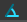 coordinates, local  or global 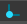. In the case of local input, the coordinate system is rotated according to the grid angle, in the case of global input the coordinate system does not change. The positioning of the plate segments relative to the drawn reference line (offset) 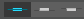 can be centered, left, or right-aligned. You can change this during drawing or later, one by one, in the Plate segment parameters panel on the sidebar. Roundings are created automatically when you draw plate segments. The radius of roundings can be modified subsequently, by selecting the curvature, individually in the sidebar, or uniformly over the entire section. You can also enter the nominal sheet thickness here.

:::note

In the section drawing window, you must also press ENTER after entering each parameter for the entered value to take effect!
:::

You can continue drawing plate segments only from one endpoint. When you have finished drawing, you can exit the command by pressing the ESC key or by clicking the EXIT button. If you want to edit the drawing, you can delete and redraw that section to fix the problem.

 The following two commands will launch the **_Intermediate Stiffener_** and **_Edge stiffener_** macros. There are three types of intermediate stiffeners and two types of edge stiffeners. A panel for specifying the geometry parameters of the stiffener appears in the right sidebar. You can also specify which side of the segment the stiffener has to be placed. After the command is executed, pointing to a plate segment with the cursor, the stiffener corresponding to the set parameters appears. After adjusting the parameters, you can place the stiffener by clicking on the desired location. After positioning, by selecting the stiffener, the parameters, and in the case of intermediate stiffeners, the positions remain adjustable. Note that these commands are just macros to make the drawing process easier. The plate segments drawn in this way only become code-compliant stiffeners, after defining other parameters in Phase 4.

 With the **Import section** command, you can import and further edit a previously created library, macro, or drawn section. Obviously, only a cold-formed, one-line drawing can be imported. After the command has been issued, a window will pop up showing the sections that are suitable for importing. Pressing the Next button loads the selected section. If you have a previously drawn geometry, the program will warn you that the current section you have drawn so far will be deleted. The section imported retains all its geometry and design parameters and remains editable.

 The **Explode section** command converts the drawn stiffeners and roundings into individual line and arc segments. After the exploding, also for these elements, only the thickness and offset can be changed, not their size and position. By exploding, elements previously defined as one segment, turn into separate segments whose classification can be defined independently.

 The **Place dimension** command is used to apply dimension lines to each segment of the section. There are two icons in the pop-up window that allow you to choose how to place the dimension line:

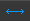 Dimension placement in projection to the coordinate system. You can specify dimension lines in the Y or Z direction.

 Placing a dimension line parallel to the line segment.

To place a dimension line, click on one of the line segments and click again to place the dimension line in the desired position.

**(2) Specify design parameters for strength and global stability tests** 

After the geometry has been drawn, the standard parameters required for the strength and global stability analysis must be set.

In the first drop-down menu, you have to choose the manufacturing type of the cross-section. It can be cold-rolled, press broken, or other cold-formed.

After that, the thickness tolerance required to calculate the design wall thickness and the number of the 90° bends have to be entered. The number of bends is automatically calculated when a macro profile is imported. In the case of a drawn section, this field must be completed by hand.

Next, the flexural and torsional buckling curves have to be selected. If the section is later used on a line member which is part of a **_[Purlin line](../5_0_structural-modeling/5_13_purlins.md#place-purlin-line)_** object, the lowest curve selected in the _Lateral-torsional buckling for purlin line_ field will be considered in the analysis.

**(3) Specify design parameters for local buckling tests** 

Moving to the third phase, the drawing area displays the lengths of the segments used to calculate the effective length (bp). By selecting a segment, you can specify on the sidebar whether, and in which direction, that segment should be considered in the calculation of the shear buckling.

The following field specifies how the segment is to be considered in the classification. There are three options to choose from

- Automatic classification and efficient length calculation  (default)

- Ignore classification and consider the total length 

- Ignore classification and do not consider the plate in the effective cross-section 

**(4) Defining stiffeners** 

In order for the drawn stiffeners to be really standard-compliant stiffeners in the calculation, they need to be defined at this phase. The first step is to decide whether the section is cold-formed Z- or C-like section or whether it is a general shape. You can choose by using the radio buttons in the sidebar.

When choosing a Z- or C-like profile, the calculation takes into account the stress of the other flange as well as the stiffness of the web when supporting the flange. To do this, of course, you need to specify which parts of the section make up the lower and upper belts, and the web, and you must add its length. By choosing a general shape section, the edge stiffeners are calculated independently of each other.

A further important difference is that only line members created as a Z-C-like section can later be used in a [_**Purlin line**_](../5_0_structural-modeling/5_13_purlins.md#place-purlin-line), [**_Purlin support zone_**](../5_0_structural-modeling/5_13_purlins.md#support-zone), or [_**Purlin overlap**_](./5_13_purlins.md#purlin-overlap-zone). 

A new panel appears next to the left-hand diagnostic panel, which shows the stiffeners in a tree structure.

To specify the stiffeners, use the icons on the command line in the top left of the window:

 **_Select non-stiffened flange_**: Only applicable for Z- or C-like sections. If one of the flanges is unstiffened, this command defines this flange. You have to select the line segments of the unstiffened flange, and then click on _**ENTER**_ or press the ENTER key to finish entering.

 _**Select edge stiffener and double edge stiffener**_: Follow the instructions in the popup window to define the stiffener in 4 steps. The first step is to select the segment(s) that make up the stiffener by framing or clicking on it and then click **_ENTER_** or press ENTER key to finish the entry. Then, select the flange which has to be stiffened and press ENTER again to complete the operation. The next step is to specify the segment that forms the web, and finally determine the length of the web by two points. Each step must be completed in the same way closed with the ENTER. The process steps can be followed in the right panel where OK will be displayed on all three lines when correctly entered.

If the section is set to Z or C, the position of the belt must also be entered in the drop-down menu at any step of the process. Click the arrow icon  to re-enter a component.

Finally, the critical stress of the stiffener must be specified in the lowest section of the panel. Here you can choose between automatic calculation or manual input. It is important that the automatic calculation only works with Z- or C-like sections, as the Eurocode gives solutions only for such cases.

 **_Select intermediate stiffener and double intermediate stiffener_**: Like the process of defining edge stiffener, you must select the segments that make up the stiffener and press ENTER to accept the entry. No further steps are required; however, the critical stress of the stiffener must be specified.

The stiffeners can be selected after input and their parameters can be changed or they can be deleted by pressing the DEL key.

Finally, you can close the section drawing by pressing the save exit button on the phase indicator panel. 

#### General Thin-walled Sections

General thin-wall sections are defined in 3 phases.

1. Drawing of the geometry

2. Specify design parameters for strength and global stability tests

3. Specify design parameters for local buckling tests

**(1) Drawing of the geometry** 

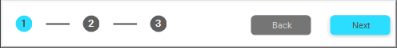

Fewer commands are available for editing this type of section since it is not possible to draw and define stiffeners. The editing process is similar to the previous one.

 The dialog used for the **_Draw line_** command is the same as the dialog for the cold-formed section, see the [previous ](#1-drawing-of-the-geometry)subchapter for details.

Due to the nature of the section, the drawing differs from the previous one, since each segment can be given different thicknesses and a closed segment can also be created. When drawing from an endpoint and clicking on an intermediate point of an already drawn segment will cause the line drawing to "skip" to that point and continue editing from that point. The so-called "Dummy" segments required for section modeling are also created, which appear on the screen as a brown dashed curved line.

 **_Move Point and Edge_** can be used to move an endpoint or an entire segment. If you select a point, the next step is to enter the endpoint of the move immediately, if selecting an edge, first click on the start point and then the endpoint of the move.

 The **_Import section_** command works exactly as described in the previous part. See [here ](#drawing-of-cold-formed-sections)for details.

 The **_Place dimension_** command works exactly as described in the previous part. See [here ](#drawing-of-cold-formed-sections)for details.

**(2) Specify design parameters for strength and global stability tests** 

After the geometry has been done, the standard parameters required for the strength and global stability boundaries must be provided. Compared to the previous subchapter, it is not possible to specify a thickness tolerance here, nor is it possible to define a purlin line buckling curve, since these sections cannot be used for a purlin line object.

**(3) Specify design parameters for local buckling tests** 

By moving to the third and final phase, the classification of the segments has to be made in the same way as described in the previous section. See details in the previous chapter.

You can finish editing with the **_SAVE EXIT_** button.

### Reinforced concrete members

Definition of reinforced macro sections to be used for columns and beams can be performed from the **_Macro dialogue._** There are two main types of reinforced concrete sections. **_Sections with design option_** (#1) and **_sections without design option_** (#2).

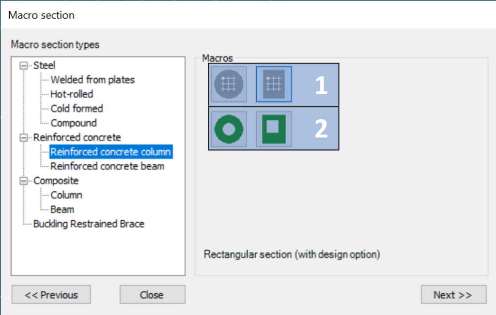

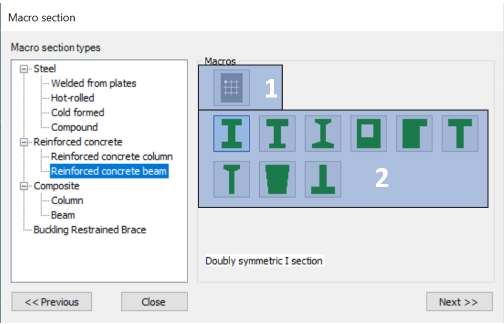

#### Reinforced concrete cross sections with design option

Are represented with a gray cross-section pictogram with a grid on the _**Macro section**_ dialogue. In Consteel, there are two section types with design options:

- Solid Circular section

- Solid Rectangular section

Design option is available both for columns and for beams.

After choosing one of the available cross-sections on the section dialogue, only the overall dimensions, the concrete material grade, and the modulus of elasticity applied in the structural analysis have to be set.

Because the reinforcement distribution may vary along the span of the concrete member, the definition of the reinforcement settings has to be made through a dedicated function:

- **_Column reinforcement_**  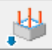 or

- **_Beam rebar editor_**

on the Structural members tab. Reinforcements should be assigned to members with concrete cross-section. Assignment can be done in the Property tree after selecting the member.

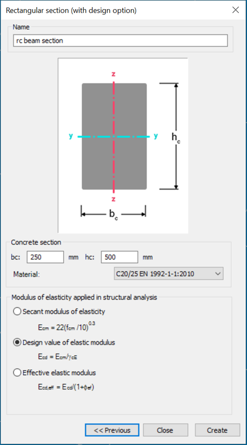

#### Beam reinforcement definition

Starting the **_Beam rebar editor_**, which can be found on the Structural members tab, the Rebar editor dialog appears.

It can be reached also from the Property tree after selecting a member with reinforced concrete beam macro section with design option, by clicking on the ... in the Reinforcement cell.

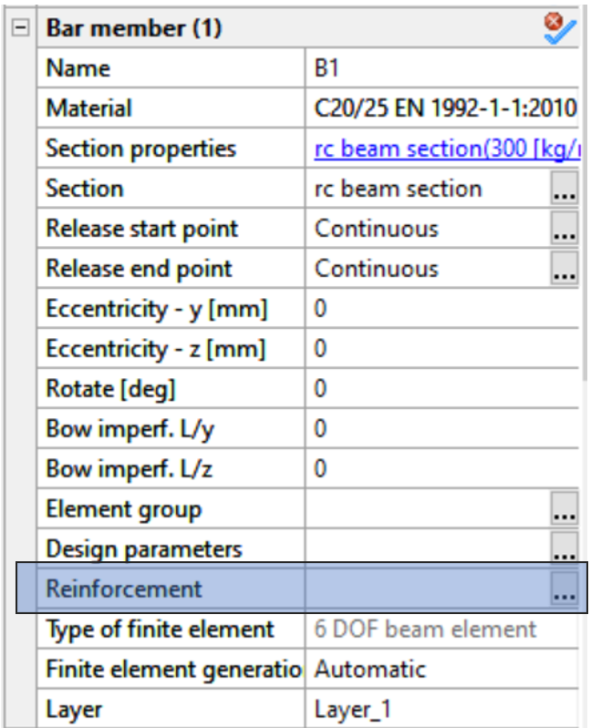

Beam reinforcement can be created only if there is a reinforced concrete beam cross section loaded into the model.

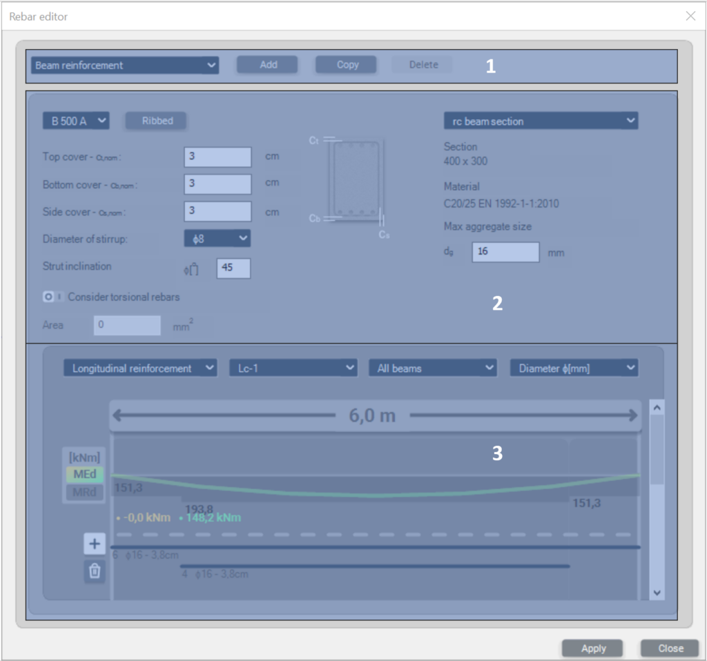

- \#1 - New beam reinforcement objects can be created by pressing the **_Add_** button. Switching between different reinforcement objects is possible by selecting from the dropdown menu. Using the **_Copy_** button, the copied object will inherit the parameters of the original object. The **_Delete_** button will delete the actively selected reinforcement object only.

* \#2 – On the middle part of the dialog, the cross-section has to be selected, to which the reinforcement settings will apply. The overall dimensions and the material grade are shown below the dropdown menu of the selected cross-section. You can specify here:

  - concrete covers

  - rebar material grades

  - diameter of stirrups

  - strut inclination

  - max. aggregate size of concrete

  - considering torsional rebars or not. If the check-box is selected, you can also specify a cross-sectional area for this reinforcement.

- \#3 – The bottom part of the dialog is a multifunctional panel. Here, the longitudinal and transverse rebars can be defined, envelope diagrams for internal bending and shear forces are shown, predesign values like (MRd and VRd) are shown, and detailing rules are checked. Functions of the panel in details:

  - **Graphical display**: after a reinforcement object is assigned to a concrete member by selecting it into the Reinforcement cell of the Property tree, the length of the member, on which the object is applied, is highlighted. If there are available analysis results for the member, the bending moment and shear force diagrams are also shown on the panel, both for individual load combinations and also as envelope diagrams which you can select from the drop-down menu. Switching between the bending and shear diagrams can be performed by selecting longitudinal or transversal reinforcement from the first drop-down menu. MEd and VEd values are also shown.  
    MRd, VRd VRd,c and VRd,max values are also represented on the panel if there are applied longitudinal and shear reinforcements (more on that below). Unfilled detailing rules are also highlighted as warnings at the bottom of the panel.
 
  - Adding longitudinal rebars: If the **_Longitudinal reinforcement_** option is selected in the upper left dropdown menu, using the  button it is possible to add rebars to the member. On the **_Add beam rebar_** dialogue the position, quantity, and diameter settings have to be entered. After pressing the **_Add_** button, the graphical representation of the rebars will appear on the graphical display. Deletion of a rebar can be performed by pressing the  button and choosing the rebar with the  sign.  
    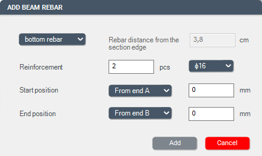

  - Adding stirrups: If the **_Transverse reinforcement_** option is selected in the upper left dropdown menu, using the  button it is possible to add stirrups to the member. On the **_Add beam rebar_** dialogue, the spacing and the start-end position has to be defined. The diameter of the stirrups has to be given on the main rebar editor dialogue. After pressing the **_Add_** button, the graphical representation of the rebars will appear on the graphical display. Deletion of a rebar can be performed by pressing the  button and choosing the rebar with the  sign.

A reinforcement object can be assigned to more members if the members have the same parameters (length and cross-section).

If a reinforcement object is placed on more members with different lengths, a copy of the original reinforcement object will automatically be created for each different member's length.

#### Column reinforcement definition

A Consteel model may contain several column reinforcement definition sets which can be assigned to the relevant members. All the actually defined sets are shown in a summary screen.

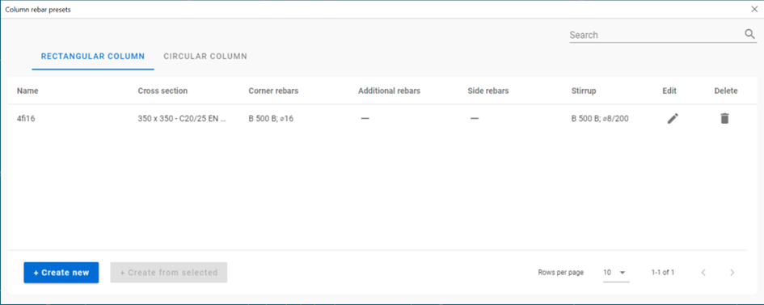

Different tab pages exist for columns with rectangular and circular cross-section. The already defined sets are listed in a table with their relevant information.

The definition of a new set can be initiated with the **_+ Create new_** button. A new set can also be defined starting from an already existing set using the **_+ Create from selected_** button.

A set can be _modified_ by double clicking on the row or using the pencil command and can be _deleted_ with the bin command.

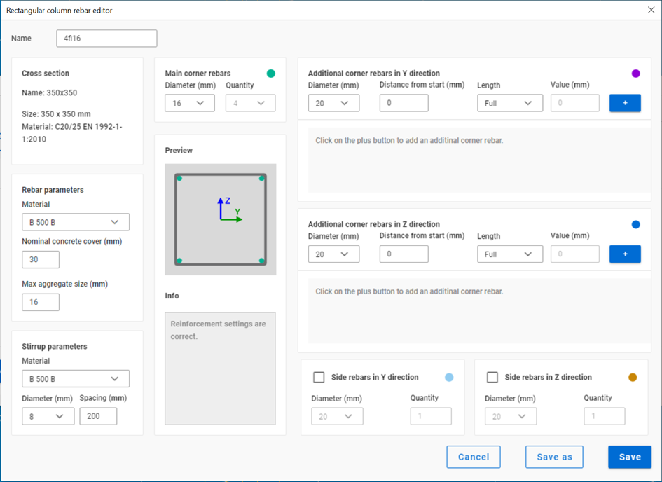

Using the dialog, longitudinal reinforcement bars and stirrups can be positioned in the actual cross-section. The rebars are shown on a dynamically scaled picture of the actual cross-section.

The positioning is made using relative location definitions. The available _longitudinal rebar_ positions are:

- **main corner rebars**. Their use is compulsory and are running from the beginning to the end of the member to which the actual cross-section is assigned to. Rectangular cross-sections have a fixed number of corner rebars (4). The actual diameters can be selected from a drop-down list.

- **additional corner rebars in Y and Z directions**. These rebars will be placed as close as possible to the corner rebars, considering the relevant detailing rules, in the corresponding direction. The Y and Z directions of the coordinate system used for the definition correspond to the member’s local coordinate system used in the 3D Consteel model. These rebars are not compulsory and can be defined as partial reinforcement bars using the _Distance from start_ and _Custom_ length values. Consteel assumes that this definition contains the necessary anchorage lengths, no additional automatic length corrections are made.

- **side rebars in Y and Z directions.** Additional full length bars can be equally distributed between the rebars located around the corners.

The definition of the stirrup is made by the definition of its diameter and the distance between each stirrup, placed equidistantly along the member.

In case of Reinforcement sets of circular cross-sections only one type of longitudinal rebar position exists. The specified number of bars will be distributed equally inside the circular stirrup.

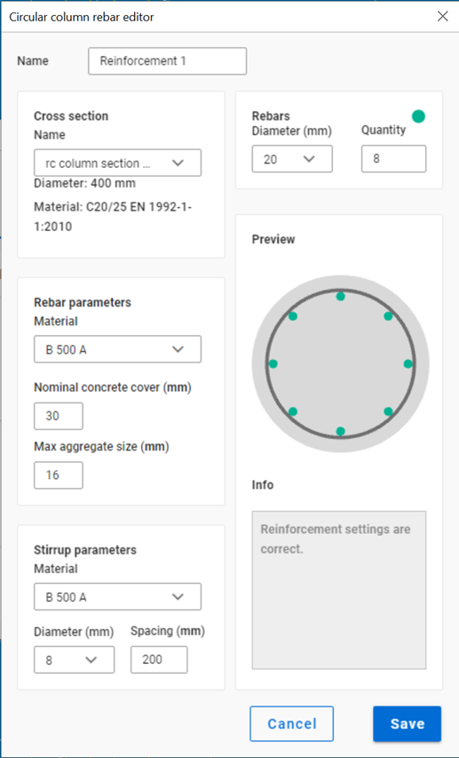

#### Reinforced concrete cross sections without design option

Members created with _**Reinforced concrete cross-sections without design option**_ can provide analysis results (see chapter [**_Analysis results_**](../8_0_structural-analysis/8_5_analysis-results.md)) and section resistance surface diagram (see [**_Resistance of composite and reinforced concrete cross-sections_**](../10_0_section-module/10_2_section-module.md#resistance-of-composite-and-reinforced-concrete-cross-sections)) considering the stiffness corresponding to the applied reinforcement in the calculation. However, these members are not suitable for concrete column and beam design verifications.

Available column cross-sections are:

- Rectangular section with hole

- Circular section with hole

Available beam cross-sections are:

- Double symmetric I section

- Singly symmetric I section

- I section with tapered flange thickness

- Rectangular section with hole

- Rectangular section with tab

- T shaped section

- T shaped section with tapered flange thickness

- Trapezoid section

- Reverse T shaped section

:::warning

Models created with earlier version of Consteel may use solid rectangular and circular sections without design option. The creation of such sections is not anymore available, but models containing such section will continue to work normally even in newer versions of Consteel.
:::

### Composite columns

The first step is to define a composite column cross-section. Five types of cross-sections are available: fully encased I-section in concrete partially encased I-section in concrete, encased Maltese cross-section in concrete, fully encased I-section in hollow section, and fully encased I-section in circular hollow section. The cross-section macros can be found among the **_Macro sections_**.

During the creation of the cross-section, the parameters of the concrete section, reinforcement, and the encased steel section have to be set.

For the structural analysis, two types of elastic modulus can be used which can be selected on the middle part of the cross-section creation dialog.

Standard initial sways can also be defined both in y and z directions. With the use of initial sway, for columns with composite cross-section, the cross-section check is sufficient according to the Eurocode, and a stability check is not necessary.

### Composite beams

The first step is to define a composite beam cross-section. There are two types available: composite beam with solid concrete slab and composite beam with profiled steel sheeting. The cross-section macros can be found among the **_Macro sections_**.

When creating a new composite cross-section the effective width must be defined. It is important to know that during the analysis the actual effective width is automatically calculated based on the design parameters. The effective width set by the user is used in the graphic representation and for determining the self-weight of the beam. It is also possible to create an edge composite beam with different widths on the left and the right sides. Rebars can be easily defined either with pitch or with a cross-sectional area (mm2/m).

After the composite cross-section is defined it can be used for member creation the same way as a steel cross-section.

Before running the analysis select the composite beam(s) and set the **_Design parameters_** on the **_Object properties_**.

In the Design settings window you can set the distance between parallel beams, the number of shear studs, the type of analysis, moment redistribution, and the support point positions along with the member. The support position table can be automatically filled up by clicking on the button above the table.

You can create more design parameters and assign them to different members. You can also use more design parameters to easily switch between them to find the best parameters or to simply compare different settings.

### Haunched members

The created members can be strengthened, if necessary, by using the **_Haunch_** function ().

The haunch can only be used for I-shaped sections (IPE, HEA, welded I), and the shape of the haunch is considered as half of a welded or hot-rolled I section (with one flange) with decreasing web height.

In the case of welded haunch, on the dialogue panel the length (L), start height (hs), end height (he) web thickness (tw), flange width (b), flange thickness (tf), and the characteristics of the haunch should be set.

In the case of hot-rolled haunch, on the dialogue panel the Length (L), start height (hs), end height (he), the section (roll radius), and the characteristics of the haunch should be set. With a click on the () button, sections can be loaded from the section administrator.

With the black arrow button () the geometrical parameters of the haunches can be loaded from the selected beam.

The position of the haunch is set by simply clicking on the member the start point (where the height of the haunch is full) and the direction point of the haunch on the member. It should be noted that if the start point is a common endpoint of more members (this is the usual case, for instance at a beam-to-column connection point) then this point should be approached and clicked on the member to be haunched. The characteristics of the haunch denote the appropriate side of the haunch on the member according to the direction of its local “z” axis. In the case of usual beam position it results in the followings:

- lower

- upper

- symmetric

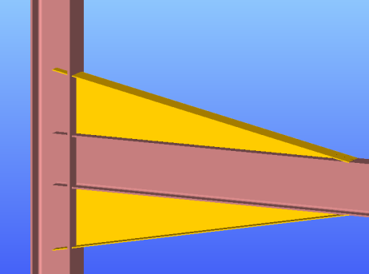

The haunches can be selected and modified in the parameter table as separate objects.

**Important to know** that for the haunched part of the member new sections are created during the automatic finite element generation which consists of the original section and the haunch with appropriate web height. These new sections are placed eccentrically on the reference line of the member (except the symmetrical haunch type).

This eccentricity causes additional effects in the analysis results due to the eccentric position of the sectional forces (for instance at the beam-to-column connection point of a frame with haunched beams and/or columns the equilibrium of the in-plane bending moments exists only if the additional moments from the eccentric axial forces are taken into account).

### Tapered members

Tapered members are often used in the economic design of steel-framed structures, so the fast and simple modeling of tapered members is of high importance. For the definition of a tapered member, a line member with welded I or H, box, or cold-formed C section should be created in the model.

**Hot rolled and other shapes of macro section can’t be tapered.**

With the **_Tapered member_** function () the section height of these sections can be set to linearly varying along the member length.

First, the user has to specify the parameters and beam eccentricity options for the member to be tapered on the **_Tapered member_** dialogue.

Specification of the start (H1) and end section height (H2) is not totally independent from the original section height of the cross-section. It is adviseable to define the original section with approximately the smaller height of the tapered member. If either H1 or H2 is smaller than 0.5 times the original height, the software will automatically overwrite the height to be the half of the orginal section height.

The start value for section height is applied at the start point of the member, the end value is applied at the other end. To change the H1 and H2 values click the 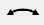 icon. The values will be changed, and selecting again the member for tapering, the sizes of the tapering will change adequately.

The rules for the beam eccentricity of the tapered member relate to the axis of the originally positioned member to be tapered.

1. _Place the centroid of the smaller section to the axis of the beam:_ the centre of smaller H value of the tapered member will be positioned to the axis of the original beam.

2. _Place the centroid of the bigger section to the axis of the beam:_ the centre of bigger H value of the tapered member will be positioned to the axis of the original beam.

3. _Place the centroid of the original section to the axis of the beam:_ the edge of the tapered member is coincident with the original member end and the tapering will start from this position.

The relative position of the tapering can be –z (the left side of the tapered member will be parallel to the axis of the originally placed member), symmetric or +z (the right side of the tapered member will be parallel to the axis of the originally placed member). These definitions regulate the directions of the offset of the given height values along the local “z” axis of the tapered beam.

Below shown the effect of the different relative positioning by the chosen eccentricity:

1. _Place the centroid of the smaller section to the axis of the beam:_ the centre of smaller H value of the tapered member will be positioned to the axis of the original beam.

**-z**

**symmetric**

**+z**

2\. _Place the centroid of the bigger section to the axis of the beam:_ the center of the bigger H value of the tapered member will be positioned to the axis of the original beam.

**-z**

**symmetric**

**+z**

3\. _Place the centroid of the original section to the axis of the beam:_ The edge of the tapered member is coincident with the original member end the tapering starts from this position.

**-z**

**symmetric**

**+z**

Activating the  icon, by clicking an earlier created tapered member in the model, the values, the eccentricity, and the relative positioning will be read out of that clicked, and appear in the dialog box. By clicking another member for taper, these parameters will be applied.

In the case of selecting a tapered member, not only the member but the tapering will be selected automatically and can be modified in the parameter table as a separate object.

:::info
**Important to know** that for the tapered members, new sections are created during the automatic finite element generation with appropriate section heights. These new sections are placed eccentrically on the reference line of the member (except the symmetrical tapering). This eccentricity causes additional effects in the analysis results due to the eccentric position of the sectional forces (for instance at the beam-to-column connection point of a frame with tapered beams and/or columns the equilibrium of the in-plane bending moments exists only if the additional moments from the eccentric axial forces are taken into account).
:::