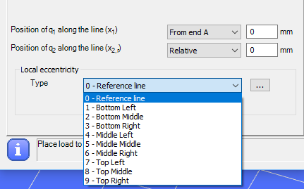
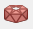
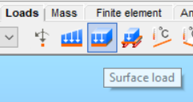
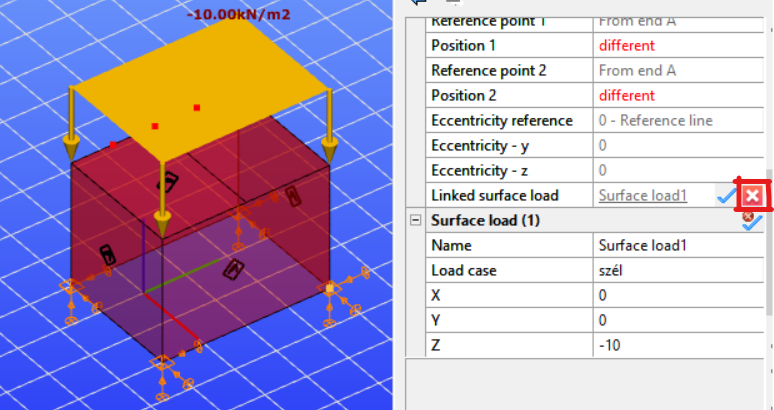
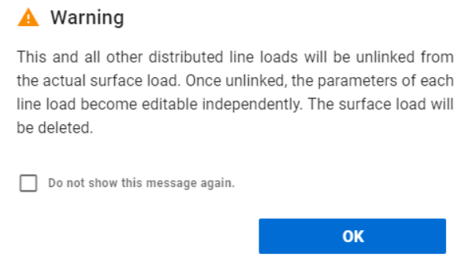
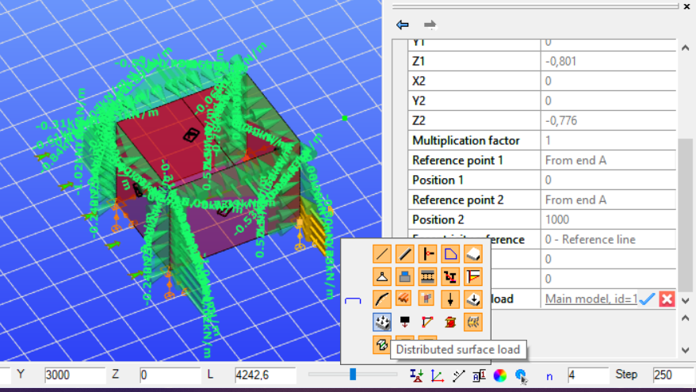
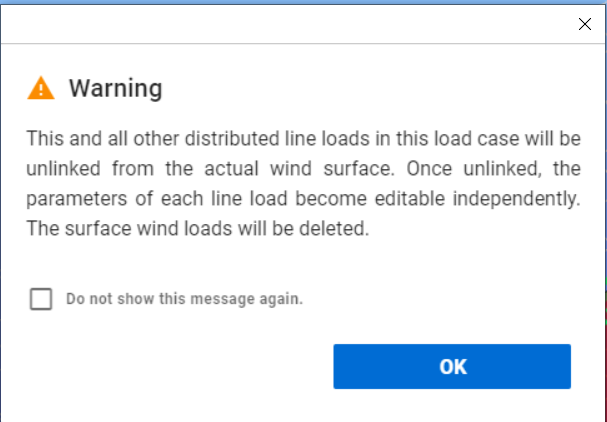

# Load types

Any placed load will belong to the load case selected from the list.

<!-- /wp:paragraph -->

<!-- wp:image {"align":"center","id":9958,"width":556,"height":71,"sizeSlug":"full","linkDestination":"media"} -->

<!-- /wp:image -->

<!-- wp:heading {"level":3} -->

### Point load ()

<!-- /wp:heading -->

<!-- wp:paragraph {"align":"justify"} -->

Point loads can be placed on any part of a line member or surface member (predefined points are not needed; end points or snap points can be used).

<!-- /wp:paragraph -->

<!-- wp:paragraph -->

Point loads can be placed according to the **Global (****)**, **Local (****)** or the **User coordinate system (****).**

<!-- /wp:paragraph -->

<!-- wp:image {"align":"center","id":9965,"width":299,"height":212,"sizeSlug":"full","linkDestination":"media"} -->

<!-- /wp:image -->

<!-- wp:paragraph {"align":"justify"} -->

Eccentricity can be applied on the point load also. The effect of the selected coordinate system, the applied local eccentricity type and values are the same as point support.

<!-- /wp:paragraph -->

<!-- wp:image {"align":"center","id":9971,"width":300,"height":244,"sizeSlug":"full","linkDestination":"media"} -->

<!-- /wp:image -->

<!-- wp:heading {"level":3} -->

### Line load ()

<!-- /wp:heading -->

<!-- wp:paragraph -->

Line loads can be assigned to existing lines (line members or edge of surface members) or to lines drawn for the loads only (for instance on a surface).

<!-- /wp:paragraph -->

<!-- wp:paragraph -->

Line loads can be placed according to the **Global (****)**, **Local (****), User coordinate system (****),** and Global projection system **(****)** which is commonly used when modeling the snow load.

<!-- /wp:paragraph -->

<!-- wp:image {"align":"center","id":9977,"width":342,"height":334,"sizeSlug":"full","linkDestination":"media"} -->

<!-- /wp:image -->

<!-- wp:paragraph {"align":"justify"} -->

In order to place a line load click on the member using the select function (). Line load can be applied to multiple members at the same time by using the **Place loads** icon (). In this case the members must be selected before clicking on the Line load icon on the Loads tab.

If just a partial line load need to be applied along the member then there are two ways to apply:

1. The first way is to use the draw function () and set the start point and the endpoint of the line load. This function can be used both for linear and curved members in accordance with the selected drawing function.

<!-- /wp:image -->

<!-- wp:image {"align":"center","id":9991,"width":326,"height":453,"sizeSlug":"full","linkDestination":"media"} -->

<!-- /wp:image -->

<!-- wp:paragraph {"align":"justify"} -->

2\. The second way is to give the exact distances of the start and end points of the line load from the member’s end points. Using the setting of Position of q1, q2, there are 2x3 = 6 possible options to define a partial line load. The “Position of q1” set to “From end A” has 3 options, and setting it to “From end B” has also 3 options:

<!-- /wp:paragraph -->

<!-- wp:columns -->

<!-- wp:column -->

<!-- wp:image {"align":"right","id":9997,"sizeSlug":"full","linkDestination":"media"} -->

<!-- /wp:image -->

<!-- /wp:column -->

<!-- wp:column -->

<!-- wp:image {"align":"left","id":10003,"sizeSlug":"full","linkDestination":"media"} -->

<!-- /wp:image -->

<!-- /wp:column -->

<!-- /wp:columns -->

<!-- wp:image {"align":"center","id":10016,"sizeSlug":"full","linkDestination":"media","className":"caption-align-default"} -->

<!-- /wp:image -->

<!-- wp:paragraph -->

This is a flexible way for numerical input the line load positions.

<!-- /wp:paragraph -->

<!-- wp:paragraph {"align":"justify"} -->

Eccentricity can be applied on the line load also. The effect of the selected coordinate system, the applied local eccentricity type and values are the same as point support.

<!-- /wp:paragraph -->

<!-- wp:image {"align":"center","id":13983,"width":323,"sizeSlug":"full","linkDestination":"media"} -->

<!-- /wp:image -->

<!-- wp:paragraph {"align":"justify"} -->

By clicking the  icon, the attributes of the selected line load fill out the parameters of the line load window, even if it was set by the draw function.

<!-- /wp:paragraph -->

<!-- wp:heading {"level":4} -->

#### Line wind load

<!-- /wp:heading -->

<!-- wp:paragraph {"align":"justify"} -->

Line wind load is a great tool to apply wind load to members easily. It saves time because only the basic data must be added and _Consteel_ automatically calculates the appropriate wind load.

<!-- /wp:paragraph -->

<!-- wp:paragraph -->

Before clicking on the Line Load icon, as a first step the member(s) has to be selected where the line wind load will be placed.

<!-- /wp:paragraph -->

<!-- wp:paragraph -->

The line wind load related functions can be found on the Wind load tab of Line Load dialog.

<!-- /wp:paragraph -->

<!-- wp:image {"align":"center","id":10030,"width":342,"height":430,"sizeSlug":"full","linkDestination":"media"} -->

<!-- /wp:image -->

<!-- wp:paragraph {"align":"justify"} -->

As a first parameter, the _Velocity pressure_ has to be added, or by clicking on the three dots button (), previously created Velocity pressure functions can be selected from the dropdown menu, or by clicking on the three dots button () a new Eurocode Velocity pressure function can be created according to the selected National Annex to use to calculate the proper _Velocity pressure_.

<!-- /wp:paragraph -->

<!-- wp:image {"align":"center","id":10037,"width":754,"height":280,"sizeSlug":"full","linkDestination":"media"} -->

<!-- /wp:image -->

<!-- wp:paragraph {"align":"justify"} -->

_Internal pressure_ can be taken into account by check in the check-box. Cpi value can be set manually or by clicking on the three dots button () and use the Internal pressure calculator function. To calculate the value, two Eurocode methods can be used.

<!-- /wp:paragraph -->

<!-- wp:paragraph -->

_External pressure_ can be set by clicking on the three dots button ().

<!-- /wp:paragraph -->

<!-- wp:image {"align":"center","id":10043,"width":224,"height":445,"sizeSlug":"full","linkDestination":"media"} -->

<!-- /wp:image -->

<!-- wp:paragraph {"align":"justify"} -->

To calculate the correct _External Pressure_ values it is necessary to give geometrical parameters of the whole building. Geometrical parameters can be set on the _Global wind parameters_ dialog.

<!-- /wp:paragraph -->

<!-- wp:image {"align":"center","id":10050,"width":392,"height":208,"sizeSlug":"full","linkDestination":"media"} -->

<!-- /wp:image -->

<!-- wp:paragraph {"align":"justify"} -->

Besides the building dimensions, the direction of the basic wind in global coordinate system has to be selected from the dropdown menu and the ground level can be set if the lowest point of the model will not be on the ground.

<!-- /wp:paragraph -->

<!-- wp:paragraph {"align":"justify"} -->

As a next step one of the standard _Surface type_ (wall, flat roof, duopitch roof, etc.) has to be selected from the dropdown menu. If the proper surface is selected, then all of the necessary parameters from the previously selected member(s) are loaded and the actual cpe values are calculated.

<!-- /wp:paragraph -->

<!-- wp:paragraph -->

To create line wind load it is necessary to set the _Position of the frame in the building_ and to set the _Frame distance_.

<!-- /wp:paragraph -->

<!-- wp:paragraph {"align":"justify"} -->

As a last step the proper wind load cases has to be selected from the dropdown menu, on the bottom of the External pressure coefficients dialog.

<!-- /wp:paragraph -->

<!-- wp:paragraph -->

By clicking on the OK button the line wind loads are created.

<!-- /wp:paragraph -->

<!-- wp:paragraph -->

Pressing the Place loads icon () on the Line load dialog the created line wind loads are placed on the selected member(s).

<!-- /wp:paragraph -->

<!-- wp:image {"align":"center","id":10057,"width":828,"height":445,"sizeSlug":"full","linkDestination":"media"} -->

<!-- /wp:image -->

<!-- wp:paragraph {"align":"justify"} -->
:::note
**IMPORTANT**: For the correct line wind load placement, it is necessary to set the direction of the used local coordinate axis (Axis z, or y) to point out from the building.
:::
<!-- /wp:paragraph -->

<!-- wp:heading {"level":4} -->

#### Line Snow load

<!-- /wp:heading -->

<!-- wp:paragraph {"align":"justify"} -->

Line snow load is a great tool to apply snow load to members easily. It saves time because only the basic data must be added and _Consteel_ automatically calculates the appropriate snow load.

<!-- /wp:paragraph -->

<!-- wp:image {"align":"center","id":13989,"width":342,"height":430,"sizeSlug":"full","linkDestination":"media"} -->

<!-- /wp:image -->

<!-- wp:paragraph -->

Before clicking on the Line Load icon, as a first step the member(s) has to be selected where the line snow load will be placed.

The line snow load related functions can be found on the Snow load tab of Line Load dialog.

The snow load parameters are automatically loaded from the selected NA, but all of these can be modified manually.

As a first step the _Shape factor_ has to be set, by clicking on the three dots button ().

To define the shape factor it is necessary to select the _Surface type_ (flat roof, duopitch roof, etc.) from the dropdown menu. If the _Surface_ type is selected, then the parameters of the previously selected member(s) are automatically loaded and the shape factor is calculated.

As a last step the proper snow load cases has to be selected from the dropdown menu, on the bottom of the Snow load dialog.

By clicking on the OK button the line snow loads are created.

Pressing the Place loads icon () on the Line load dialog the created line snow loads are placed on the selected member(s).

### Surface load ()

Surface load can be defined in three ways. No surface moment loads can be placed.

- **Uniform** surface load

- **Linear** surface load

- **Wind** load

#### Uniform surface load

The load can be defined in two ways, similarly to the definition of line load.

Using the selection function () the intensity of the load must be entered in the dialog, then the load can be applied to the entire surface(s) by clicking on them.

For partially surface loads the drawing () function must be selected. The last 3 shortcuts will then be active, with which it is possible to draw rectangular, circular or polygonal surfaces.

To place the load, first select the surface to be loaded and then draw the boundary edges of the load according to the instructions in the information field of the dialog. In the case of a polygon load, after entering the last corner point, you can use the right mouse button to complete the load definition.

#### Linearly varying surface load

To define a linearly varying surface load, you must first specify the direction of the load in the top line of the dialog.

There are three ways to specify the change in load intensity (load distribution type):

- **General**: the intensity of the load is determined by the intensity values given at 3 arbitrary points on the surface, which must be entered at the bottom of the dialog box (q1, q2, q3).

- **In local x**: two points and their corresponding intensity values must be entered. The value of the load changes parallel to the local x-axis of the surface.

- **In local y**: similar to the previous one, but along the local y-axis.

After entering the data, the surface must first be selected to place the load onto, and then, depending on the type of load distribution, 2 or 3 points must be clicked on the surface, at which points the previously given intensity values apply.

In the case of a drawn () load specification, after selecting the surface, first, draw the loaded part of the surface as described in the previous point, and then enter the intensity determining points.

#### Wind load

At present, surface wind load can only be defined for Load transfer surface (see section 6.4.4).

The definition of the surface wind load should begin by specifying the velocity pressure and the external and internal shape coefficients. For a description of the dialogs () for each parameter, see the line wind load section (see section 6.4.2.1). After setting the parameters, the load can be placed on the surface by clicking on it.

### Load transfer surface ()

Load transfer surface (LTS) is a special surface that distributes surface loads to members as line loads. This is very useful in those cases when surface load needs to be distributed to members, like floor loads, snow and wind load, etc.

After clicking on the **_Load transfer surface_** () icon on the **Loads** tab a dialog window appears.

Just like in the two-dimensional figure drawing there are different possibilities to draw the surface: draw a rectangle, draw a leaning rectangle, draw a circle, or draw a polygon. After drawing the surface it is possible to select the members to which the surface distributes the load. There are two options: distribute the load to the selected members or distribute the load to all members covered by the surface in the surface plane. If the second option is clicked then the appropriate members will be highlighted. If none of the options is clicked, then the second one will be applied as a default.

It is possible to choose the first option and select members for carrying the surface load or remove members from the selection using the SHIFT + Left click. After the corresponding members have been selected and _**OK**_ is clicked then the surface is created.

It is also possible to use the **_Multiple placement of load transfer surfaces_** by clicking on the () icon. This function is used to define multiple load transfer surfaces with a simple selection (rectangle selection, or by clicking the border edges). Edges of a load transfer surface have to be in the same plane.

**It is important to know**, that the maximum number of edges that can be selected in one step, is currently limited to 200. If the selected edges exceed the limit of 200, a notification will be shown on the Edit load transfer surface dialog.

There are two visibility options: view the surface load or view the distributed load.

Changing the views is possible by clicking on the dedicated icon which can be found among the visibility of graphics symbols setting.

There are two possible methods to convert surface load to the selected members:

(1) Converting surface loads to uniform line loads is performed by a meeting the following requirements:

- the resultant force of all the line loads is the same as for the surface load

- the line loads are _constant_ on all the selected members

(2) Converting the surface load to line loads based on structural points has the following background:

1. the surface load is first converted to concentrated point loads acting on the selected structural points using the Delaunay triangulation technique

6. the concentrated loads are then converted to line loads on the selected members meeting with the following requirements:

- the resultant force of all the line loads is the same as for the surface load

- the line loads are _linear_ on all the selected members

- the end value of the line loads on the selected structural points for all the selected members are equal

The basic working method is the following:  
First create the load transfer surface. Select the members which it distributes load to, or accept the default setting which is distribute loads to all planar members. Apply surface loads to the surface at every load case where it is necessary.

The distribution of the surface loads to the selected bar members is still done automatically but the created Distributed Line loads can be individually selected. When selected, the attributes (value, eccentricities, etc.) are visible but not editable. All Distributed Line Loads are linked to the surface load it is crated from. Users can edit the properties of the distributed line loads once exploded from the surface load.

<!-- /wp:paragraph -->

<!-- wp:paragraph -->

In case of manually placed surface load to explode, select the load go to the Object properties window→ Distributed line load →Linked surface load →click on the red X button .

<!-- /wp:paragraph -->

<!-- wp:image {"id":72984,"width":"162px","height":"auto","sizeSlug":"full","linkDestination":"none"} -->

<!-- /wp:image -->

<!-- wp:image {"id":72994,"width":"332px","height":"auto","sizeSlug":"full","linkDestination":"none"} -->

<!-- /wp:image -->

<!-- wp:image {"id":73004,"width":"464px","height":"auto","sizeSlug":"full","linkDestination":"none"} -->

<!-- /wp:image -->

<!-- wp:paragraph -->

After exploding the surface load, the following warning will appear:

<!-- /wp:paragraph -->

<!-- wp:image {"id":73014,"width":"360px","height":"auto","sizeSlug":"full","linkDestination":"none"} -->

<!-- /wp:image -->

<!-- wp:paragraph -->

In the case of generated meteorological surface loads, to explode the surface load after selecting it, the visibility must be changed to Distributed surface load option. Following that, proceed in the same manner as in the previous situation.

<!-- /wp:paragraph -->

<!-- wp:image {"id":73024,"width":"466px","height":"auto","sizeSlug":"full","linkDestination":"none"} -->

<!-- /wp:image -->

<!-- wp:paragraph -->

In this case, the following waring message will appear:

<!-- /wp:paragraph -->

<!-- wp:image {"id":73034,"width":"347px","height":"auto","sizeSlug":"full","linkDestination":"none"} -->

<!-- /wp:image -->

<!-- wp:paragraph -->

Please note that the surface load explosion cannot be reversed.

<!-- /wp:paragraph -->

<!-- wp:paragraph -->

The automatic redistribution of the surface loads can be switched off temporarily to speed up the modelling. For more information, go to the **[Options menu.](../1_0_general-description/1_2_the-main-window.md#options-menu)**

<!-- /wp:paragraph -->

<!-- wp:heading {"level":4} -->

#### Modifying load transfer surface

<!-- /wp:heading -->

<!-- wp:paragraph {"align":"justify"} -->

Load transfer surface can be modified by selecting it and changing the properties in the property bar. Member selection can be easily modified from the planar members to selected members. It is possible to highlight the previously selected members by clicking on the blue thick.

<!-- /wp:paragraph -->

<!-- wp:image {"align":"center","id":10148,"sizeSlug":"full","linkDestination":"media"} -->

<!-- /wp:image -->

<!-- wp:paragraph {"align":"justify"} -->

If selected members option is chosen and then the black arrow is clicked then previously selected members can be removed from the selection or new members can be added.

<!-- /wp:paragraph -->

<!-- wp:heading {"level":3} -->

### Temperature load ()

<!-- /wp:heading -->

<!-- wp:paragraph -->

Temperature loads can be defined to members () or to surfaces ().

<!-- /wp:paragraph -->

<!-- wp:paragraph {"align":"justify"} -->

First choose the type of the temperature load: the temperature can change along the cross section’s height or the width. Then add the construction temperature (reference temperature) and the upper and lower temperature of the cross section. The last step is to select the member where you would like to apply the load.

<!-- /wp:paragraph -->

<!-- wp:columns -->

<!-- wp:column -->

<!-- wp:image {"align":"right","id":10154,"width":324,"height":245,"sizeSlug":"full","linkDestination":"media"} -->

<!-- /wp:image -->

<!-- /wp:column -->

<!-- wp:column -->

<!-- wp:image {"align":"left","id":10160,"width":325,"height":245,"sizeSlug":"full","linkDestination":"media"} -->

<!-- /wp:image -->

<!-- wp:paragraph -->

<!-- /wp:paragraph -->

<!-- /wp:column -->

<!-- /wp:columns -->

<!-- wp:image {"align":"center","id":10166,"width":305,"height":182,"sizeSlug":"full","linkDestination":"media"} -->

<!-- /wp:image -->

<!-- wp:heading {"level":3} -->

### Prescribed displacement ()

<!-- /wp:heading -->

<!-- wp:paragraph -->

Prescribed displacement can be applied for point supports.

<!-- /wp:paragraph -->

<!-- wp:paragraph -->

It can be placed according to the **Global (****)**, or the **User coordinate system (****)** and can be given with components or by vector.

<!-- /wp:paragraph -->

<!-- wp:image {"align":"center","id":10173,"width":292,"height":193,"sizeSlug":"full","linkDestination":"media"} -->

<!-- /wp:image -->

<!-- wp:heading {"level":3} -->

### Change in length (), tension force ()

<!-- /wp:heading -->

<!-- wp:paragraph -->

The change of the original member system length can be set and applied as a load on bar members with the **Change in length** () function. With this function prestress effect can be modeling.

<!-- /wp:paragraph -->

<!-- wp:image {"align":"center","id":10180,"width":292,"height":125,"sizeSlug":"full","linkDestination":"media"} -->

<!-- /wp:image -->

<!-- wp:paragraph -->

Tension force can be applied on bar members as a load with the **Tension force** () function.

<!-- /wp:paragraph -->

<!-- wp:image {"align":"center","id":10186,"width":299,"height":137,"sizeSlug":"full","linkDestination":"media"} -->

<!-- /wp:image -->

<!-- wp:paragraph -->

<!-- /wp:paragraph -->
