# Installing and running the software

<!-- wp:Consteel/content-block -->

<!-- /wp:Consteel/content-block -->

<!-- wp:paragraph -->

Please ensure that the following software and hardware requirements are met in order to run the Consteel program. Otherwise, it may not run at the expected speed or may not run at all.

<!-- /wp:paragraph -->

<!-- wp:paragraph -->

**Minimum hardware requirements:**

<!-- /wp:paragraph -->

<!-- wp:columns {"align":"wide"} -->

<!-- wp:column {"verticalAlignment":"top","width":"20%"} -->

- Processor
- Memory
- HDD
- Video-card
- Operating system

<!-- /wp:column -->

<!-- wp:column {"width":"66.66%"} -->

<!-- wp:paragraph -->

Intel Core i5 or equivalent  
4 GB  
300 MB  
512 MB non-integrated  
64-bit MS Windows 10

<!-- /wp:paragraph -->

<!-- /wp:column -->

<!-- /wp:columns -->

<!-- wp:paragraph -->

**Recommended hardware:**

<!-- /wp:paragraph -->

<!-- wp:columns -->

<!-- wp:column {"width":"20%"} -->

<!-- wp:list -->

- Processor
- Memory
- Video-card
- Operating system

<!-- /wp:column -->

<!-- wp:column {"width":"66.66%"} -->

<!-- wp:paragraph -->

Intel Core i7 or equivalent  
32 GB  
2 GB non-integrated  
64-bit Windows 10

<!-- /wp:paragraph -->

<!-- /wp:column -->

<!-- /wp:columns -->

<!-- wp:paragraph -->

Installation needs administrative or power user rights. Without that, the hard lock driver and those .**dll** files, which are indispensable for the system is cannot be installed.

<!-- /wp:paragraph -->

<!-- wp:paragraph -->

#### **Downloading the install package**

<!-- /wp:paragraph -->

<!-- wp:paragraph -->

The ConSteel install package can be downloaded from the [Downloads/Install packages](https://consteelsoftware.com/downloads/) section of the ConSteel website  (https://consteelsoftware.com/downloads/) for registered users only.

<!-- /wp:paragraph -->

<!-- wp:paragraph -->

**Registration process**

<!-- /wp:paragraph -->

<!-- wp:image {"align":"center","id":27672,"sizeSlug":"large","linkDestination":"none","editorskit":{"devices":false,"desktop":true,"tablet":true,"mobile":true,"loggedin":true,"loggedout":true,"acf_visibility":"","acf_field":"","acf_condition":"","acf_value":"","migrated":false,"unit_test":false}} -->

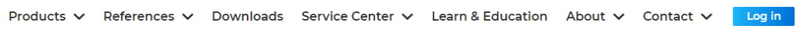

<!-- /wp:image -->

<!-- wp:columns {"align":"wide"} -->

<!-- wp:column {"verticalAlignment":"top","width":"65%"} -->

<!-- wp:paragraph -->

To create a new user account, click the **LOG IN** button in the upper right corner of the Consteel website, then click **Register** at the bottom of the pop-up window. Then enter your email address, your name, and a chosen password in the **_Create Account_** window that appears. It is important to enter a real email address because you will receive an email to confirm it as the next step. At the bottom of the window, it is possible to subscribe to Consteel's professional newsletter and you must accept the terms of use and privacy policy. You can then click on the **_Register_** button to proceed, and another window will inform you that the registration confirmation e-mail has been sent to the specified e-mail address and the registration must be completed using the link included in the email. If you don't receive the email in a long time, you may need to check your spam and promotional folders in your email system. If the email is not found there either, you can request to send the confirmation email again if you try to login with your email address and password, then clicking on the **_Send confirmation email again_** text. After confirming the registration, you can log in to your user account.

<!-- /wp:paragraph -->

<!-- /wp:column -->

<!-- wp:column {"verticalAlignment":"bottom","width":"30%"} -->

<!-- wp:image {"align":"left","id":6803,"sizeSlug":"full","linkDestination":"media","editorskit":{"devices":false,"desktop":true,"tablet":true,"mobile":true,"loggedin":true,"loggedout":true,"acf_visibility":"","acf_field":"","acf_condition":"","acf_value":"","migrated":false,"unit_test":false}} -->

<!-- /wp:image -->

<!-- /wp:column -->

<!-- /wp:columns -->

<!-- wp:paragraph -->

**Installing Consteel**

<!-- /wp:paragraph -->

<!-- wp:paragraph -->

To install Consteel, start the downloaded installation file and follow the instructions. As a first step, the language of the setup must be set. *Consteel* will use this language for the first time you start it, but you may switch to another language later. The installing program will copy the elements of the software into the directory you have specified (default directory: C:\\Program Files\\Consteel xx - where xx=version number), then it will position the Menu of the program onto the selected place of the „START”-menu. Finally, the install shield will place the desktop shortcut onto the desktop. The last step of the setup is the hard lock driver installation. This has no progress signal, so you have to wait until it finishes.

<!-- /wp:paragraph -->

<!-- wp:paragraph -->

#### **Network operation**

<!-- /wp:paragraph -->

<!-- wp:columns -->

<!-- wp:column {"width":"50%"} -->

<!-- wp:paragraph -->

If you have purchased a network-enabled hardware key, it can be connected to any computer on the internal network with a free USB port on which the hardware key driver has been pre-installed. This driver is also part of the Consteel installation package, which is installed on the computer by default (see the previous section), but it is also possible to install it independently if you want to connect the hardware key to a server computer. The hardlock driver is available from our website Downloads menu. After downloading the exe file, install the driver on the usual way.

<!-- /wp:paragraph -->

<!-- wp:image {"align":"center","id":38168,"sizeSlug":"full","linkDestination":"none","editorskit":{"devices":false,"desktop":true,"tablet":true,"mobile":true,"loggedin":true,"loggedout":true,"acf_visibility":"","acf_field":"","acf_condition":"","acf_value":"","migrated":false,"unit_test":false}} -->

<!-- /wp:image -->

<!-- wp:paragraph -->

#### **Starting the program**

<!-- /wp:paragraph -->

<!-- wp:paragraph -->

Launching the program for the first time you have to select whether you use Consteel with a hardware key dongle or with an online license. You have to select it according to your contract. **If you own a hardware key dongle you have to select USB dongle.** If you have already switched to the new online license and have already sent back your dongle, then you can select the Online license.

<!-- /wp:paragraph -->

<!-- wp:paragraph -->

You can save this setting as a default setting. **Do this only if you are sure about your choice!** (If you have accidentally saved the online license as default but you do not have it the solution is at the moment only reinstalling Consteel.)

<!-- /wp:paragraph -->

<!-- wp:paragraph -->

Students, teachers, or trial users only can request an online license. Please for trial users read our guide [here](https://Consteelsoftware.com/how-licensing-works/#trialuser), for educational members, read the steps [here](https://Consteelsoftware.com/student-and-education/).

<!-- /wp:paragraph -->

<!-- wp:columns -->

<!-- wp:column -->

<!-- wp:image {"align":"right","id":28965,"sizeSlug":"medium","linkDestination":"media","editorskit":{"devices":false,"desktop":true,"tablet":true,"mobile":true,"loggedin":true,"loggedout":true,"acf_visibility":"","acf_field":"","acf_condition":"","acf_value":"","migrated":false,"unit_test":false}} -->

Hardware key dongle

<!-- /wp:image -->

<!-- /wp:column -->

<!-- wp:column -->

<!-- wp:image {"align":"left","id":28971,"sizeSlug":"medium","linkDestination":"media","editorskit":{"devices":false,"desktop":true,"tablet":true,"mobile":true,"loggedin":true,"loggedout":true,"acf_visibility":"","acf_field":"","acf_condition":"","acf_value":"","migrated":false,"unit_test":false}} -->

Online license

<!-- /wp:image -->

<!-- wp:paragraph -->

<!-- /wp:paragraph -->

<!-- /wp:column -->

<!-- /wp:columns -->

<!-- wp:paragraph -->

#### **Selecting USB Dongle**

<!-- /wp:paragraph -->

<!-- wp:paragraph -->

Before starting the program, you must plug the hardware key (dongle) into an empty USB port on your computer, or in the case of a network key, the key must be available on a computer on the local network. If, after startup, Consteel cannot find the correct hardware key connected to the computer (or over the network), a login window will appear to launch the program using the online license assigned to the Consteel user account.

<!-- /wp:paragraph -->

<!-- wp:paragraph -->

#### **Selecting Online**

<!-- /wp:paragraph -->

<!-- wp:paragraph -->

You will need to log in with your online account to use Consteel with your online protection. If you are on a Personal plan you can choose the available seat then start Consteel. In the Team plan, each software seat comes with two software accesses by default, but more software accesses can be requested for an additional fee if required. Therefore, if you are on a Team plan, you can select from different seats if your license holder has been given access to multiple seats. For more information about how to give access to seats: read [here](#end-user-management-tool-for-teams).

<!-- /wp:paragraph -->

<!-- wp:paragraph -->

According to your membership level, you can take the chosen seat as an offline seat for 72 hours maximum. To do this, select the check box behind the selected seat and enter the length of offline use by clicking the clock icon that appears. (You can also do this later, while the program is running, using the License menu item in the main menu.)

<!-- /wp:paragraph -->

<!-- wp:image {"align":"center","id":30934,"sizeSlug":"full","linkDestination":"none","editorskit":{"devices":false,"desktop":true,"tablet":true,"mobile":true,"loggedin":true,"loggedout":true,"acf_visibility":"","acf_field":"","acf_condition":"","acf_value":"","migrated":false,"unit_test":false}} -->

<!-- /wp:image -->

<!-- wp:paragraph -->

After selecting the desired seat the Project Center will appear. If Consteel hasn't found an available seat you can check your account on our website to request to see your license status or ask your license holder to give you access and seat to use Consteel.

<!-- /wp:paragraph -->

<!-- wp:paragraph -->

If you have other problems please [contact us](https://Consteelsoftware.com/contact/).

<!-- /wp:paragraph -->

<!-- wp:image {"align":"center","id":28182,"width":464,"height":381,"sizeSlug":"full","linkDestination":"media","editorskit":{"devices":false,"desktop":true,"tablet":true,"mobile":true,"loggedin":true,"loggedout":true,"acf_visibility":"","acf_field":"","acf_condition":"","acf_value":"","migrated":false,"unit_test":false}} -->

Seat selection

<!-- /wp:image -->

<!-- wp:paragraph -->

#### **End-user management tool for teams**

<!-- /wp:paragraph -->

<!-- wp:paragraph -->

Regarding teams, any access can be flexibly connected to any seat in the End-user management tool by the License holder. The End-user management tool is located at the license holder's online account/subscription submenu under the My account tab.

<!-- /wp:paragraph -->

<!-- wp:paragraph -->

-  **Software access** covers license-related information together with the End Use Agreement. Some of our latest articles can also be found on this first panel.

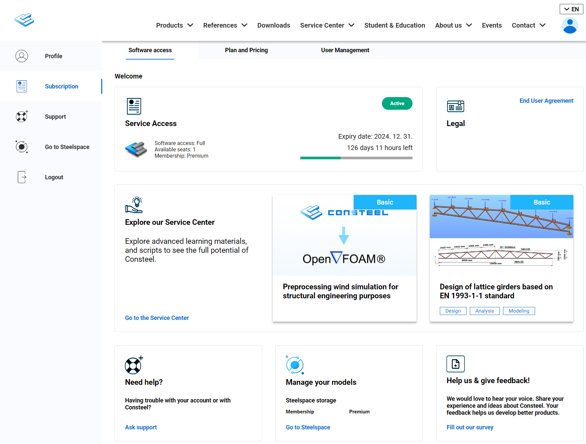
<!-- /wp:paragraph -->

<!-- wp:paragraph -->
- **Plan and Pricing** on this page the following can be verified: 
the license plan, available membership, Team plan, Billing and Pricing details.

<!-- /wp:paragraph -->

<!-- wp:paragraph -->

- **User Management** here the License holder has to assign users to software accesses. Every access is connected to a Consteel Community Membership level. Cloud services available in Consteel are set by these [membership levels](https://consteelsoftware.com/offers-licensing/#ccm).
By clicking on the "Add user" card the license holder can type the user's email address registered as a Consteel account then click add to assign that particular access. 
By clicking on the three-dotted icon the license holder can move a user to another available membership or remove the user.  One user can be assigned to only one software access at a time. After assigning users to software accesses the license holder can give online seat access to these users. By clicking on a seat's panel the panel will open and the license holder can select a user from the list of assigned users to give access to that particular user. After selecting a user the "Give access" button will be active and clickable. Users can be removed from a seat by clicking on the "X" icon. One user can be assigned to multiple seats.

<!-- /wp:paragraph -->

<!-- wp:image {"align":"center","id":28339,"width":855,"height":767,"sizeSlug":"large","linkDestination":"media","editorskit":{"devices":false,"desktop":true,"tablet":true,"mobile":true,"loggedin":true,"loggedout":true,"acf_visibility":"","acf_field":"","acf_condition":"","acf_value":"","migrated":false,"unit_test":false}} -->

Subscription plan information and end-user management

<!-- /wp:image -->

<!-- wp:paragraph -->

### **Project Center**

<!-- /wp:paragraph -->

<!-- wp:paragraph -->

The Project Center unites all the functionalities for model and account management.

<!-- wp:paragraph -->

In the top-right corner, you can access and open the following:
- **News** : Display news that are relevant and engaging for the users.
- **Notifications**: Lists all general public announcements, such as reminders or notifications about temporary updates, possibly including a link.
- **Protection Type**: Indicates whether the protection is online or USB dongle.
- **Licence Window**: Allows you to access your licence information and change protection settings or go offline.
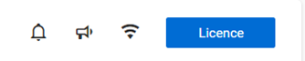

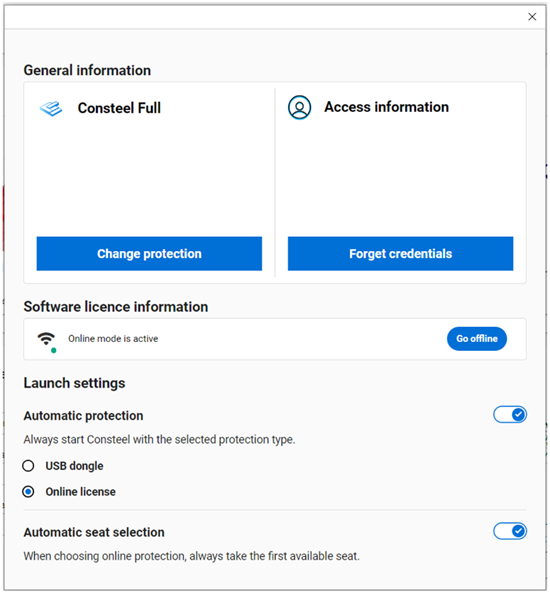

In the top-left side you can choose between opening options from the computer or from the cloud.

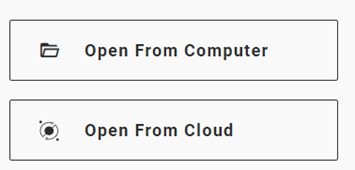

In the middle-left side you can navigate to Home, + Create New, Open and Learn tabs.

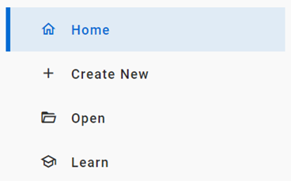

#### Home tab

This is the screen that appears when opening Consteel. It differs depending on whether you are a **commercial** or **trial** user. In the trial version, since you do not yet have any recent models, **example models** are displayed in the top section to help you get familiar with the software.

For commercial users, their **recent models** appear in the same section. The bottom part is the same for all users, where all options for **Creating new** models are provided.

#### Create new tab

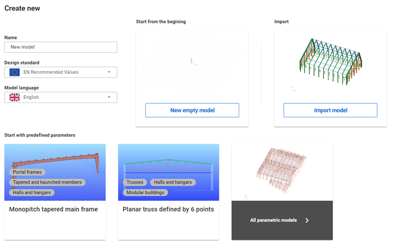

New models can be created by entering a name, selecting a design standard, and choosing the model language. You can choose from the following options:
- **Start from the begining**: Create a new empty model with no predefined structural members.
- **Import**: Opens a new model, and it will automatically trigger the Import Center window, allowing you to import models from various file formats.
- **Start with predefined parameters**: Open a project and select a model from the parametric model library, where you can filter and choose the preferred model.

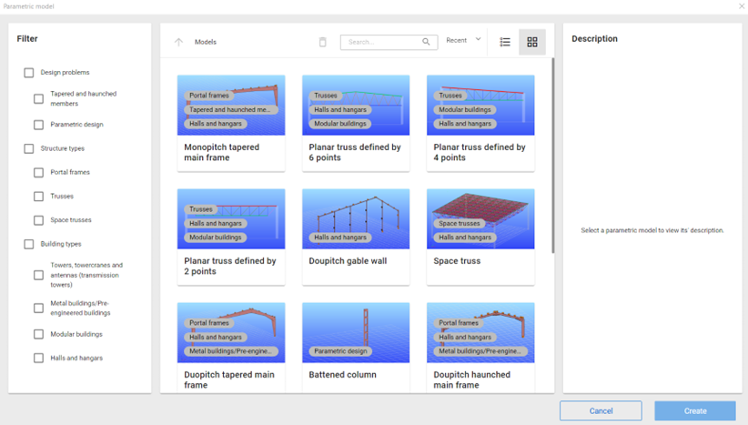

#### Open tab

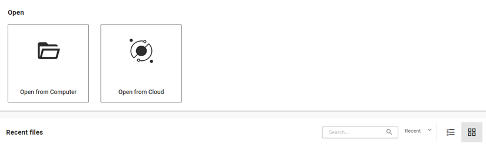

You can choose between Open from computer, Open from Cloud and Recent files. 

**Could open**

If you have models in your cloud storage or someone shared a model with you, you can access those models by clicking on the _"Open from Cloud"_ button.

On the top left corner, you can choose between the following folders: My Models, Shared with Me, and Public Models. Clicking on any of these will open the corresponding folder. (1).

You can execute different actions (2) in your cloud storage from left to right: _"create new folder", "move", "share model", "delete", "search", "sort by date or name", "list or card view"_, and switch _"model or folder information"_ on or off.

The **Model Details** window will appear after selecting a model or folder and clicking the _"Model Information"_ button. In this window, you can view details such as the _folder's creation date, parent folder,_ and _size_. 

If a model is selected, it will display information including _the model name, storage used, location, owner, creation date, last modification date,_ and _model description_. For models in the **History tab**, you can navigate through all the created histories of the current model. In the case of folders, the History tab is inactive. (3).

Every model opening and sharing cost data bandwidth from your storage. Your monthly bandwidth limit is set by your membership level. You can monitor your current bandwidth usage at the left bottom corner (4).

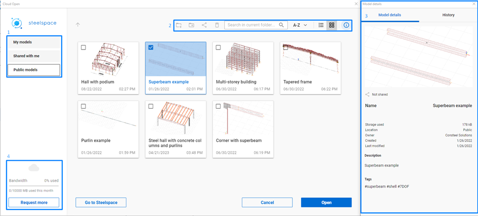

Cloud storage provided by the Steelspace platform
When you open a model from the cloud it is always downloaded to the local device into the folder: C:\Users(username)\AppData\Local\Consteel\CloudModels and kept synchronized. The amount of data bandwidth is set by your subscription's membership level, and it will renew every month.

#### Learn tab

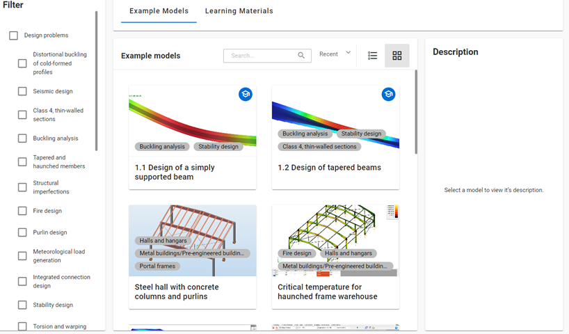

In this window, you can filter between model examples and learning materials according to your needs. Several tutorials are already available, providing step-by-step instructions for specific modeling or design phases, focusing on important features. Our tutorial library will be expanded soon.

On the left side, you can filter by design problem, structure type, and building type. Multiple categories can be selected at once.

Once you select an example model, a description will appear on the right side, providing all the relevant information about the model. Below the description is the **Open** button; pressing it will open a Consteel project containing the selected model.

If you select learning material, a description of the article will appear on the right side. Below the description is the **Learn More** button, which will guide you to our Knowledge Base platform, where you can read the full article based on your membership type.

#### Getting Started and Help

At the bottom-left corner of the Project Center, you will find the **Getting Started** and **Help** buttons.

Clicking the **Getting Started** button will direct you to our YouTube channel, where you can find videos about new features and tutorials on how to use the software.

The **Help** button will take you to the Consteel Help Center, where you can access support for both Consteel and Steelspace. To use the Consteel Support Center or the Steelspace support, you need to register separately.

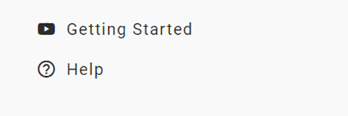

### Navigation overview

After opening the model, the first window that will pop up is the Navigation Overview. This window will help new users to familiarize themselves with the 
-	**Navigation**: you can customize your navigation preferences — such as movement, rotation, and zoom — by choosing from settings used by several popular software platforms.
-	**Selection**: the most useful selection types are presented
-	**Model views**: Hide, Submodel view, Full view and Fit view
-	**Background options**: Default, Light, Dark
-	**Help**:  Support, hot keys and learning materials provided by Consteel.
 
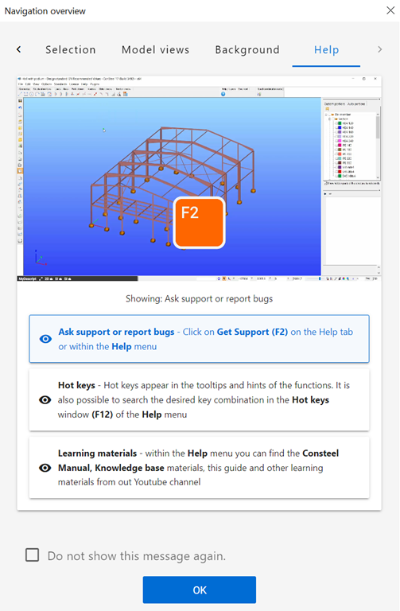

For more experienced users this window can be closed permanently by pressing the ‘Do not show this message again’ checkbox.  The window can be called up at any time from the Help menu. `Shift + N`
