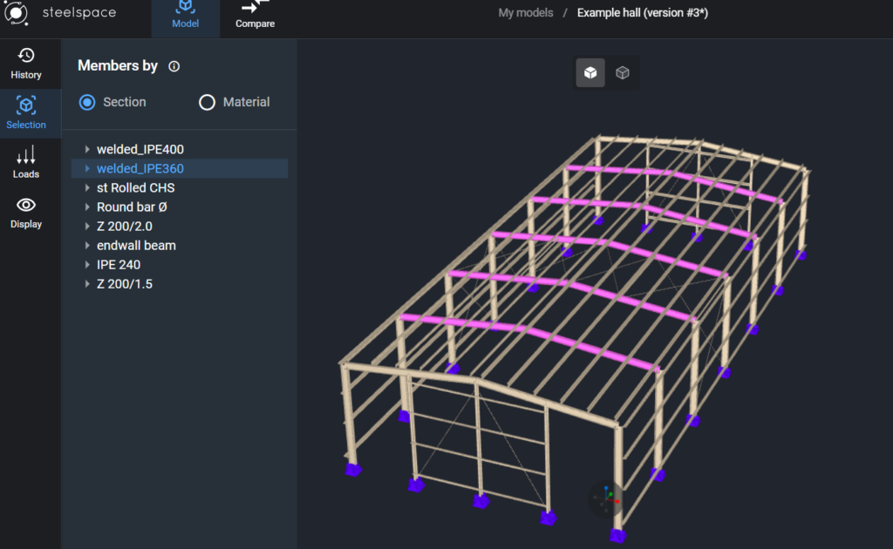
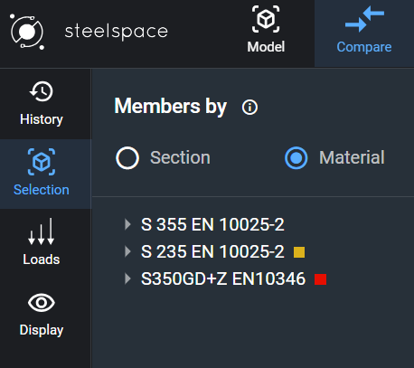
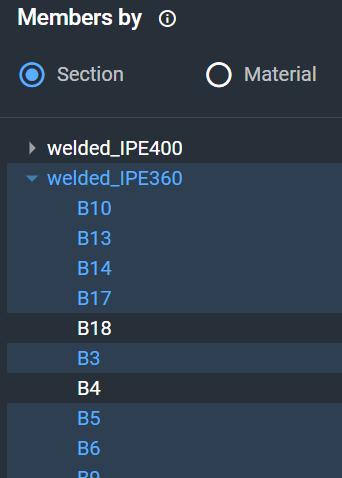
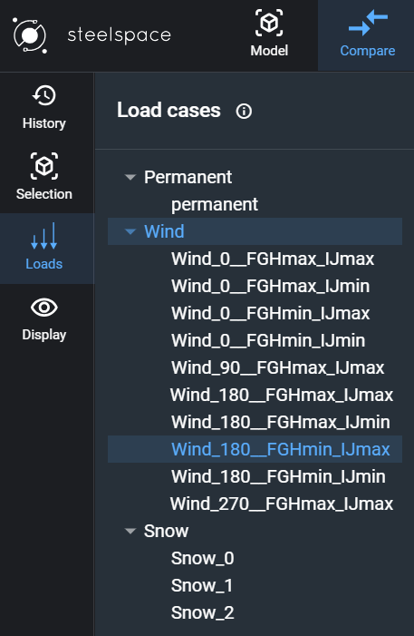
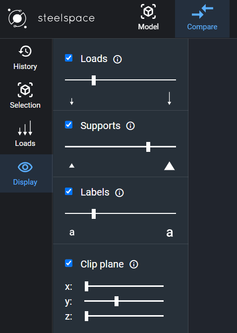
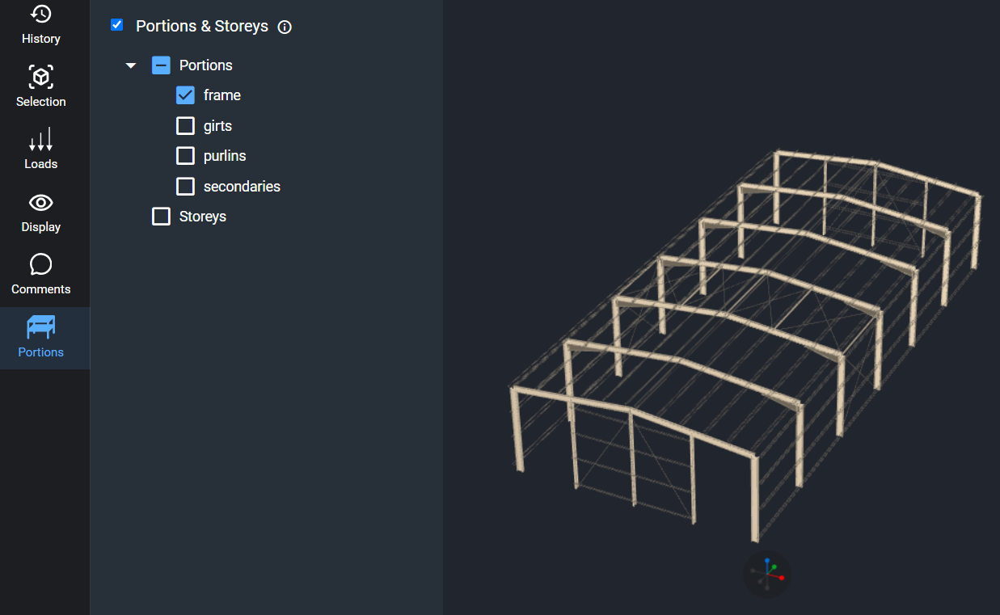
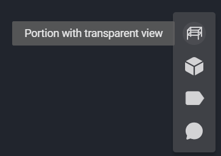

# Steelspace

[Steelspace](https://steelspace.io/login#partnership)  is a continuously evolving open platform for structural engineers that makes knowledge sharing and collaboration easier. It offers cloud-based collaboration, seamless compatibility with structural models from Consteel, enhanced workflows through various useful functionalities, and serves as an ideal platform for creating a knowledge-sharing environment.

## Login to Steelspace

You can sign in to your Steelspace account using your existing **Consteel account** or your **Microsoft account**.

## Steelspace Explorer

After logging in, you will see the Steelspace Explorer window:

In the top left corner, you can choose between the following folders: My Models, Shared with Me, and Public Models. Clicking on any of these will open the corresponding folder (1).

With the "Add New" button, you can create a new folder or import a new file. Currently, .ifc and Consteel's general format .smadsteel files are supported.

You can perform various actions (2) in your cloud storage from left to right: "Create New Folder," "Move," "Share Model," "Delete," "Search," "Sort by Date or Name," "List or Card View," and toggle "Model or Folder Information" on or off.

The Model Details window will appear after selecting a model or folder and clicking the "Model Information" button. In this window, you can view details such as the folder's creation date, parent folder, and size.

If a model is selected, it will display information including the model name, storage used, location, owner, creation date, last modification date, and model description. For models in the [History](../2_0_file-handling/2_5_Steelspace.md#model-history-in-steelspace) tab, you can navigate through all the created histories of the current model. In the case of folders, the History tab is inactive (3).

Every model opening and sharing action consumes data bandwidth from your storage. Your monthly bandwidth limit is set by your membership level. You can monitor your current bandwidth usage in the bottom-left corner (4). You can also switch the view mode between dark or light.

More detailed information about Steelspace, how it works, supported members, pricing, and limitations can be found by pressing the help button (5). If you wish to see your account details or log out, click on your profile to do so.

## Model handling in Steelspace

Double-clicking on the investigated model will open it in the Steelspace platform. The 3D structure will appear immediately in the graphical window, with several options displayed on the sides.

### History 

<!-- /wp:heading -->

<!-- wp:paragraph -->

The [history](../2_0_file-handling/2_4_history-model-versioning-and-comparing-versions.md#model-history-in-steelspace) function is fully integrated into Steelspace, as described in the previous chapter. For more detailed information, please check it out.

In the **History tab**, you can _view_ all the version histories of a model and create new history items. If needed, you can _download, restore,_ or _delete_ versions of a model.

<!-- /wp:heading -->

<!-- wp:paragraph -->

<!-- /wp:heading -->

<!-- wp:paragraph -->

<!-- /wp:paragraph -->

<!-- wp:paragraph -->

On this tab, you will find the [_Compare Version_](../2_0_file-handling/2_4_history-model-versioning-and-comparing-versions.md#compare-model-versions) button at the top. Clicking it will activate the compare feature, and the current model version will automatically be set as one of the versions. A hint will appear, and you can simply select another version to compare it with.

<!-- /wp:paragraph -->

<!-- wp:image {"align":"center","id":44101,"width":402,"height":397,"sizeSlug":"full","linkDestination":"none"} -->

### Selection

<!-- /wp:heading -->

<!-- wp:paragraph -->

To enhance understanding of the model, users can select objects based on their sections or materials. Selected objects will blink with a magenta color. Selection is made by clicking on the name of the section or material. Users can use the dropdown arrows to select members by their names, and selecting multiple sections is possible.

<!-- /wp:paragraph -->

<!-- wp:image {"align":"center","id":75995,"width":"670px","height":"auto","sizeSlug":"large","linkDestination":"none"} -->

<!-- /wp:image -->

<!-- wp:image {"align":"right","id":76005,"width":"340px","height":"auto","sizeSlug":"full","linkDestination":"none"} -->

<!-- /wp:image -->

<!-- wp:image {"align":"center","id":76015,"width":"271px","height":"auto","sizeSlug":"full","linkDestination":"none"} -->

<!-- /wp:image -->

<!-- wp:heading {"level":3} -->

### Loads

<!-- /wp:heading -->

<!-- wp:paragraph -->

The next button in the taskbar is the Loads button. It helps users identify the load groups and the load cases applied within each load group on the structure.

<!-- /wp:paragraph -->

<!-- wp:image {"id":76025,"width":"300px","height":"auto","sizeSlug":"full","linkDestination":"none"} -->

<!-- /wp:image -->

<!-- wp:heading {"level":3} -->

### Display

<!-- /wp:heading -->

<!-- wp:paragraph -->

In the Display section, Steelspace offers users various visibility options. Users can adjust the dimensions of Loads, Supports, and Labels using sliders.

<!-- /wp:paragraph -->

<!-- wp:paragraph -->

Additionally, the Clip Plane checkbox allows users to gain a better perspective of the model by using a clip plane from the X, Y, or Z direction. The position of the clip plane can be adjusted with sliders. Furthermore, multiple clip planes can be applied simultaneously to the model.

<!-- /wp:paragraph -->

<!-- wp:image {"id":76035,"width":"345px","height":"auto","sizeSlug":"full","linkDestination":"none"} -->

<!-- /wp:image -->

### Comments

The comments function can be used for the global structure, specific objects, or specific groups of objects.

To **create** a comment, first [select](#selection) the object, group of objects, or if no selection is made, it will be a global comment referring to the entire model.

Next, on the bottom right side of the window, you will find the "Comment Creation" button. Press it, and depending on the selected element, you will be able to write the comment.

To **view** the assigned comments, go to the Visibility settings, and on the right side of the window, enable the visibility for comments.

Select the Comment Type:
In the **Comments panel**, choose the type of comment you want to view.

- **Global** comments will be listed in the panel.
  - Object-specific comments will appear on the model interface, associated with the respective objects.

- **Object-Specific** Comments:
  - To view the comments for a specific object, click the icon on the assigned object in the model.
  - The Model Information window will automatically open, displaying the details for the selected section along with the relevant comments.

- **Object group-specific** comments
  - The comments will appear only after selecting the comment icon in the model interface.

You can **delete**, **modify**, or **reply** to existing comments.

  

  ### Portions

In the **Portions tab**, you can find all the created portions and storeys imported from other structural design and analysis software.

To **view** the portions, check the checkbox that appears in the panel and select the appropriate portions or storeys.

You can **adjust the visibility** settings on the right side of the window, where you can choose from three options:

- Model view - portions cannot be distinguished
- Portion only view
- Portions with transparent view

