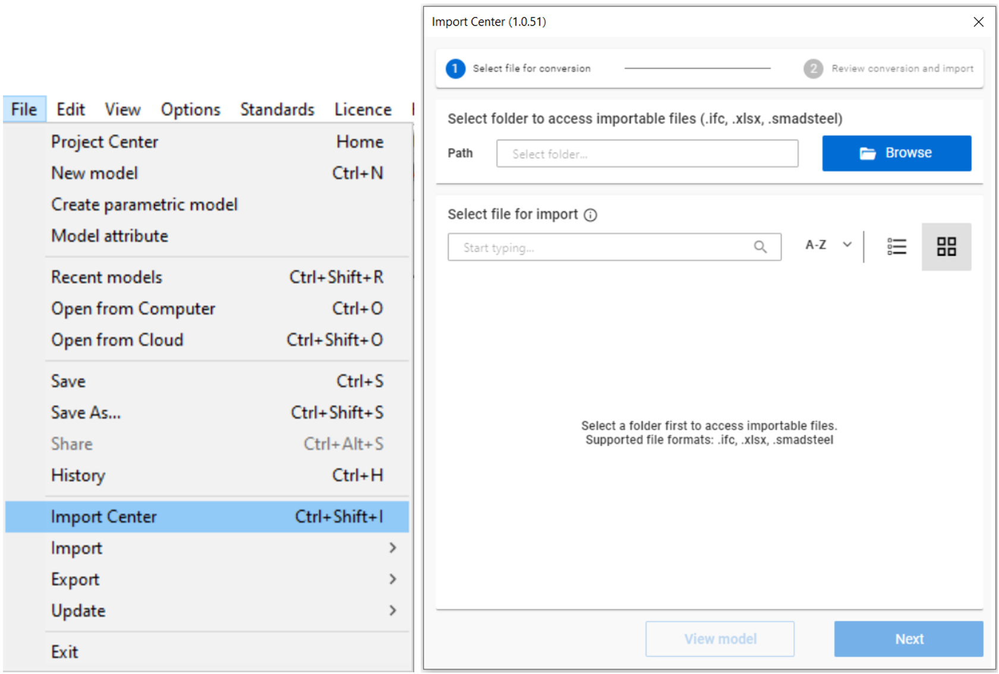
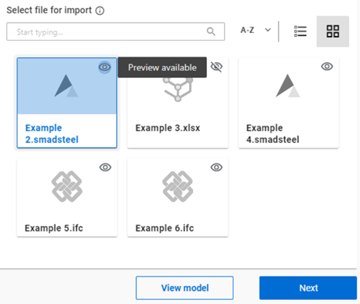
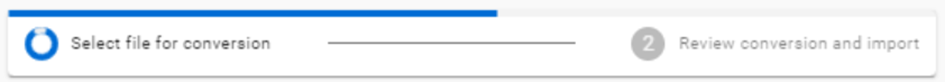
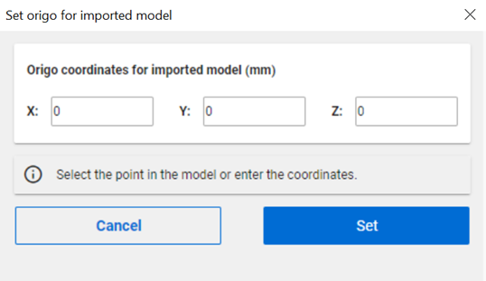

# Import Center

Starting with Consteel 18, the primary import functionalities have been relocated to the new **Import Center**, enhancing coordination between models from different sources and unifying the model import workflow.

## Accessing the Import Center

To begin, go to the **File** menu and select **Import Center**, or press the `Ctrl+Shift+I` hotkey to open the window.



---

## Steps to Import a Model

### 1. Select File for Conversion

- In the **Select Folder** field, click the **Browse** button to choose the folder containing the importable files (`.ifc`, `.xlsx`, `.smadsteel`).

:::note
While browsing, files will not be visible in the folder. The browser only searches for folders and does not display files with other extensions.
:::



---

### 2. File Selection

After selecting the folder, all the convertible files will appear in the main window:

- The files can be organized alphabetically (A-Z) or by recent use. The view can be switched between **grid** or **list** formats.
- The **eye icon** next to each file indicates whether the model can be previewed. Clicking on the model will activate the **View Model** button. Currently, only `.ifc` and `.smadsteel` files can be previewed.
- The Import Center can identify the source of the files, indicated by icons in grid view and listed in the table in list view.
- After selecting the file from which the model should be imported, press **Next**.

---

### 3. Conversion Process

The conversion takes place at this step, as indicated by the top bar. Please note that the process may take a few seconds, especially for more complex models.



:::note
The conversion method converts each format into `.smadsteel` using a multi-level approach:

- A user-defined tabular file matches cross-sections by name.
- If no match is found, the cross-section is created based on the parametric section macro from the source model.
- If still unsuccessful, the section is replaced with a placeholder.
  :::

---

### 4. Review Conversion and Import

- By activating the **Show Previews** option, the converted model can be viewed in the Consteel workspace.
- The position of the imported model can be adjusted by pressing **Change** and defining the new origin coordinates, which will specify the position of the bottom-left corner of the bounding box. This can be done either by clicking in the Consteel workspace or by setting the coordinates manually. When finished, press **Set**.



#### Importing the Model

- After setting the origin, the imported model can be placed by pressing the **Import** button.

---

### 5. Documentation Tab

At the **Documentation** tab, a comprehensive log will provide a detailed summary of the conversion process.

:::note
This feature is not yet available but is planned to be implemented soon.
:::

```

```
