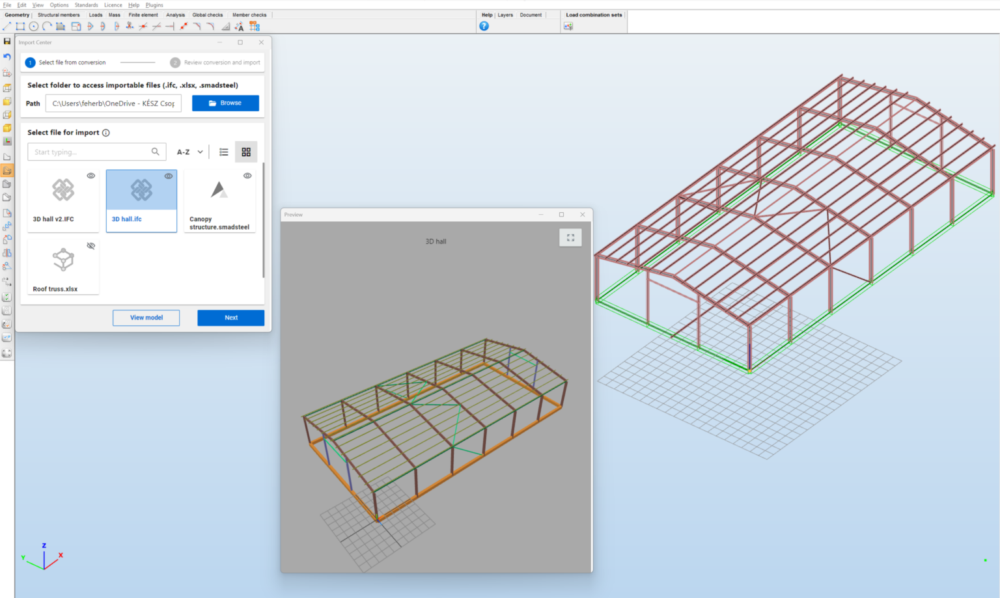
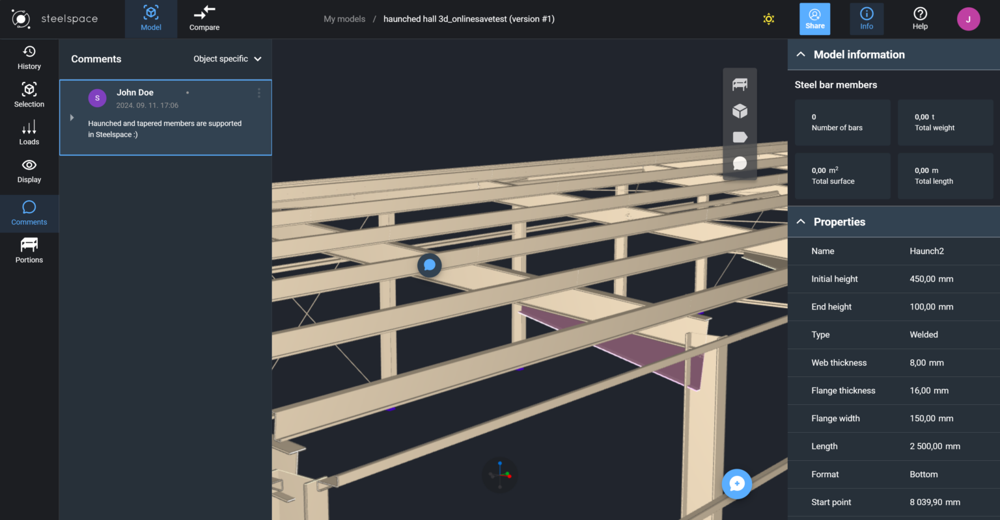
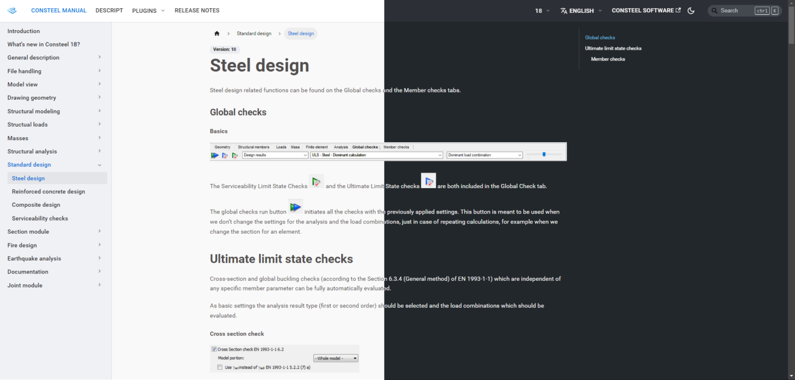
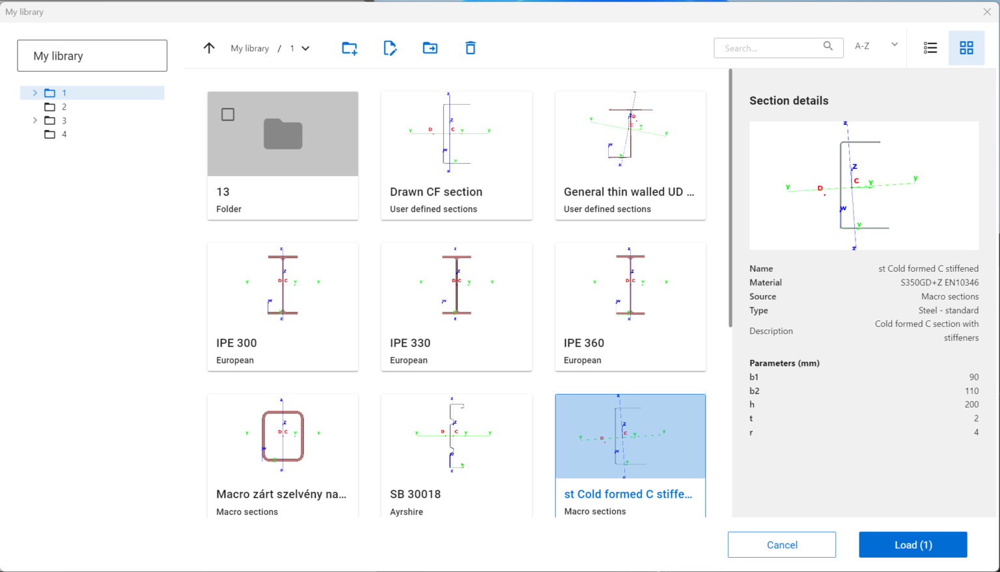
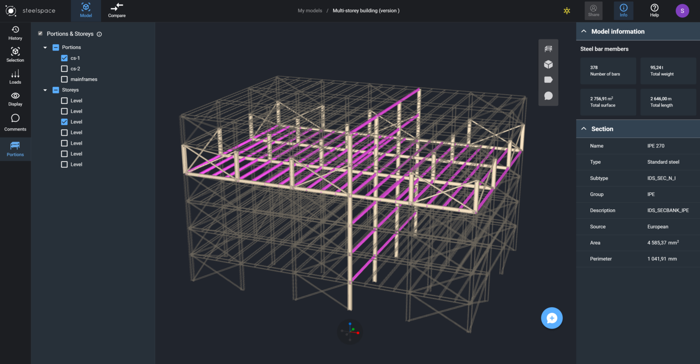
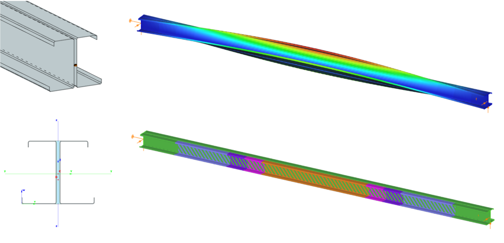

# What's new in Consteel 18?

This year, we made it easier to get started with **Consteel**, from helping colleagues familiarize themselves with the software to ensuring **seamless integration with other tools**, and we've made significant strides in improving **usability**, **scripting**, and **engineering functions**. Additionally, we introduced the first version of our long-term development project: the **FALCON plugin**, a comprehensive wind load generation tool based on fluid dynamics simulation.

## Onboarding
### New Project center

The goal of renewing our *Project Center* was to create a seamless and tailored flow for **navigating** the expanded **model management** options. The two main options are clearly separated, with extended alternatives provided:

**Creating a new model:**

- Start from scratch with an empty model

- Build a parametric model quickly from the new Parametric Models Library

- Import a model in another format (IFC, Smadsteel, SAF)

**Opening an existing model:**

- Browse files on your local computer.

- Access models from your cloud storage

- Select from your recently saved models

- Choose from the new Example Models Library

- Explore the new Tutorial Models Library

Moreover, in the new *Home* view, the offered model management options are customized based on the profile and workflow type of the logged-in user.

You’ll also find a **personalized feed of news**, release notes, bug fixes, and additional content, along with information about your current software license.

 
### Navigation overview

When creating or opening a model, the *Navigation overview* window will appear, providing detailed information on navigation, selection, model views, background settings, and help functions. 

You can also customize your navigation preferences — such as movement, rotation, and zoom — by choosing from settings used by several popular software platforms. The window can be called up at any time from the Help menu.

 
## Collaboration

### New Import Center

In Consteel 18, the **import and export** functionalities are located in the new *Import Center* area to help coordinate models from different sources and unify the model import workflow.

The selected folder displays compatible files (.IFC, .smadsteel, .xlsx). Once a model is selected, the conversion process starts, generating a Consteel-compatible model in the workspace.

A comprehensive documentation of the conversion process ensures better transparency.

  

### Generalized model conversion

The **smadsteel** is compatible with both Consteel and Steelspace.

Previously, this technology was only used for converting AxisVM models, but due to its further development, it is now also capable of converting IFC and SAF models.

The generalized model conversion uses a multi-step method to transform the cross-sections, logging the source and target attributes, as well as any potential errors.

### Cloud collaboration developments

In this version, we introduce a multilevel **commenting** tool for cloud-saved and shared models on our Steelspace platform. Comments can be linked to individual model elements, specific model parts, or the entire model. All participants (whether owner or contributor) are notified of any comments made.

 
## Software use
### New Documentation Center

The **Documentation Center** consolidates the **Consteel manual**, **Descript manual**, **Plugin documentation**, and **Release notes** into one centralized resource.

The updated platform introduces several enhanced features, including a dark and light mode for a customizable viewing experience, advanced search capabilities to quickly locate relevant information, and support for multiple software versions. 
 
 

### Cross-section handling
We’ve introduced a new method for managing steel cross-sections and profiles, offering greater flexibility and efficiency. You can now create a **personalized section library** that includes your frequently used sections—whether they are standard, macro, or manually drawn—and organize them within a custom folder structure. 

This library is saved locally on your computer, allowing you to quickly access your preferred sections across multiple projects.

 
### Descript improvements

In Consteel 18, in addition to the new Descript functions added to our library, you’ll find entirely new user interface components within dialogues created by scripts. These updates are designed to make your scripting more intuitive and effective.

### Cloud model handling

Our [Steelspace](https://steelspace.io/explorer) platform has seen several upgrades in its cloud-based model viewer and management functions. The viewer now supports visualization of tapered and haunched members from Consteel models. Additionally, **custom model portions** can be accessed within Steelspace, allowing you to view these portions alone or with a transparent overlay of the rest of the model.
 
 

## Engineering developments

### New structural member object: member with double C profile

Designing and analyzing **double C (or Sigma)** profiles is a complex task in cold-formed steel structures. Our new structural member object accurately calculates all properties, including the effects of warping, torsion, and buckling, and treats the two sections as a single member for easier modeling.

### New support type: compression-only support

A new point support type is introduced: the **compression-only support**. This support involves an iterative process during the first and second order analysis to find the real state, similarly as the tension-only element. With this support you can model situations when there are no real connectivity between objects they merely rest on each other.

## The FALCON plugin

In recent years, we have focused on the development of CFD simulations to **generate wind loads on buildings with non-standard geometries**. Our goal has been to provide an easy-to-use tool that automatically creates standard wind zones and loads.

The **FALCON plugin** is available as a free beta version in Consteel 18, offering the opportunity for testing and feedback. The final version will be released next year.
 

