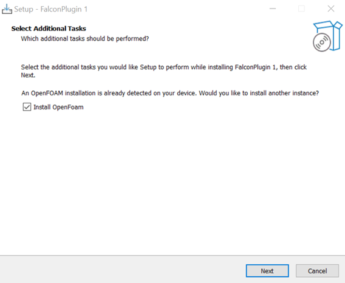
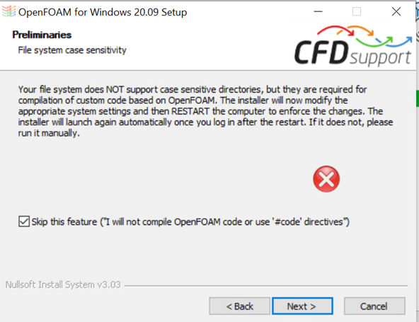
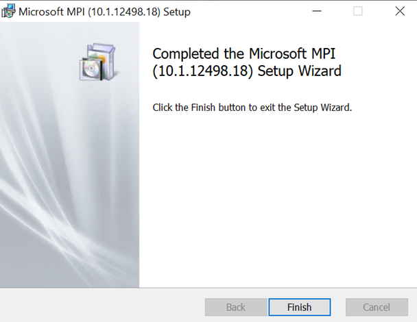
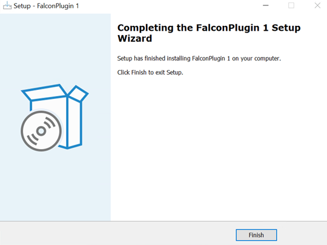

# Installing FALCON

To utilize the wind simulation feature initially, users are required to install the **FALCON plugin**. This plugin can be accessed via the Consteel website under the “Downloads” section. Within the plugins category, select  “Consteel 18” and proceed to download the “FALCON” plugin.
Starting from Consteel 18 the Plugin is compatible. 

 
After downloading the plugin .exe file, ensure that you check the “Install OpenFOAM” checkbox if it was **not** installed previously. Then, press “Next.”

### Is there an OpenFOAM installation on your computer?

### YES
*** 

-  If OpenFOAM is already installed but you check the checkbox anyway, the following message will appear:

_"An OpenFOAM installation is already detected on your device. Would you like to install another instance? Install OpenFOAM."_

If you press Install, a new OpenFOAM instance will be installed, which will **slow down** the installation process. It is recommended to go **Back** and uncheck the installation checkbox.

-  Press **Next** on the Select _Additional Tasks_ window.

-  On the _Ready to Install_ page, press **Install**.

-  On the final window, _Completing the FalconPlugin 1 Setup Wizard_, press **Finish**.

 

### NO

*** 

•	If OpenFOAM is **not** already installed, the following message will appear:

_"No OpenFOAM installation was found on your device. You need to install it before proceeding. Install OpenFOAM."_

• **Do not use Consteel** while installing the plugin. If the software is open, the following message will appear:

_"The following applications are using files that need to be updated by Setup. It is recommended that you allow Setup to automatically close these applications. After the installation has completed, Setup will attempt to restart the applications."_

•	Press **Install** to continue the installation.

•	On the _Welcome to OpenFOAM_ for Windows Setup window, press **Next**.

•	On the _Preliminaries_ window, check the **Skip this feature** checkbox and press **Next**. 
:::note
 OpenFOAM is developed on Linux, a case-sensitive system, while Windows is not case-sensitive by default. For those intending to further develop OpenFOAM, changing Windows settings would be necessary. However, for most users, it is safe to skip this step.
 :::

 
•	On the following seven windows, press **Next** and **Install** without changing the default settings.

•	When you reach the Complete the Microsoft MPI Setup Wizard window, press **Finish**.

 

•	After the Microsoft MPI installation is completed by pressing **OK**, Cygwin and OpenFOAM need to be installed in five steps:
- 	Step 1: Installing Open FOAM

:::info
The following 4 steps are recommended only for research purposes; for regular engineering projects, users can **skip** the installation of ParaView, swak4Foam, PyFoam and Gnuplot
:::

- 	Step 2: Install ParaView 

   

- 	Step 3: Install swak4Foam
- 	Step 4: Install PyFoam
- 	Step 5: Install Gnuplot

•	Next, the language needs to be selected for the installation. Press **OK**.

•	On the following window, the _License Agreement_ has to be accepted. Press **Next**.

•	Press **Next** on the _Information_ window.

•	Select the destination location and components, then press **Next**.

•	Select the _Start Menu Folder_, and press **Next**.

•	Additional tasks can be selected; then press **Install** on the _Ready to Install_ window.

•	Press **Next** on the Information window, then **Finish**.
   
   
 

If the installation is successful, two new **FALCON icons** on the _Loads tab_ will be functional when **Consteel 18** is opened:
-	**FALCON – Wind simulation**  
-	**FALCON- Wind Load generation from simulation results** 

:::info
Since this initial stage of the **FALCON plugin** is a free beta version available for for preliminary testing and use, please ensure that you [register](https://share.hsforms.com/1ryjbZxr3S1OFOKhEjZhtzQ2irg2) before starting. 

Following a fine-tuning phase in collaboration with our dedicated users, the final version is scheduled for release next year.
:::