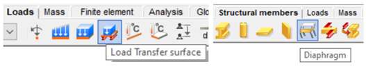

# Meteorological effects definition 

Before starting the wind simulation process, the first and most important step is to create **Load Transfer Surfaces** on which the simulation will be conducted.

You can create the transfer surface by using the **Load Transfer Surface** option in the _Loads tab_

:::note
Simulation surfaces can only be applied to load transfer surfaces.
:::

After creating the transfer surfaces, the wind simulation process can begin. 

All **FALCON-wind simulation** related features can be found on the _Loads tab_.

### 1.	Meteorological effects
 

The first step in **wind simulation** is to define the **meteorological effects**. To do this, use the specially designed icon in the Loads tab.
For the wind load simulation, the **Velocity Pressure** and **Geometric Parameters** must be specified:

- **Velocity Pressure**:

  - Terrain category
  - Basic wind velocity
- **Wind Load Generation Geometric Parameters**:
  - Building dimensions relative to the primary wind direction
  - The exact dimension of the load area is not relevant in the wind simulation in the beta version.

For more information on meteorological effects, please refer to the **Load chapter** in the Consteel manual.

### 2.	Meteorological surfaces

 
The next step is to define the **Meteorological Surface**.

In this window, users can return to the first step by pressing the three dots button next to **Meteorological Effects**.

:::info
 The **Standard Surface** section does not affect the wind simulation; it is only used for standardized wind generation according to Eurocode. 
:::

For the wind simulation, use the final section of the window, labeled **Simulation Surface**, and select the appropriate surface category:

- 	**General** – for the building being designed
- 	**Obstacle** – for any surrounding buildings that are modeled and may impact the wind simulation

After selecting the surface category, all relevant surfaces must be selected. If the simulation surface is applied correctly, this icon will appear at the center of each surface:

 

