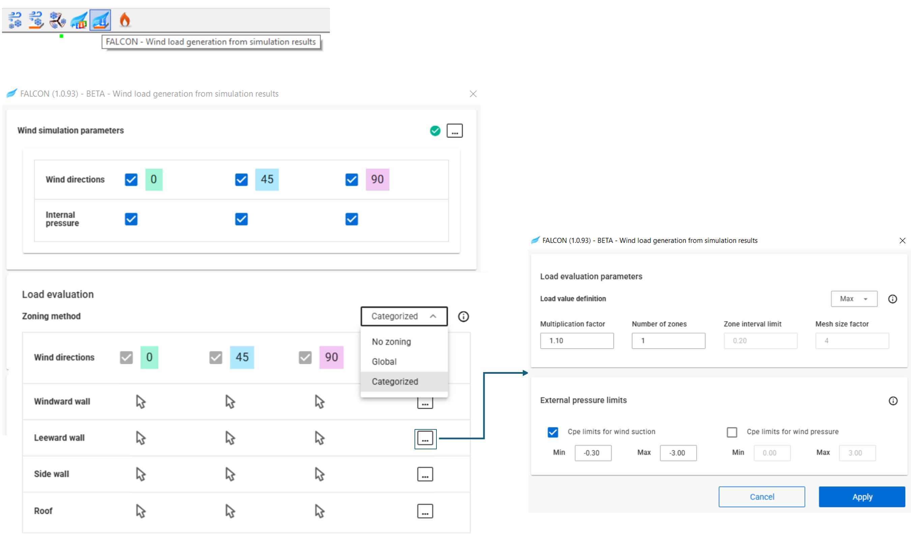

#	Wind load generation 

 
In this final step, FALCON generates loads from the simulation results that can be used as regular loads in your model. The window will guide you through the steps to generate the wind loads:

### **A. Wind simulation parameters**: 
- If the wind simulation has not been completed, use the three dots button to return to the previous step and run it.

### **B. Load evaluation**: 
- During mesh generation, the finite volume mesh undergoes additional refinement, ensuring each finite element mesh face has at least four stored results. This allows for various result evaluation methods to verify load convergence and add conservatism as needed.

  #### **Zoning method**
    - The method of result postprocessing to generate uniform surface loads.

    - The 'no zoning' option allows to generate loads directly on the finite element mesh.

    - The 'global' option creates equal intervals across the entire result range based on the 'number' setting, classifies the finite elements accordingly, and merges them to generate zoned loads.

    - The 'categorized' option automatically assigns the simulation surfaces to one of the following four categories based on their local normal vectors and the wind direction: windward, leeward, side, and roof. Similar to the 'global' option, it generates zoned loads, which are evaluated using validated default settings depending on the category.

   #### **Load evaluation parameters**

     - A set of parameters used to derive surface loads from the finite element mesh which stores the pressure results obtained during the simulation.
     - The advanced settings window can be opened using the three dots button: 
       - **Load value definition** This parameter affects two things:

         - During the mesh generation, the finite volume mesh always has an extra refinement, resulting that every finite element mesh face has at least 4 stored results. This allows to evaluate the results in multiple ways, to check the convergence of the generated loads, and also to add extra conservatism.

         - During zoned load creation using the 'global' or 'categorized' zoning methods the average or the maximum value of a certain interval will be used for load value definition.
        
       -  **External pressure limits** include boundary values for both external pressure and suction coefficients.

### **C. Run Load Generation** 
- Press the Run button at the bottom of the window to start generating loads.

If the wind load generation completes successfully, new wind load cases will appear in the _Load Cases and Groups_ section.
 

All wind load cases will contain the corresponding wind loads generated from the simulation.

