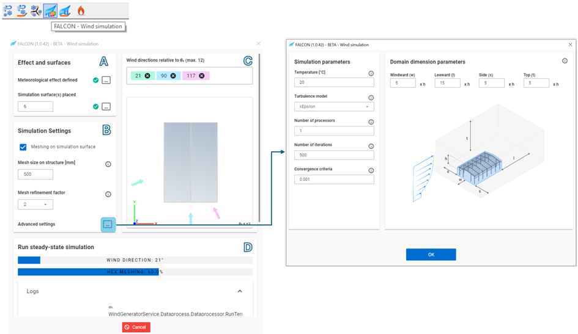
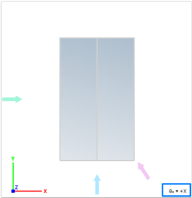

# User interface

Before starting the wind simulation process, the first and most important step is to create **Load Transfer Surfaces** on which the simulation will be conducted.

You can create the transfer surface in several ways:

- 	By using the **Load Transfer Surface** option in the _Loads tab_

-	By creating a **Diaphragm** in the Structural _Members tab_

After creating the transfer surfaces, the wind simulation process can begin. 

All **FALCON-wind simulation** related features can be found on the _Loads tab_.

### 1.	Meteorological effects
 

The first step in **wind simulation** is to define the **meteorological effects**. To do this, use the specially designed icon in the Loads tab.
For the wind load simulation, the **Velocity Pressure** and **Geometric Parameters** must be specified:

- **Velocity Pressure**:

  - Terrain category
  - Basic wind velocity
- **Wind Load Generation Geometric Parameters**:
  - Building dimensions relative to the primary wind direction
  - The exact dimension of the load area is not relevant in the wind simulation in the beta version.

For more information on meteorological effects, please refer to the [_Load chapter_](../../../manual/6_0_structural-loads/6_6_meteorological-loads.md) in the Consteel manual.

### 2.	Meteorological surfaces

 
The next step is to define the **Meteorological Surface**.

In this window, users can return to the first step by pressing the three dots button next to **Meteorological Effects**.

:::info
 The **Standard Surface** section does not affect the wind simulation; it is only used for standardized wind generation according to Eurocode. 
:::

For the wind simulation, use the final section of the window, labeled **Simulation Surface**, and select the appropriate surface category:

- 	**General** – for the building being designed
- 	**Obstacle** – for any surrounding buildings that are modeled and may impact the wind simulation

After selecting the surface category, all relevant surfaces must be selected. If the simulation surface is applied correctly, this icon will appear at the center of each surface:

 

:::note
Simulation surfaces can only be applied to load transfer surfaces, including diaphragms.
:::

### 3.	FALCON-Wind simulation
 
 :::info
   
   If a green checkmark appears next to the three-dot button, it indicates that the previous steps were completed successfully, allowing users to proceed with the wind simulation process.
   
  
  The Info button provides detailed information about each step. Pressing it opens a window with comprehensive guidance.
:::

The third step is running the wind simulation with FALCON. Use the **FALCON-Wind Simulation** button in the _Loads tab_ to open the dialog.

This dialog is divided into four sections to guide users through the settings and simulation process:

#### A. Effects and Surfaces

- **Meteorological Effect**: If not previously defined, users can navigate back to this setting by pressing the three-dots button.

- **Simulation Surfaces**: The number below this section indicates how many simulation surfaces are currently placed in the model. If no surfaces are defined, use the three-dots button to navigate back and define them.

#### B. Simulation Settings
- **Mesh Size on Simulation Surface**: Adjusts the mesh size applied to the simulation surface.
- **Mesh Size on Structure**: Controls the automatic generation of two meshes:

	- **The Finite Element Mesh (FEM)**, generated specifically for post-processing, applies only to the building with planar faces suitable for load creation.
    - **The Finite Volume Mesh (FVM)**, generated by the simulation solver, contains polygonal faces across the entire simulation domain and adapts to wind direction. FVM results are projected onto the FEM mesh for simulation purposes.

- **Mesh Refinement Factor**: The refinement factor (r) increases cell edge sizes (c) at the simulation domain’s boundaries to speed up calculations by reducing detail farther from the building. The cell size at boundaries is calculated as:

  c=s×2^r

  Here, (s) is the mesh size on structure, and each refinement halves cells in all three directions, creating a refined mesh near the building.

- **Advanced Settings**: Default settings are generally suitable, but advanced parameters can be adjusted if needed. Use the three dots button to modify:

  - **Temperature**: Sets ambient temperature for simulation.
  - **Turbulence Model**: Predicts turbulence effects.
  - **Number of Processors**: Defines processors for parallel simulations.
  - **Number of Iterations**: Specifies the iteration count.
  - **Convergence Criteria**: Sets convergence standards for calculated fields.
  - **Domain Dimension Parameters**: Adjusts the simulation domain dimensions using height multipliers for each direction:
    - **Windward** (w)
    - **Leeward** (l)
    - **Side** (s)
    - **Top** (t)

#### C. Wind Directions Relative to Θ₀ (Max 12)
In this section, specify all wind directions in the XY plane relative to Θ₀, with a maximum of 12 directions at a time. After entering each new direction in the input box, press **Enter**.

The Θ₀ direction is visible in the lower-right corner of the simulated structure top view, along with the wind simulation directions. The colored arrows indicate the simulated wind direction relative to the structure.

#### D. Run steady-state simulation
On the last sections the state of the simulation and direction can be observed:
 

After pressing the Run button at the bottom of the dialog, two loading bars display the wind directions being simulated and their progress percentage.

:::info
 While the wind simulations are running, Consteel remains fully functional, allowing you to continue working.
 :::

To monitor the simulation progress, open the **Logs** dropdown window. The simulation can be stopped at any time by pressing **Cancel**.

### 4.	FALCON-Wind load generation from simulation results. 

 
In this final step, FALCON generates loads from the simulation results that can be used as regular loads in your model. The window will guide you through the steps to generate the wind loads:

- **Perform Wind Simulation**: If the wind simulation has not been completed, use the three dots button to return to the previous step and run it.

- **Load Evaluation**: During mesh generation, the finite volume mesh undergoes additional refinement, ensuring each finite element mesh face has at least four stored results. This allows for various result evaluation methods to verify load convergence and add conservatism as needed.

- **Set External Pressure Limits**: Define upper limits for both pressure and suction coefficients.

- **Set Wind and Internal Pressure Directions**: Adjust the wind and internal pressure directions for load generation, based on the simulation results.

- **Select Generated load type- Uniform Surface Loads**:

  - **On Mesh Elements**: Generates loads directly on the finite element mesh.

  - **On Zones**: Creates loads based on the defined number of wind zone categories, resulting in zoned loads.

  - **On Specific Zones**: Applies zoned loads to specific portions of the model.

- **Run Load Generation**: Press the Run button at the bottom of the window to start generating loads.

If the wind load generation completes successfully, new wind load cases will appear in the _Load Cases and Groups_ section.
 

All wind load cases will contain the generated wind loads from the simulation. 

