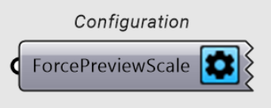

# Model

**Configurations, model portions, model create and deconstruct.**

## Configuration 

See the component in use in the script library: [Continuous multispan beam](https://consteelsoftware.com/script/continuous-3-span-beam/).

### Inputs

| Name              | Id  | Description                                  |
| ----------------- | --- | -------------------------------------------- |
| ForcePreviewScale | FPS | Scaling factor for the force preview arrows. |

 

## Frame corner wizzard

See the component in use in the script library: [Tapered frame with results](https://consteelsoftware.com/script/tapered-frame-with-results/).

### Inputs

| Name     | Id | Description                                              |
| -------- | -- | -------------------------------------------------------- |
| On       | O  | Should be the FrameCornerWizard be on or off?            |
| Portions | P  | Which model portions should be considered by the wizard. |

### Outputs

| Name                                  | Id  | Description                                                |
| ------------------------------------- | --- | ---------------------------------------------------------- |
| ConSteel Frame Corner Wizard Settings | FCW | Configures the FrameCornerWizard object in ConSteel model. |

 

## Consteel Global Model Settings

See the component in use in the script library: [Tapered frame with results](https://consteelsoftware.com/script/tapered-frame-with-results/).

### Inputs

| Name               | Id | Description                                                                     |
| ------------------ | -- | ------------------------------------------------------------------------------- |
| SelfWeightCase     | SWC    | Load case that should contain auto generated self weight of structural objects. |                                                                           |
| EigenValUpperLimit | EL | The upper limit of relevant eigenvalues during buckling calculation.            |

### Outputs

| Name                           | Id  | Description                                         |
| ------------------------------ | --- | --------------------------------------------------- |
| ConSteel Global Model Settings | GMS | Represents global model settings in ConSteel model. |

 

## Portion Folder

See the component in use in the script library: [Purlin distribution, evaluation and model merging](https://consteelsoftware.com/script/purlin-distribution-evaluation-and-model-merging/).

### Inputs

| Name    | Id | Description                           |
| ------- | -- | ------------------------------------- |
| Items   | I  | Items in this portion folder.         |
| Name    | N  | Name of the portion folder.           |
| Visible | V  | Should be the portion folder visible? |

### Outputs

| Name            | Id | Description                         |
| --------------- | -- | ----------------------------------- |
| CSPortionFolder | PF | The created ConSteel PortionFolder. |

 

## Model Portion

See the component in use in the script library: [Tapered frame with results](https://consteelsoftware.com/script/tapered-frame-with-results/).

### Inputs

| Name          | Id | Description                                                                                             |
| ------------- | -- | ------------------------------------------------------------------------------------------------------- |
| CornerType    | CT | If the Frame Corner Wizard is active, how should the corners be handled.                                |
| Items         | I  | Items in this portion.                                                                                  |                                                       |
| Name          | N  | Name of the Model Portion.                                                                              |
| Visible       | V  | Should be the ModelPortion visible?                                                                     |

### Outputs

| Name           | Id | Description                        |
| -------------- | -- | ---------------------------------- |
| CSModelPortion | La | The created ConSteel ModelPortion. |

 

## Structural Group

### Inputs

| Name | Id | Description                          |
| ---- | -- | ------------------------------------ |
| Name | N  | Name of the created Structural Group |

### Outputs

| Name                      | Id                | Description                                      |
| ------------------------- | ----------------- | ------------------------------------------------ |
| ConSteel structural group | CSStructuralGroup | Represents a structural group in ConSteel model. |

 

## Deconstruct Consteel Model

See the component in use in the script library: [Continuous multispan beam](https://consteelsoftware.com/script/continuous-3-span-beam/).

### Inputs

| Name | Id | Description                          |
| ---- | -- | ------------------------------------ |
| Consteel Model | CSM  | Consteel Model Object |

### Outputs

Dynamically can change depending on the model objects.

## Consteel Model

See the component in use in the script library: [Simple Cantilever Beam](https://consteelsoftware.com/script/simple-cantilever-beam/?search=).

