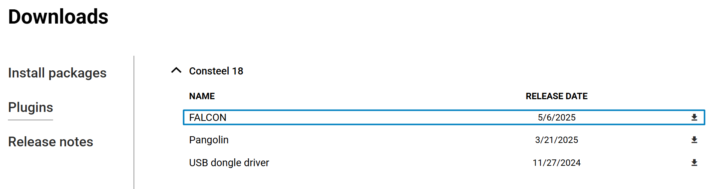
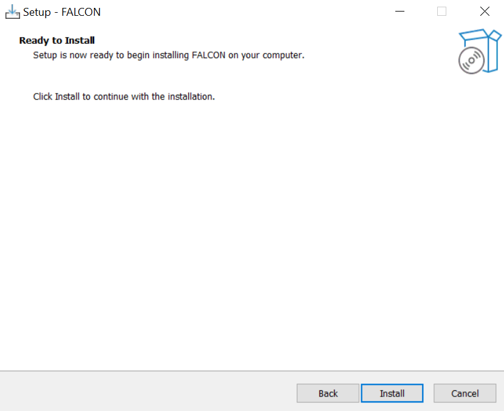
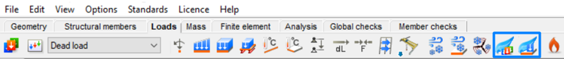

# Installing FALCON

To utilize the wind simulation feature initially, users are required to install the **FALCON plugin**. This plugin can be accessed via the Consteel website under the “Downloads” section. Within the plugins category, select  “Consteel 19” and proceed to download the “FALCON” plugin.
Starting from Consteel 18 the Plugin is compatible. 

 

### License Agreement

In order to start the installation process, the licensing agreement must be accepted.

### Setup

If the installation is successful, two new **FALCON icons** on the _Loads tab_ will be functional when **Consteel** is opened:
-	**FALCON – Wind simulation**  
-	**FALCON- Wind Load generation from simulation results** 

